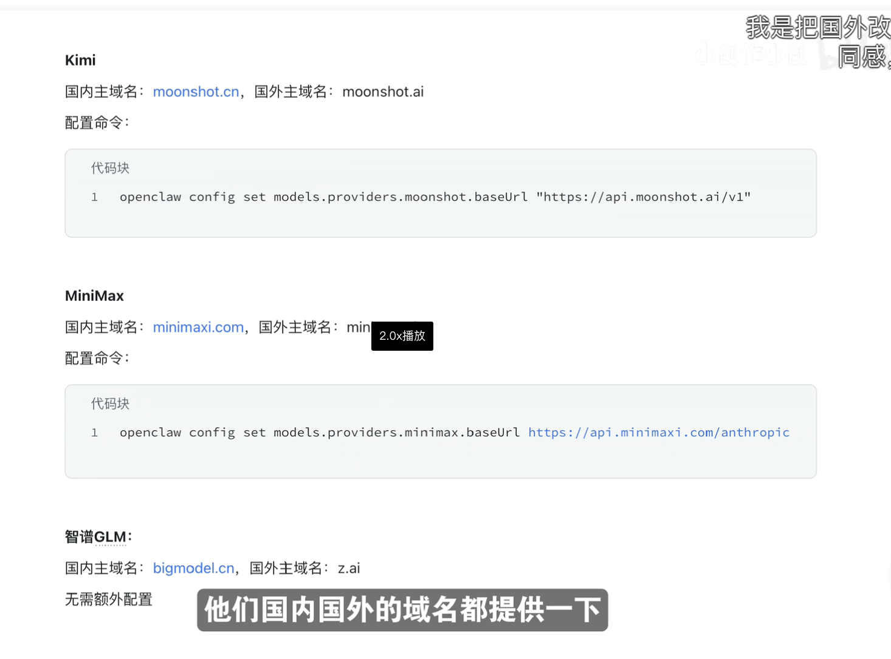

# OpenClaw 使用指南

OpenClaw 是一款**能干活的 AI 助手**，支持在终端、聊天平台（如 WhatsApp、Telegram、飞书等）中与 AI 对话，并能通过 Skills 扩展能力，完成代码、文档、日历等实际任务。本文记录安装、模型配置、常用命令与 Skills 扩展的用法。

---

## 一点背景：Webhook 和 ngrok 是什么（飞书对接时会用到）

接飞书时文档里会提到「Webhook」「ngrok」等词，用大白话理解即可。

### Webhook 是什么

- **平时你访问网站**：是「你 → 主动去请求 → 服务器」（比如打开网页、点按钮）。
- **Webhook 反过来**：是「对方服务器 → 主动把事件推给你 → 你留一个网址等着收」。

飞书就是这样：用户给你发消息时，**飞书的服务器**要主动把「有人发消息了」这件事发到**你提供的网址**（即「请求地址」）。  
你本机跑的 OpenClaw 就是在 3000 端口开了一个「小网站」，专门接收飞书发过来的这些事件——这个「留个网址等着收飞书推送」的机制，就叫 **Webhook**。  
所以：**Webhook = 你给飞书的一个接收地址，飞书有事件就往这个地址发请求。**

### 为什么需要 ngrok

- 飞书的服务器在公网上，只能访问**公网网址**（如 `https://xxx.com/feishu/events`）。
- 你的 OpenClaw 跑在自己电脑上，地址是 **本机** 的 `http://127.0.0.1:3000`，外网访问不到。
- **ngrok** 的作用：在你电脑上运行后，会生成一个**公网网址**（如 `https://xxxx.ngrok-free.app`），别人访问这个网址时，ngrok 会把请求**转发到你本机的 3000 端口**。

可以理解为：ngrok 在你家和互联网之间搭了一座桥，飞书通过这座桥才能把消息事件「送到」你本机的 OpenClaw。  
所以：**ngrok = 内网穿透工具，让公网能访问你本机某个端口，这样飞书才能把 Webhook 事件推到你电脑上的 OpenClaw。**

### 还有哪些需要了解的点

- **请求地址必须是 HTTPS**  
  飞书只接受以 `https://` 开头的请求地址。ngrok 免费版会自带 HTTPS，无需自己配证书。

- **飞书会先发一次「校验请求」**  
  你在后台第一次保存「请求地址」时，飞书会往这个地址发一条校验请求（带一个参数），你的服务需要按飞书要求原样返回，校验通过后事件订阅才会生效。OpenClaw 的飞书插件一般已实现，只要服务在跑、地址填对即可。

- **应用权限要在开放平台开通**  
  在飞书开放平台里，你的应用要开通相应权限（如「获取与发送单聊、群组消息」等），否则可能收不到消息或发不出回复。可参考项目里的 `docs/AI/json/feishu_privilege.json` 做权限参考。

- **本地开发 vs 长期使用**  
  本机 + ngrok 适合自己调试、偶尔用用；免费版 ngrok 重启会换域名，且电脑关机就断。若需要 7×24 或给多人用，建议把 OpenClaw 部署到有公网 IP 或固定域名的服务器上，在飞书里填该服务器的 `https://你的域名/feishu/events`。

- **安全**  
  请求地址是公网可访问的，飞书会对推送请求做签名等校验，OpenClaw 插件会验证请求确实来自飞书，避免伪造请求。

- **在其他网络下能否用飞书和机器人聊**  
  **可以。** 流程是：对方（任意网络、任意设备）在飞书里发消息 → 消息先到**飞书服务器** → 飞书服务器再按你配置的「请求地址」把事件推到你的 **ngrok 公网地址** → ngrok 转到你本机 3000 端口 → OpenClaw 处理并回复。  
  所以只要你这台电脑上的 OpenClaw 和 ngrok 在跑、飞书里填的请求地址和当前 ngrok 地址一致，**谁在什么网络下**（家里 WiFi、公司网、手机 4G、别人家的网）给机器人发消息，都能收到回复。和对方是否跟你同一 WiFi 无关。  
  唯一前提：你这台跑 OpenClaw 的电脑要在线且 ngrok 没断；本机关机或 ngrok 重启（免费版会换域名）后，需要重新把新 URL 填回飞书并发布版本，否则飞书推不到你这台机器。

---

## OpenClaw 底层架构

OpenClaw 采用**以 Gateway 为中心**的架构：一个长期运行的 **Gateway（网关）** 作为控制面，把「各种聊天入口」和「AI 推理与技能」连在一起，实现「一个持久化助手、多端接入、跑在自己环境里」。

### 整体模型

- **Gateway**：单机一个进程，默认 WebSocket 端口 `18789`，是所有连接的中心。
- **客户端（Clients）**：macOS 应用、CLI、Web 管理端等，通过 WebSocket 连到 Gateway，收发请求与事件。
- **通道适配器（Channel Adapters）**：把各平台的 API（WhatsApp、Telegram、飞书、Slack、Discord、iMessage、WebChat 等）统一成同一套协议，由 Gateway 路由。
- **节点（Nodes）**：macOS/iOS/Android 或无头设备，以 `role: node` 连接，提供设备能力（如画布、相机、录屏、定位等），供 Agent 调用。

这样，**界面层**（飞书/Telegram/CLI…）和**智能层**（Agent 与 Skills）分离，你从任意入口说话，都由同一个 Gateway 背后的 Agent 处理。

### Gateway 做什么

- **连接与鉴权**：握手、设备身份、配对（pairing），本地连接可自动通过，非本地需审批。
- **消息路由**：把各通道的进站消息转给 Agent，把回复从 Agent 发回对应通道。
- **事件广播**：向已连接的客户端推送 `agent`、`chat`、`presence`、`health`、`heartbeat`、`cron` 等事件。
- **协议与校验**：所有帧按 JSON Schema 校验；请求/响应走统一格式（如 `req`/`res`），带幂等键防重放。

### 通信协议（简要）

- **传输**：WebSocket，文本帧，JSON  body。
- **连接后**：首帧必须是 `connect`，通过后才会处理其他请求。
- **事件**：`{ type: "event", event, payload, ... }`。
- **请求/响应**：`{ type: "req", id, method, params }` → `{ type: "res", id, ok, payload | error }`。
- 有副作用的操作（如发消息、跑 Agent）需要**幂等键**，便于安全重试。

### 飞书在架构中的位置

接飞书时，用的是**飞书通道适配器**：飞书通过 **Webhook** 把事件推到你在 Gateway 上暴露的 HTTP 端点（如本机 3000 端口的 `/feishu/events`），适配器把飞书事件转成 Gateway 内部协议，再由 Gateway 交给 Agent 处理；回复则从 Agent 经 Gateway、适配器，用飞书 API 发回会话。  
因此，**ngrok 的作用**就是让飞书服务器能访问到你本机上的这个 Webhook 地址，从而把「用户发消息」等事件送进 Gateway。

更多细节见官方：[Gateway 架构](https://docs.openclaw.ai/concepts/architecture)、[Gateway 协议](https://docs.openclaw.ai/gateway/protocol)。

---

## 安装

### 系统要求

- **Node.js**：22 或更高版本（推荐 LTS）
- **系统**：Windows 10+、macOS 12+ 或 Linux（如 Ubuntu 20.04+、Debian 11+）
- **内存**：建议 4 GB 以上
- **磁盘**：约 500 MB（含依赖）

### 安装方式

**1. 一键脚本（推荐）**

- **macOS / Linux**：
  ```bash
  curl -fsSL https://openclaw.ai/install.sh | bash -s -- --install-method git
  ```
- **Windows (PowerShell，建议管理员)**：
  ```powershell
  curl -fsSL https://openclaw.ai/install.cmd -o install.cmd && install.cmd --tag beta && del install.cmd
  ```

**2. npm / pnpm**

```bash
# npm
npm i -g openclaw@beta

# 或 pnpm
pnpm add -g openclaw@beta
```

**3. 验证安装**

```bash
openclaw --version    # 查看版本
openclaw doctor       # 环境诊断
openclaw onboard      # 首次配置向导（API Key、聊天平台等）
```

完成安装后建议执行一次 `openclaw onboard --install-daemon`，按提示选择 AI 供应商、填写 API Key 并连接所需平台。

---

## 模型与认证（Model / Auth Provider）

### Moonshot（Kimi）

Moonshot 提供兼容 OpenAI 的 Kimi API，适合国内使用。

**快速配置：**

```bash
# 使用 Moonshot API Key
openclaw onboard --auth-choice moonshot-api-key

# 若使用 Kimi Coding
openclaw onboard --auth-choice kimi-code-api-key
```

**国内端点：** 若需使用国内 API 地址，可单独设置 baseUrl：

```bash
openclaw config set models.providers.moonshot.baseUrl 'https://api.moonshot.cn/v1'
```

**注意：** Moonshot 与 Kimi Coding 是两套独立提供商，API Key 和端点不同；Moonshot 模型使用 `moonshot/` 前缀（如 `moonshot/kimi-k2.5`），Kimi Coding 使用 `kimi-coding/` 前缀。

### 免费 / 低成本 API 参考

不同模型商都会提供免费额度或试用，例如：

- **Moonshot (Kimi)**：官网有免费额度
- **OpenAI / Anthropic / Google**：通常有少量免费额度或试用
- **Ollama**：本地部署，完全免费，可离线使用

具体免费额度和申请方式以各厂商当前政策为准。下图为一例模型与 API 配置界面参考：



---

## 常用命令

| 命令 | 说明 |
|------|------|
| `openclaw onboard` | 交互式配置（API、平台、默认模型等） |
| `openclaw doctor` | 检查 Node 版本、依赖、配置与网络 |
| `openclaw --version` | 查看当前版本 |
| `openclaw config set <path> <value>` | 设置配置项（如模型 baseUrl） |

更多命令见官方文档：[docs.openclaw.ai](https://docs.openclaw.ai/)。

---

## 定期更新

保持 OpenClaw 更新以获取新功能和修复：

```bash
# npm
npm update -g openclaw@latest

# pnpm
pnpm update -g openclaw@latest
```

Git 安装方式可在仓库目录下执行 `git pull && pnpm install && pnpm run build`。版本与更新说明见：[GitHub Releases](https://github.com/openclaw/openclaw/releases)。

---

## Skills 与 ClawHub

Skills 用于扩展 OpenClaw 的能力（日历、文档、代码、飞书等）。**ClawHub** 是官方技能商店，类似 npm 之于 Node.js，可搜索、安装社区 Skills。

- 技能商店：<https://clawhub.ai/skills>

### 安装与管理 Skills（ClawHub CLI）

若使用 ClawHub CLI：

```bash
# 安装 ClawHub CLI（可选）
npm i -g clawhub

# 搜索技能
clawhub search "calendar"

# 安装技能（会安装到当前目录 ./skills，下次启动 OpenClaw 自动加载）
clawhub install <skill-slug>

# 列出已安装、更新、发布
clawhub list
clawhub update --all
clawhub publish ./my-skill
```

### 飞书插件

通过 OpenClaw 插件安装飞书集成：

```bash
openclaw plugins install @m1heng-clawd/feishu
```

**配置飞书：**

- 在 [飞书开放平台](https://open.feishu.cn/app) 创建应用，获取 **App ID**、**App Secret**。
- 在应用后台配置权限（如通讯录、文档、多维表格等，可按需参考 `docs/AI/json/feishu_privilege.json` 中的 scope）。
- 在 OpenClaw 的配置或环境变量中填入上述 **appid**（及 secret），并完成飞书侧授权与回调配置。

**用户配对与审批：**

用户首次在飞书里 @ 机器人时，可能会看到：

```
OpenClaw: access not configured.
Your Feishu user id: ou_xxxxxxxxxxxx
Pairing code: XXXXXXXX
Ask the bot owner to approve with:
openclaw pairing approve feishu XXXXXXXX
```

表示该用户尚未被授权使用机器人。**机器人管理员**在运行 OpenClaw 的机器上执行（将 `XXXXXXXX` 换成用户收到的配对码）：

```bash
openclaw pairing approve feishu XXXXXXXX
```

例如配对码为 `H7WKRS3K` 时：

```bash
openclaw pairing approve feishu H7WKRS3K
```

审批通过后，对应用户即可在飞书中正常使用该 OpenClaw 机器人。

具体字段名和配置路径以该插件的文档为准。

### Webhook 已监听但没回复

日志里出现 `Webhook server listening on port 3000` 只说明本机在 3000 端口起了服务，**飞书要把用户发消息等事件推送到你这个地址**，必须能访问到你的服务器。本机 `127.0.0.1:3000` 飞书云端访问不到，所以不会收到事件，也就不会回复。

**处理方式：**

1. **让飞书能访问到你的 Webhook（必做）**
   - **内网穿透**：用 [ngrok](https://ngrok.com/)、[frp](https://github.com/fatedier/frp) 等把本机 3000 暴露为公网 HTTPS 地址，例如 `https://xxxx.ngrok.io`。
   - 在飞书应用后台「事件订阅」里，**请求地址**填：`https://你的公网域名/feishu/events`（路径要与日志里一致，一般为 `/feishu/events`）。
   - 若 OpenClaw 或插件支持配置 webhook base URL，则填上述公网地址，确保飞书请求会打到本机 3000。
   - **或**把 OpenClaw 部署到有公网 IP/域名的服务器上，在飞书里填该服务器的 `https://域名/feishu/events`。

2. **飞书应用后台检查**
   - 事件订阅已开启，且「请求地址」与上面一致。
   - 已订阅「接收消息」等事件（如 `im.message.receive_v1`），否则收不到用户发来的消息。
   - 首次保存请求地址时，飞书会发校验请求，服务需正确响应校验逻辑（一般插件会自带）。

3. **本机防火墙/路由器**
   - 若已用公网 IP 直连本机，需放行 3000 端口；用 ngrok 等则无需改本机防火墙。

#### 用 ngrok 的具体操作

1. **安装 ngrok**
   - 官网：<https://ngrok.com/download>
   - macOS（Homebrew）：`brew install ngrok/ngrok/ngrok`
   - 或下载对应系统二进制后解压，把 `ngrok` 放到 PATH。

2. **登录（免费账号即可）**
   - 在 <https://ngrok.com/> 注册并登录，在 Dashboard 里复制你的 **Authtoken**。
   - 本机执行一次：
     ```bash
     ngrok config add-authtoken <你的Authtoken>
     ```

3. **先启动 OpenClaw**
   - 确保 OpenClaw 已启动，且日志里出现 `Webhook server listening on port 3000`。

4. **再开一个终端，暴露 3000 端口**
   ```bash
   ngrok http 3000
   ```
   - 终端里会显示类似：
     ```
     Forwarding   https://abcd1234.ngrok-free.app -> http://localhost:3000
     ```
   - 记下这里的 **https 地址**（例如 `https://abcd1234.ngrok-free.app`），不要带末尾斜杠。

5. **在飞书后台填请求地址**
   - 打开 [飞书开放平台](https://open.feishu.cn/app) → 你的应用 → **事件订阅**。
   - 在「请求地址」中填写：`https://你的ngrok域名/feishu/events`  
     例如：`https://abcd1234.ngrok-free.app/feishu/events`。
   - 保存。飞书会发校验请求，通过后即可接收消息事件。

6. **注意**
   - 免费版 ngrok 每次重启 `ngrok http 3000`，域名会变，需要重新把新的 URL 填回飞书「请求地址」。
   - 使用期间需保持：OpenClaw 在跑、ngrok 终端不关，飞书才能持续把消息推到本机。

#### 还是没回复时请逐项检查

- **是否已发布版本**  
  飞书后台改完「请求地址」或事件订阅后，页面上会提示「当前版本发布后生效」。必须点 **「创建版本」**，再在「版本管理」里把该版本 **「发布」**，线上才会真正往你的 URL 推事件；只保存不发布等于没生效。

- **是否添加了「接收消息」事件**  
  在事件订阅里点 **「添加事件」**，勾选与「接收用户消息」相关的事件（如 **`im.message.receive_v1`**）。没加这条就不会推送用户发来的消息，机器人自然不会回复。

- **ngrok 是否还在跑、URL 是否一致**  
  终端里 ngrok 窗口不要关；若重启过 ngrok，域名会变，需把新地址再填回飞书「请求地址」并保存、发布新版本。

- **用户是否已配对**  
  若聊天里出现过「access not configured」和配对码，需在运行 OpenClaw 的机器上执行：  
  `openclaw pairing approve feishu <配对码>`，否则该用户发消息可能被拒绝。

---

## 参考链接

- 官网与安装：[openclaws.io/zh/install](https://openclaws.io/zh/install/)
- 配置与模型：[docs.openclaw.ai](https://docs.openclaw.ai/)
- Moonshot 提供商：[docs.openclaw.ai/zh-CN/providers/moonshot](https://docs.openclaw.ai/zh-CN/providers/moonshot)
- ClawHub 技能商店：<https://clawhub.ai/skills>
