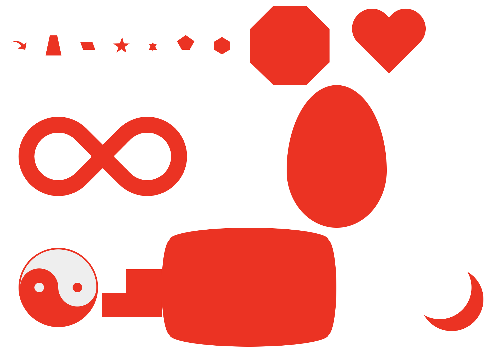

# CSS3 绘制特殊图形的技巧



## 具体事例

#### 弯尾箭头 Curved Tail Arrow

#### 梯形 Trapezoid

#### 平行四边形 Parallelogram

#### 五角星 Star 5-points

#### 五边形 Pentagon

#### 六边形 Hexagon

#### 八边形 Octagon

#### 心形 Heart

#### 无限符图形 Infinity

#### 菱形 Diamond Square

#### 钻石盾牌 Diamond Shield

#### 窄菱形 Diamond Narrow

#### 钻石型 Cut Diamond

#### 鸡蛋 Egg

#### 吃豆人 Pac-Man

#### 聊天框 Talk Bubble

#### 爆炸形状 Point Burst

#### 阴阳八卦 Yin Yang

#### 徽章丝带 Badge Ribbon

#### 太空入侵者 Space Invader

#### 电视屏幕 TV Screen

#### 雪佛龙 Chevron

#### 放大镜 Magnifying Glass

#### 圆锥形 Cone

#### 月亮 Moon

```
<!DOCTYPE html>
<html lang="en">

<head>
  <meta charset="UTF-8">
  <meta name="viewport" content="width=device-width, initial-scale=1.0">
  <title>Document</title>
  <style>
    * {
      margin: 0;
      padding: 0;
    }

    .icon {
      padding: 20px;
    }

    .icon i {
      display: inline-block;
      vertical-align: middle;
      margin: 0 10px;
    }

    .Curved_Tail_Arrow {
      position: relative;
      width: 0;
      height: 0;
      border-top: 9px solid transparent;
      border-right: 9px solid red;
      transform: rotate(10deg);
    }

    .Curved_Tail_Arrow::after {
      content: "";
      position: absolute;
      border: 0 solid transparent;
      border-top: 3px solid red;
      top: -12px;
      left: -9px;
      width: 12px;
      height: 12px;
      border-radius: 20px 0 0 0;
      transform: rotate(45deg);
    }

    .Trapezoid {
      width: 10px;
      height: 0;
      border-bottom: 25px solid red;
      border-left: 5px solid transparent;
      border-right: 5px solid transparent;
    }

    .Parallelogram {
      width: 15px;
      height: 10px;
      transform: skew(20deg);
      background-color: red;
    }

    .Star_5 {
      margin: 5px 0;
      position: relative;
      width: 0;
      height: 0;
      border-right: 10px solid transparent;
      border-bottom: 7px solid red;
      border-left: 10px solid transparent;
      transform: rotate(35deg);
    }

    .Star_5::before,
    .Star_5::after {
      content: "";
      width: 0;
      height: 0;
      border-right: 10px solid transparent;
      border-bottom: 7px solid red;
      border-left: 10px solid transparent;
      position: absolute;
      top: 0;
      left: 0;
    }

    .Star_5::before {
      transform: rotate(-140deg);
      top: 0;
      left: -10px;
    }

    .Star_5::after {
      transform: rotate(-70deg);
      top: 0;
      left: -10px;
    }

    .Star_6 {
      width: 0;
      height: 0;
      border-left: 5px solid transparent;
      border-right: 5px solid transparent;
      border-bottom: 10px solid red;
      position: relative;
    }

    .Star_6::after {
      content: "";
      width: 0;
      height: 0;
      border-left: 5px solid transparent;
      border-right: 5px solid transparent;
      border-top: 10px solid red;
      position: absolute;
      top: 3px;
      left: -5px;
    }

    .Pentagon {
      position: relative;
      width: 10px;
      border-width: 11px 6px 0;
      border-style: solid;
      border-color: red transparent;
    }

    .Pentagon::before {
      content: "";
      position: absolute;
      height: 0;
      width: 0;
      top: -19px;
      left: -6px;
      border-width: 0 11px 8px;
      border-style: solid;
      border-color: transparent transparent red transparent;
    }

    .Hexagon {
      position: relative;
      width: 20px;
      height: 10px;
      background-color: red;
    }

    .Hexagon:before,
    .Hexagon::after {
      content: "";
      position: absolute;
      height: 0;
      width: 0;
      border-style: solid;
      left: 0;
    }

    .Hexagon:before {
      top: -6px;
      border-width: 0 10px 6px;
      border-color: transparent transparent red transparent;
    }

    .Hexagon:after {
      bottom: -6px;
      border-width: 6px 10px 0;
      border-color: red transparent transparent transparent;
    }

    .Octagon {
      width: 100px;
      height: 100px;
      background: red;
      position: relative;
    }

    .Octagon:before {
      content: "";
      position: absolute;
      top: 0;
      left: 0;
      border-bottom: 29px solid red;
      border-left: 29px solid #fff;
      border-right: 29px solid #fff;
      width: 42px;
      height: 0;
    }

    .Octagon:after {
      content: "";
      position: absolute;
      bottom: 0;
      left: 0;
      border-top: 29px solid red;
      border-left: 29px solid #fff;
      border-right: 29px solid #fff;
      width: 42px;
      height: 0;
    }

    .Heart {
      position: relative;
      width: 100px;
      height: 90px;
    }

    .Heart:before,
    .Heart:after {
      position: absolute;
      content: "";
      left: 50px;
      top: 0;
      width: 50px;
      height: 80px;
      background: red;
      -moz-border-radius: 50px 50px 0 0;
      border-radius: 50px 50px 0 0;
      -webkit-transform: rotate(-45deg);
      -moz-transform: rotate(-45deg);
      -ms-transform: rotate(-45deg);
      -o-transform: rotate(-45deg);
      transform: rotate(-45deg);
      -webkit-transform-origin: 0 100%;
      -moz-transform-origin: 0 100%;
      -ms-transform-origin: 0 100%;
      -o-transform-origin: 0 100%;
      transform-origin: 0 100%;
    }

    .Heart:after {
      left: 0;
      -webkit-transform: rotate(45deg);
      -moz-transform: rotate(45deg);
      -ms-transform: rotate(45deg);
      -o-transform: rotate(45deg);
      transform: rotate(45deg);
      -webkit-transform-origin: 100% 100%;
      -moz-transform-origin: 100% 100%;
      -ms-transform-origin: 100% 100%;
      -o-transform-origin: 100% 100%;
      transform-origin: 100% 100%;
    }

    .Infinity {
      position: relative;
      width: 212px;
      height: 100px;
    }

    .Infinity:before,
    .Infinity:after {
      content: "";
      position: absolute;
      top: 0;
      left: 0;
      width: 60px;
      height: 60px;
      border: 20px solid red;
      -moz-border-radius: 50px 50px 0 50px;
      border-radius: 50px 50px 0 50px;
      -webkit-transform: rotate(-45deg);
      -moz-transform: rotate(-45deg);
      -ms-transform: rotate(-45deg);
      -o-transform: rotate(-45deg);
      transform: rotate(-45deg);
    }

    .Infinity:after {
      left: auto;
      right: 0;
      -moz-border-radius: 50px 50px 50px 0;
      border-radius: 50px 50px 50px 0;
      -webkit-transform: rotate(45deg);
      -moz-transform: rotate(45deg);
      -ms-transform: rotate(45deg);
      -o-transform: rotate(45deg);
      transform: rotate(45deg);
    }

    .Diamond_Square {}

    .Diamond_Shield {}

    .Diamond_Narrow {}

    .Cut_Diamond {}

    .Egg {
      display: block;
      width: 126px;
      height: 180px;
      background-color: red;
      /* border-radius: 50% 50% 50% 50% / 60% 60% 40% 40%; */
      border-top-left-radius: 50% 60%;
      border-top-right-radius: 50% 60%;
      border-bottom-right-radius: 50% 40%;
      border-bottom-left-radius: 50% 40%;
      /*
        is equivalent to:width:
        border-top-left-radius: 50% 60%;
        border-top-right-radius: 50% 60%;
        border-bottom-right-radius: 50% 40%;
        border-bottom-left-radius: 50% 40%;
        */
    }

    .Pac_Man {}

    .Talk_Bubble {}

    .Point_Burst {}

    .Yin_Yang {
      position: relative;
      width: 96px;
      height: 48px;
      background-color: #eee;
      border-style: solid;
      border-color: red;
      border-width: 2px 2px 50px 2px;
      border-radius: 100%;
    }

    .Yin_Yang::before,
    .Yin_Yang::after {
      content: "";
      top: 50%;
      position: absolute;
      width: 12px;
      height: 12px;
      border-radius: 100%;
    }

    .Yin_Yang::before {
      left: 0;
      background-color: #eee;
      border: 18px solid red;
    }

    .Yin_Yang::after {
      right: 0;
      background-color: red;
      border: 18px solid #eee;
    }

    .Badge_Ribbon {}

    .Space_Invader {
      box-shadow:
        0 0 0 1em red,
        0 1em 0 1em red,
        -2.5em 1.5em 0 .5em red;
      background: red;
      width: 1em;
      height: 1em;
      overflow: hidden;
      margin: 50px 0 70px 65px;
    }

    .TV_Screen {
      position: relative;
      width: 200px;
      height: 150px;
      margin: 20px 0;
      background: red;
      border-radius: 50% / 10%;
      color: white;
      text-align: center;
      text-indent: .1em;
    }

    .TV_Screen:before {
      content: '';
      position: absolute;
      top: 10%;
      bottom: 10%;
      right: -5%;
      left: -5%;
      background: inherit;
      border-radius: 5% / 50%;
    }

    .Chevron {}

    .Magnifying_Glass {}

    .Cone {}

    .Moon {
      width: 80px;
      height: 80px;
      border-radius: 50%;
      box-shadow: 15px 15px 0 0 red;
    }
  </style>
</head>

<body>
  <div class="icon">
    <i class="Curved_Tail_Arrow"></i>
    <i class="Trapezoid"></i>
    <i class="Parallelogram"></i>
    <i class="Star_5"></i>
    <i class="Star_6"></i>
    <i class="Pentagon"></i>
    <i class="Hexagon"></i>
    <i class="Octagon"></i>
    <i class="Heart"></i>
    <i class="Infinity"></i>
    <i class="Diamond_Square"></i>
    <i class="Diamond_Shield"></i>
    <i class="Diamond_Narrow"></i>
    <i class="Cut_Diamond"></i>
    <i class="Egg"></i>
    <i class="Pac_Man"></i>
    <i class="Talk_Bubble"></i>
    <i class="Point_Burst"></i>
    <i class="Yin_Yang"></i>
    <i class="Badge_Ribbon"></i>
    <i class="Space_Invader"></i>
    <i class="TV_Screen"></i>
    <i class="Chevron"></i>
    <i class="Magnifying_Glass"></i>
    <i class="Cone"></i>
    <i class="Moon"></i>
  </div>
</body>

</html>
```
