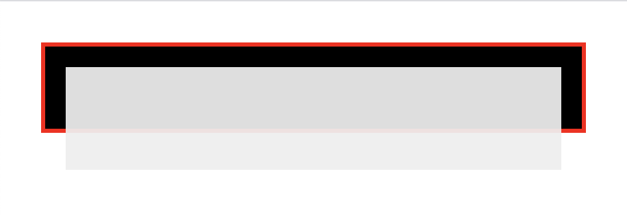
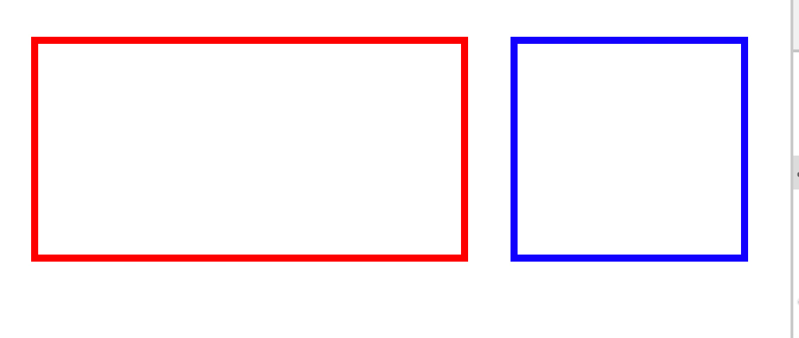
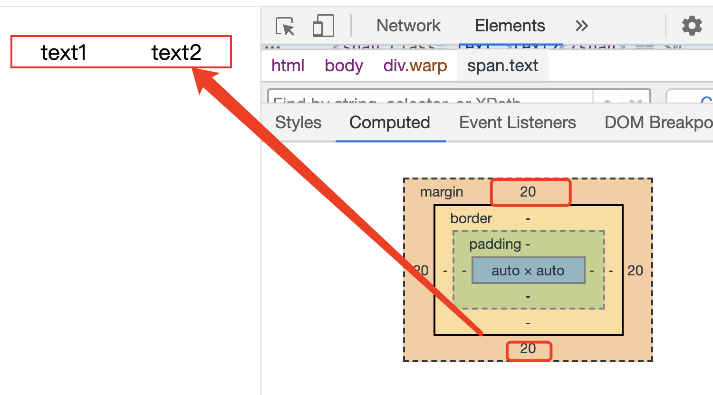
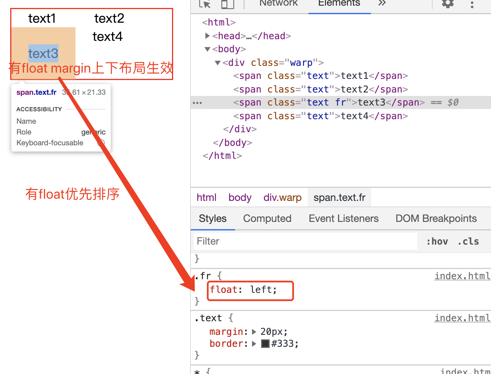
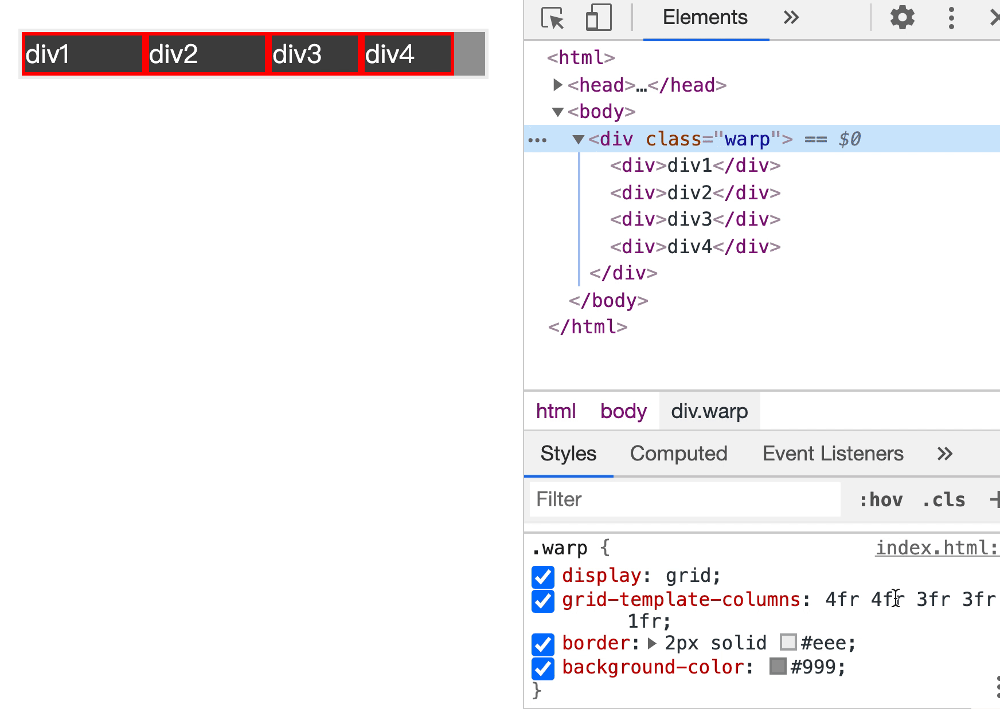
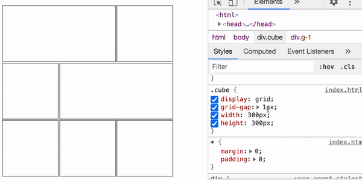

# CSS 格式化上下文 - Formatting Context

`Formatting Context`: 指页面中的一个渲染区域，并拥有一套渲染规则，他决定了子元素如何定位，以及与其他元素的相互关系和作用。他是 W3C CSS2.1 规范中的一个概念。
常见的 Formatting Context 有 BFC、IFC、GFC 和 FFC.

Box 是 css 布局的对象和基本单位，直观点说，就是一个页面是由很多个 Box 组成。元素的类型和 display 属性，决定了这个 box 的类型，不同类型的 Box，会参与不同的 Formatting Context(决定如何渲染文档的容器)，因此 Box 内的元素会以不同的方式渲染。

所有带 FC 的都会渲染成一个独立的区域

## BFC

BFC 全称为 `块级格式化上下文`（Block Formatting Context），是 web 页面的可视化 CSS 渲染出的一部分。
它是块级盒布局出现的区域，也是浮动层元素进行交互的区域。
一个 BFC 由以下之一创建：

- 根元素或其他包含元素
- 浮动元素（元素 float 不是 none）
- 绝对地位元素（position 为 absolute 或 fixed）
- 内联块（元素具有 display: inline-block）
- 表格单元格（display: table-cell, HTML 表格单元格默认属性）
- 表格标题（display: table-caption, HTML 表格标题默认属性）
- display: flow-root
- 具有 overflow 且值不是 visible 的块元素
- column-span: all 应当总是会创建一个新的格式化上下文，即便具有 column-span:all 的元素并不被包裹在一个多列容器中。
- 一个块格式化上下文包括创建它的元素内部所有内容，除了被包含于创建新的块级格式化上下文的后代元素内的元素。

### BFC 特性（解决的问题）

- 1. 使 BFC 内部浮动元素不会到处乱跑，解决父元素塌陷问题
- 2. 和浮动元素产生边界，两个相邻的块级盒子之间垂直向上的外边距会塌陷
     margin 或只改问题【overflow:hidden】
  - box 重置方向的距离由 margin 决定，属于同一个 BFC 的两个相邻的 Box 的 margin 会发生重叠

#### 使 BFC 内部浮动元素不会到处乱跑

正常的文档流


```html
<style>
  * {
    margin: 0;
    padding: 0;
  }
  body {
    padding: 20px;
  }
  .out {
    padding: 10px;
    border: 2px solid #f00;
    background-color: #000;
    min-height: 20px;
  }
  .in {
    height: 50px;
    background-color: #eeee;
  }
</style>
<div class="out">
  <div class="in"></div>
</div>
```

加 float 或 position 脱离普通文档流

此时如果还希望让外层元素包裹住内层元素，就要让外层元素产生一个 BFC.


```html
<style>
  * {
    margin: 0;
    padding: 0;
  }
  body {
    padding: 20px;
  }
  .out {
    padding: 10px;
    border: 2px solid #f00;
    background-color: #000;
    min-height: 20px;
    overflow: hidden;
  }
  .in {
    width: 100%;
    height: 50px;
    background-color: #eeee;
    float: left;
  }
</style>
<div class="out">
  <div class="in"></div>
</div>
```

#### 和浮动元素产生边界



```html
<style>
  * {
    margin: 0;
    padding: 0;
  }
  body {
    padding: 20px;
  }
  div {
    border: 3px solid red;
    height: 100px;
  }
  .left {
    min-width: 200px;
    margin-right: 20px;
    float: left;
  }
  .right {
    border-color: blue;
    display: flow-root;
  }
</style>
<div class="left"></div>
<div class="right"></div>
```

## IFC

行内格式化上下文
一般用来解决: 元素垂直居中、多个文本元素行高不一致排列混乱

### IFC 布局规则

- 子元素水平方向横向排列，并垂直方向起点为元素顶部
- 子元素只会计算横向样式空间，`padding, border, margin`，垂直方向的样式空间不会被计算->`padding, border, margin`；
- 在垂直方向上，子元素会以不同形式来对齐`vertical-align`;
- 能把一行上的框都完全包含进去的一个矩形区域，被称为该行的行框（line box）。行框宽度是由包含块（containing box）和与其中的浮动来决定的。
- IFC 中的`line box`一般左右贴紧其包含块，但 float 元素会优先排列。
- IFC 中的`line box`高度由 CSS 行高计算规则来确定，同时 IFC 下的多个 linebox 高度可能会不同。
- 当一个 line box 超过父元素高度时，它会被分割成多个 boxes，这些 oxes 分布在多个 linebox 中，如果子元素未设置强换行的情况下，inlinebox 将不可分割，将会溢出父元素

#### 上下间距不生效，可以用 IFC 来解释



```html
<style>
  * {
    margin: 0;
    padding: 0;
  }
  body {
    padding: 20px;
  }
  .warp {
    border: 1px solid red;
    display: inline-block;
  }
  .text {
    margin: 20px;
    border: #333;
  }
</style>
<div class="warp">
  <span class="text">text1</span>
  <span class="text">text2</span>
</div>
```

#### float 元素优先排列



```html
<style>
  * {
    margin: 0;
    padding: 0;
  }
  body {
    padding: 20px;
  }
  .warp {
    border: 1px solid red;
    display: inline-block;
  }
  .text {
    margin: 20px;
    border: #333;
  }
  .fl {
    float: left;
  }
</style>
<div class="warp">
  <span class="text">text1</span>
  <span class="text">text2</span>
  <span class="text fr">text3</span>
  <span class="text">text4</span>
</div>
```

## GFC

GFC(`GridLayout Formatting Contexts`): 网格布局式上下文
为了处理 table

### GFC 产生条件

- display 属性值设置为`grid`或`inline-grid`的容器
  

```html
<style>
  * {
    margin: 0;
    padding: 0;
  }
  body {
    padding: 20px;
  }
  .warp {
    display: grid;
    grid-template-columns: 1fr 1fr 1fr;
    border: 2px solid #eee;
    background-color: #999;
  }
  .warp > div {
    border: 2px solid #f00;
    background-color: #444;
    color: #fff;
  }
</style>
<div class="warp">
  <div>div1</div>
  <div>div2</div>
  <div>div3</div>
  <div>div4</div>
</div>
```

grid 默认为 4 等分


```html
<style>
  * {
    margin: 0;
    padding: 0;
  }
  body {
    padding: 20px;
  }
  .cube {
    display: grid;
    grid-gap: 2px;
    width: 300px;
    height: 300px;
  }
  .cube div {
    border: 1px solid grey;
  }
  .cube .g-1 {
    grid-column-start: 1;
    grid-column-end: 3;
  }
  .cube .g-3 {
    grid-column-start: 2;
    grid-column-end: 4;
    grid-row-start: 2;
    grid-row-end: 3;
  }
</style>
<div class="cube">
  <div class="g-1"></div>
  <div class="g-2"></div>
  <div class="g-3"></div>
  <div class="g-4"></div>
  <div class="g-5"></div>
  <div class="g-6"></div>
  <div class="g-7"></div>
</div>
```

## FFC

FFC(`Flex Formatting Contexts`): 自适应格式化上下文 || 弹性格式化上下文

### FFC 产生的条件

- `display`属性值设置为`flex`或`inline-flex`容器

### FFC 布局中，float, clear, vertical-align 属性不会生效。

## 总结：

实现思路千千万，选择自己喜欢的。
通常弹性布局使用 FFC，二维网格布局使用 GFC
