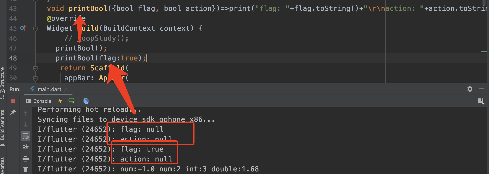
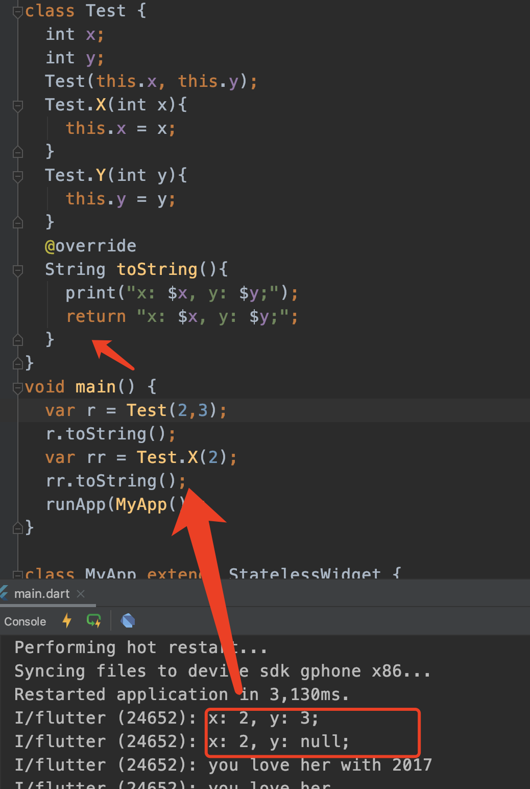
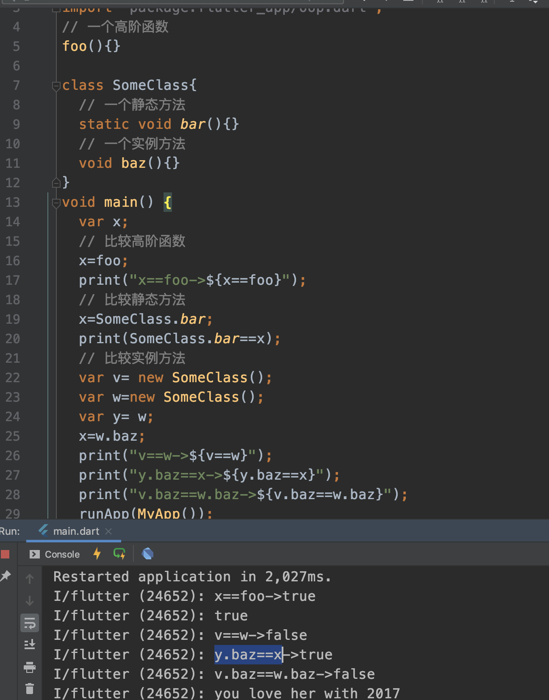

# Dart 基础\_方法函数

## 函数的构成

`返回值类型`+`方法名`+`参数`

- `返回值类型`: 可缺省，也可以为`void`或具体类型
- `方法名`: 匿名方法不需要方法名
- `参数`: 参数类型和参数名，参数类型可缺省，另外参数又分为可选参数与参数默认值

### 有哪些方法

- 构造方法
- 实例方法
- setters 和 getters
- 静态方法
- 抽象方法
- 私有方法
- 匿名方法
- 泛型方法

### 大致类型

- 普通函数
  - 指定返回值类型的函数
    - var
    - Object
    - dynamic
  - 不指定返回值类型的函数
  - 函数的简写
  - 可选参数
  - 关于重载
  - 作用域
  - 闭包
- 高阶函数
- `main()`函数

### 指定返回值类型的函数

```dart
void printDynamicParams(dynamic params){
  print(params);
}
```

> tips: 没有指定类型的参数可以用`var`, `dynamic`, `Object`来指定

#### `var`, `dynamic`, `Object`的区别：

> var: 本身并不是一种类型，只有在变量赋值的那一刻，决定了他是什么类型。

```dart
var a = 1;
a="adf"; // err
```

> Object 之所以能够被赋值为任意类型，那是因为所以类都派生自 Object

```dart
object a = 1;
a="testString"; // ok
```

> dynamic 不是在编译时确定实际类型，而是在运行时

```dart
dynamic a = "test";
a++; // err
```

### 不指定返回值类型的函数

当不指定返回值类型的时候，还是返回值类型默认为 Object,也就是说可以 return 任何类型
当没有返回值时，函数默认返回`null`;

```dart
printReturnObjectParams(Object params){
  print(params);
  return params;
}
printObjectParams(Object params){
  print(params);
}
```

### 函数的简写

这种写法只适合无返回值，且函数体中仅有一个表达式的函数

```dart
// num 是一个数值类型，仅支持int和double类型
void printNumber(num number)=>print(number);
```

### 可选参数

一个函数可以有两种参数，可选和必须的。必须的放前面，可选的放后面。
可选参数可以是位置参数或命名参数，两种都可以有默认值，如果没有提供默认值则为 null。

#### 1. 可选的命名参数

定义一个函数，使用`{param1, param2, ...}`指定命名参数，调用函数时，可以指定使用命名参数 `paramName: value`;

> 无默认值例子

```dart
void printBool({bool flag, bool action})=>print("flag: "+flag.toString()+"\r\naction: "+action.toString()+"\r\n");
```

> 有默认值（命名参数使用`:`指定默认值）

```dart
void printDefaultBool({bool flag: false})=>print(flag);
```



#### 2. 可选的位置参数

把参数用`[]`包装起来，就能识别成位置参数

```dart
// 无默认值参数
String msg(String msg, [String time]){
  if(time !=null){
    return "$msg with $time";
  }
  return msg;
}
// 可选位置参数：有默认值
String msgTwo(String msg, [String time="2018", String name]){
  if(time ==null){
    return "$msg from name";
  }
  if(name == null){
    return "$msg with $time";
  }
  return "$msg with $time from $name";
}
print(msg("you love her", "2017"));
print(msg("you love her"));
print(msgTwo("you love her", null, "Bob"));
print(msgTwo("you love her", "2019", "Bob"));
print(msgTwo("you love her"));
```

> 总结：可选的命名参数声明使用`{}`，用`:`指定默认值，可选的位置函数声明使用`[]`，用`=`指定默认值。

### 重载

dart 是不支持重载的，可以用命名构造函数

```dart
class Test {
  int x;
  int y;
  Test();
  Test.X(int x){
    this.x = x;
  }
  Test.Y(int y){
    this.y = y;
  }
  @override
  String toString(){
    return "x: $x, y: $y;";
  }
}
main(List<String> arguments){
  Test testX = new Test.X(1);
  print(testX.toString());
  Test testY = new Test.Y(2);
  print(testY.toString());
}
```



### 高级函数

将函数作为参数传递给另一个函数或将函数作为参数的函数称为高级函数

```dart
printElement(element){
  print(element);
}
main(List<String> argument){
  var list = [1,2,3];
  // 这里的forEach方法就是匿名方法
  list.forEach(printElement);
}
// or
main(List<String> argument){
  var loudify = (msg)=>"!!!${msg.toUpperCase()}!!!";
  assert(loudify("hello")=="!!!HELLO!!!"); // 断言函数 false 时停止执行
}
```

### 作用域

```dart
bool test = true;
main(List<String> arguments){
  bool test1=true;
  myFunction(){
    bool test2= true;
    needFunction(){
      bool test3 = true;
      assert(test);
      assert(test1);
      assert(test2);
      assert(test3);
    }
  }
}
```

### 闭包

dart 闭包和 JavaScript 一样，其实就是一个函数对象。

```dart
// 返回一个函数对象
Function makeAdder(num addBy){
  return (num i)=>addBy+i;
}

main(List<String> arguments){
  var add2 = makeAdder(2);
  var add4 = makeAdder(4);
  assert(add2(3)==5); // 2+3
  assert(add4(3)==7); // 4+3
}
```

### 函数是否相等

测试高阶函数、静态方法和实例方法是否相等

```dart
// 一个高阶函数
foo(){};

class SomeClass{
  // 一个静态方法
  static void bar(){};
  // 一个实例方法
  void baz(){}
}
main(List<String> arguments){
  var x;
  // 比较高阶函数
  x=foo;
  print(x==foo);
  // 比较静态方法
  x=SomeClass.bar;
  print(SomeClass.bar==x);
  // 比较实例方法
  var v= new SomeClass();
  var w=new SomeClass();
  var y= w;
  x=w.baz;
  print(v==w);
  print(y.baz==x);
  print(v.baz==w.baz);
}
```



### main()

main()就是入口方法
