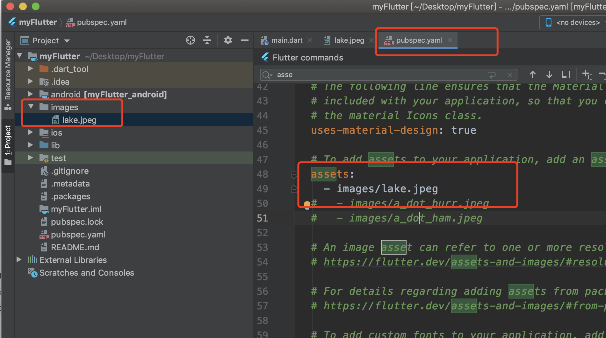
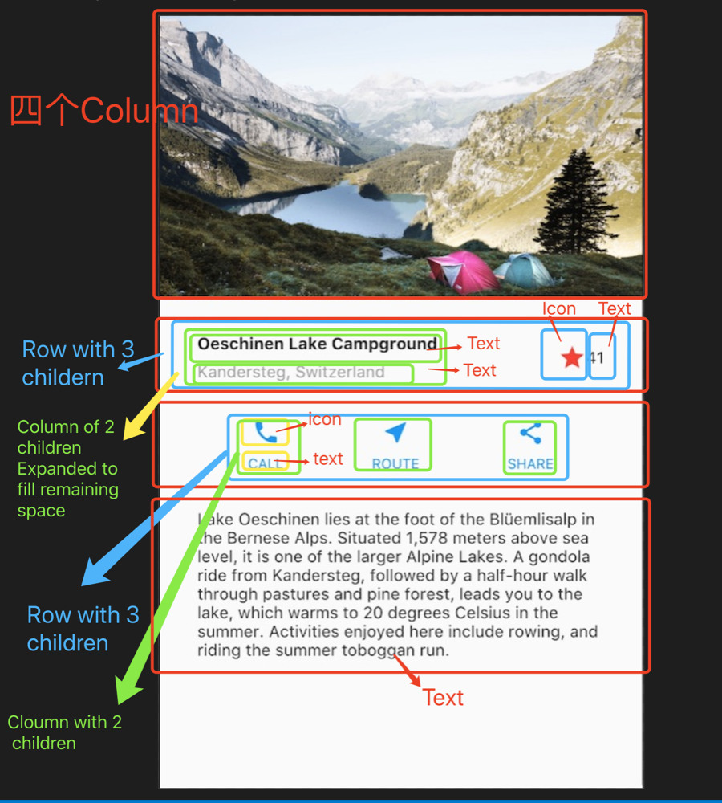

# Flutter 基础\_常用布局控件

[官网 Flutter 布局控件](https://flutterchina.club/widgets/widgetindex/)

## 基本常识

- 通过`Container`的`padding`属性设置`EdgeInsets`内边距，`margin`来设置外边距
- 当需要圆角的时候，可以在`Container`的`decoration`中设置`BoxDecoration`来添加，在`BoxDecoration.borderRadius`属性中设置圆角
- 通过`Expanded`来实现 H5 中 Flexd 布局
- 通过`crossAxisAlignment`来设置 android 中的`Gravity`，也就是内容位置

### 用 Row 布局 flex 调整 Row 子组件占比

```dart
body: new Center(
  child: new Row(
    crossAxisAlignment: CrossAxisAlignment.center,
    children: [
      new Expanded(
        child: new Image.asset("images/pic1.jpg")
      ),
      new Expanded(
        flex: 2,
        child: new Image.asset("images/pic2.jpg")
      ),
      new Expanded(
        child: new Image.asset("images/pic3.jpg")
      )
    ]
  )
)
```

### 控件层叠`Stack`

```dart
class _MyHomePageState extends State<MyHomePage>{
  @override
  Widget build(BuildContext context){
    var stack = new Stack( // 创建Stack Widget
      alignment: const Alignment(0.6, 0.6),
      children: [
        new CircleAvatar( // 图形头像的控件
          backgroundImage: new AssetImage("images/pic.jpg"),
          radius: 100.0, // 图片的圆角
        ),
        new Container(
          decoration: new BoxDecoration(
            color: Colors.black45, // Container背景颜色
          ),
          child: new Text(
            "Bob",
            style: new TextStyle(
              fontSize: 20,
              fontWeight: FontWeight.bold,
              color: Colors.white,
            )
          )
        )
      ]
    );
  }
}
```

### GridView

使用`GridView`将 Widget 放置为二维列表，`GridView`提供两个预制 list， 或自定义网格，当`GridView`检测到其内容太长而不适合渲染框时，会自动滚动。

```dart
import "package:flutter/material.dart";

void main() => runApp(MyApp());

class MyApp extends StatelessWidget {
  List<String> findthenum(){
    List<String> items=[];
    for(int kk=0;kk< 30;kk++){
      items.add("$kk");
    }
    return items;
  }
  MyApp({Key key, @required findthenum()}) : super(key: key);

  // This widget is the root of your application.
  @override
  Widget build(BuildContext context) {
    return MaterialApp(
      title: 'Flutter Demo',
      theme: ThemeData(
        primarySwatch: Colors.blue,
      ),
      home: Scaffold(
        appBar: AppBar(
          title: Text('List View Vertical'),
        ),
        body: GridView.count(
          crossAxisCount: 2,
          mainAxisSpacing:0.0,
            crossAxisSpacing:0.0,
          children: findthenum().map((text) {
            return new Container(
              margin: new EdgeInsets.all(5),
              decoration: new BoxDecoration(
                  color: Colors.red.shade50,
              ),
              child: Center(
                child: Image.asset(
                  "images/lake.jpeg",
                )
              )
            );
          }).toList(),
        ),
      ),
    );
  }
}
```

## 具体案例

ui 图


### 0. 设置

1. 确保 Flutter 环境正常
2. 添加图片

- 在工程目录创建一个`image`文件
- 添加`lake.jpg`(wget 不能保存二进制文件)
- 更新`pubspec.yaml`文件以包含`assets`标签，这样才能在代码中引用图片

### 1. 绘制布局图

对于 Flutter 而言，所有可见的都是`Widget`。即使是全新的页面，也是一个`Widget`。
Flutter 布局基本都是通过`Row`、`Column`来实现的。思想类似于 HTML 里的`Div`。

- Row/Columnn: 实现页面中的一块控件
- Container: 控制控件的内外边距
- Expanded: 实现类似于 Flex 的功能，用于分配控件空间
  

#### 如何布局

- 找出行和列
- 布局包含网格吗
- 有重叠的元素吗
- 是否需要选项卡
- 注意需要对齐、填充和边框的区域
  > 一旦页面复杂，小控件会比较多，嵌套层级会非常深，所以 Flutter 官方推荐奖子控件通过函数返回，或创建一个 Widget 类来实现


第二行的第一个子项，列，包含了 2 行文字，占用了大量空间，所以必须包装在`Expanded widget`中。

### 2. 最终实现

```dart
import "package:flutter/material.dart";
void main()=>runApp(MyApp());

class MyApp extends StatelessWidget{
  @override
  Widget build(BuildContext context) {
    Widget titleSection = new Container(
      padding: const EdgeInsets.all(32.0),
      child: new Row(
        children: [
          new Expanded(
              child: new Column(
                crossAxisAlignment: CrossAxisAlignment.start,
                children: [
                  new Container(
                    padding: const EdgeInsets.only(bottom: 8.0),
                    child: new Text(
                      "this is title",
                      style: new TextStyle(
                        fontWeight: FontWeight.bold,
                      )
                    )
                  ),
                  new Text(
                    "this is substance",
                    style: new TextStyle(
                      color: Colors.grey[500],
                    )
                  )
                ],
              )
          ),
          new Icon(
            Icons.star,
            color: Colors.red[500],
          ),
          new Text("34")
        ],
      ),
    );
  // 为了最大限度的减少深度嵌套布局代码的视觉混淆，将一些实现放置在变量和函数中
  //  声明一个名字为buildButtonColumn的函数，此函数返回Column对象
    Column buildButtonColumn(IconData icon, String label){
      Color color = Theme.of(context).primaryColor;
      return Column(
        mainAxisSize: MainAxisSize.min,
        mainAxisAlignment: MainAxisAlignment.center,
        children: [
          Icon(icon, color: color,),
          Container(
            margin: const EdgeInsets.only(top: 8.0),
            child: Text(
              label,
              style: TextStyle(
                fontSize: 12.0,
                fontWeight: FontWeight.w400,
                color: color,
              ),
            )
          )
        ],
      );
    }
    // 利用上面的函数【buildButtonColumn】，来组件第三行代码
    Widget buttonSection = Container(
      child: Row(
        mainAxisAlignment: MainAxisAlignment.spaceEvenly, // 将控件平均分配给子控件，如果子控件中有Expanded,就会以 Expanded 子控件为主，mainAxisAlignment将会失效
        children: [
          buildButtonColumn(Icons.call, "CALL"),
          buildButtonColumn(Icons.near_me, "ROUTE"),
          buildButtonColumn(Icons.share, "SHARE")
        ],
      ),
    );
    Widget bigTextSection = Container(
      padding: const EdgeInsets.all(32.0),
      child: Text("asdfasddfasfasdfasddfasfasdfasddfasfasdfasddfasfasdfasddfasfasdfasddfasfasdfasddfasfasdfasddfasfasdfasddfasfasdfasddfasf",
        softWrap: true,
      ),
    );
    return MaterialApp(
      title: "Layout Dome",
      home: Scaffold(
          body: ListView(
            children: [
              Image.asset(
                "images/lake.jpeg",
                width: 600.0,
                height: 240.0,
                fit: BoxFit.cover,
              ),
              titleSection,
              buttonSection,
              bigTextSection,
            ],
          )
      )
    );
  }
}
```
