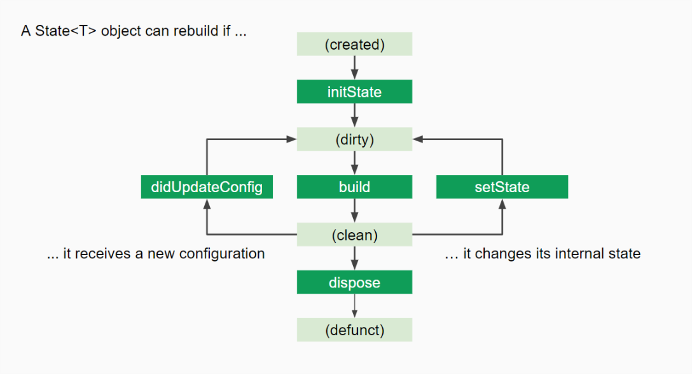
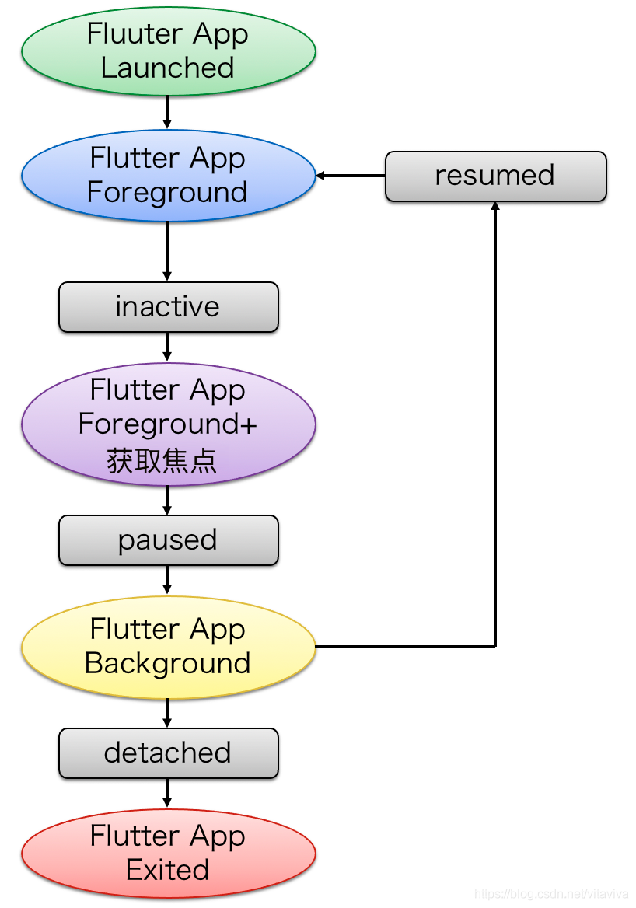

# Flutter 基础\_生命周期

## Widget



```s
create widget
构造函数
initState
didChangeDependencies
build
|-render tree  -> remove widget ->deactive -> dispose -> over
| didUpdateWidget
|-build

// app切都后台再切回前台
inactive
paused
inactive
resumed
```

### 1, 创建 wedget 到显示，打印结果

```
: initState
: didChangeDependencies
: build
```

### 2, 退出这个页面执行

```
: deactivate
: dispose
```

### 3, 点击热重载按钮

```
: reassemble
: didUpdateWidget
: build
```

### 4, app 由显示到切换后台（home 状态）

```
: AppLifecycleState.inactive
: AppLifecycleState.paused
```

### 5, App 由后台切回到前台

```
: AppLifecycleState.inactive
: AppLifecycleState.resumed
```

### Flutter 页面生命周期实战指南

### StatelessWidget 只有 createElement, build 两个生命周期方法

### StatefullWidget 生命周期

#### 1，初始化时期

createState, initState

#### 2，更新期间

didChangeDependencies, build, didUpdateWidget

#### 3，销毁期

deactivate, dispose

```dart
// stful + enter 快速搭建一个dart结构文件
// 引入依赖  option+enter
import 'package:flutter/material.dart';
class WidgetLifecycle extends StatefulWidget {
    @override
    _WidgetLifecycleState createState()=> _WidgetLifecycleState();
}
class _WidgetLifecycleStateState extends State<WidgetLifecycleState> {
  int _count = 0;
  @override
  // 做初始化工作(channel初始化，监听器的初始化等)
  void initState(){
    print('-----initState----');
    super.initState();
  }
  // 当依赖的state对象改变时会调用
  // 1, 在initState()之后立即调用
  // 2, 如果StatefullWidgets依赖于InheritedWidget，那么当前State所依赖的InheritedWidget中的变量改变时会再次调用
  @override
  void didChangeDependencies(){
    print('----didChangeDependencies----');
    super.didChangeDependencies();
  }
  // 在didChangeDependencies()之后立即调用；
  // 另外在调用setState后也会再次调用该方法；
  @override
  Widget build(BuildContext context){
    print('----build----');
    return Scaffold(
      appBar: AppBar(
        title: Text('Flutter页面生命周期'),
        leading: BackButton(),
      ),
      body: Center(
        child: Column(
          children: <Widget>[
            RaisedButton(
              onPressed: (){
                setState((){
                  _count += 1;
                });
              },
              child: Text(
                "点我",
                style: TextStyle(fontSize: 26),
              ),
            ),
            Text(_count.toString()),
          ],
        ),
      ),
    );
  }
  // command + n  重写方法  搜索到想重写的方法
  // 很少使用，当父组件需要重新绘制的时候才调用
  void didUpdateWidget(WidgetLifecycle oldWidget){
      print('--------didUpdateWidget------');
      super.didiUpdateWidget(oldWidget);
      // if(oldWidget.xxx != widget.xxx) ....
  }
  // 很少使用，当组件被移除时调用在dispose之前调用
  @override
  void deactivate(){
      print('----------deactivate---------');
      super.deactivate();
  }
  // 常用，组件被销毁时调用
  // 通常在该方法中执行一些资源的释放：监听器的卸载，channel的销毁等
  @override
  void dispose(){
    print('----dispose----');
    super.dispose();
  }
}
```

## App 生命周期



```dart
// 用WidgetsBindingObserver来获取Flutter应用维度的生命周期
import 'package:flutter/material.dart';
class AppLifeCycle extends StatefulWidget{
    @override
    _AppLifeCycleState createState()=>_AppLifeCycleState();
}
class _AppLifeCycleState extends State<AppLifeCycle> with WidgetsBindingObserver{
    @override
    void initState(){
        WidgetsBinding.instance.addObserver(this);
        super.initState();
    }
    @override
    Widget build(BuildContext context){
        return Scaffold(
            appBar: AppBar(
                title: Text('Flutter应用生命周期'),
                leading: BackButton(),
            ),
            body: Container(
                child: Text('Flutter应用生命周期'),
            )
        );
    }
    @override
    void didChangeAppLifecycleState(AppLifecycleState state){
        super.didChangeAppLifecyclesState(state);
        print('state = $state');
        if(state == AppLifecycleState.paused){
          print('App进入后台');
        } else if(state ==AppLifecycleState.resumed){
          print('App进入前台');
        } else if(state == AppLifecycleState.inactive){
          // 不常用：应用处于非活动状态，并且未接收到用户输入时调用，比如： 打电话
        } else if(state == AppLifecycleState.suspending){
          // 不常用，ios不会触发，应用被挂起的时候触发
        }
    }
    @override
    void dispose(){
        WidgetsBinding.instance.removeObserver(this);
        super.dispose();
    }
}
```
