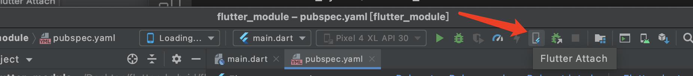
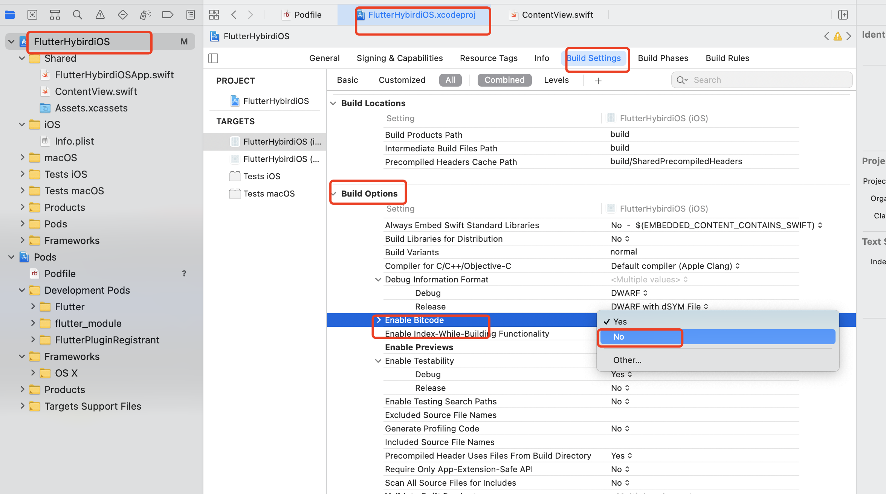
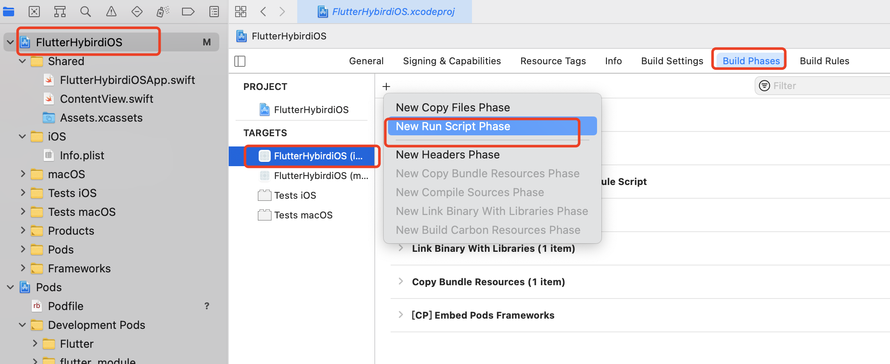

# 混合开发 Android

- 页面级的混合开发
- 模块的混合开发

## 项目运行

- 安装和配置 Flutter 开发环境
- 首先在`flutter_hybrid > flutter_module`目录下运行`flutter packages get`;
- 运行在 iOS 上的方式
  - 在`flutter_hybrid-> FlutterHybridiOS`目录下运行`pod install`;
  - 用 Xcode 打开`FlutterHybridiOS.xcworkspace`然后运行项目；
- 运行 Android 上的方式
  - 用`Android Studio`打开`flutter_hybrid->FlutterHybridAndroid`然后运行项目；

## Flutter 集成步骤

- 创建`Flutter module`
- 添加`Flutter module`
- 在`Java/Object-c`中调用`Flutter module`
- 编写 Dart 代码
- 运行项目
- 热重启/热加载
- 调试 Dart 代码
- 发布应用

## 创建`Flutter module`

在做混合开发前，我们首先需要创建一个`Flutter module`  
假如 Native 项目是`xxx/flutter_hybrid/native项目`

```shell
cd xxx/flutter_hybrid/
flutter create -t module flutter_module[模块名]
```

上面代码会切换到你的 Android/iOS 项目的上一级目录，并创建一个 flutter 模块。

```ls
// flutter_module/
.android // 隐藏文件   flutter_module的Android宿主工程
.gitignore
.idea
.ios  // 隐藏文件      flutter_module的iOS宿主工程
.metadata
.packages
build
flutter_module_android.iml
flutter_module.iml
lib  // flutter_module的Dart部分代码
pubspec.lock
pubspec.yaml   // flutter_module的项目依赖配置文件
README.md
test
```

> 因为宿主工程的存在，`flutter_module`在不加额外配置的情况下是可以独立运行的

## android 混合开发

### 为 android 项目添加 flutter 依赖

- 1. 在 flutter_module 同级目录下添加`FlutterHybridAndroid`项目依赖
- 2. 设置 Android 项目下的`Gradle Scripts`里的`settings.gradle`和`build.gradle`

```java
// settings.gradle
// 让flutter做单独的模块
include ':app'
rootProject.name = "FlutterHybridAndroid"
setBinding(new Binding([gradle: this]))
evaluate(new File(
        settingsDir.parentFile,
        'flutter_module/.android/include_flutter.groovy'
))
include ':flutter_module'
project(':flutter_module').projectDir = new File('../flutter_module')
// build.gradle  添加依赖
dependencies {
  ...
  implementation project(':flutter')
}
// 在settings.gradle下 async
```

### 在 Java 中调用 Flutter module 模块

在 Java 中调用 Flutter 模块有两种方式

- 使用`Flutter.createView`API 的方式
- 使用`FlutterFragment`的方式

### Flutter.createView

```java
// FlutterHybridAndroid/app/src/main/java/some/package/MainActivity.java
fab.setOnClickListener(new View.OnlickListener(){
  @override
  public void onClick(View view){
    View flutterView = Flutter.createView(
      MainActivity.this,
      getLifecycle(),
      "route1",
    );
    FrameLayoutt.LayoutParams layout = new FrameLayout.LayoutParams(600,800);
    layout.leftMargin = 100;
    layout.topMarginn = 200;
    addContentView(fluterView, layout);
  }
})
```

### FlutterFragment

```java
// FlutterHybridAndroid/app/src/main/java/some/package/SomeAcivity.java
findViewById(R.id.test).setOnClickListener(new View.OnClickListener(){
    @Override
    public void onClick(View view){
        FragmentTransaction tx = getSupportFragmentManager().beginTransaction();
        FlutterFragment fragment = FlutterFragment.withNewEngine().initialRoute("{name:'devio',dataList:['aa','bb','cc']}").build();
        tx.replace(R.id.someContainer, fragment);
        tx.commit(); // fragment创建及替换
    }
});
```

```dart
// 用window去读取参数
void main() => runApp(MyApp(initParams: window.defaultRouteName));
```

### 热重启/重新加载

- 打开一个模拟器，或连接一个设备到电脑上
- 关闭 APP，然后运行`flutter attach`
- android studio restart app
- app 调起 Flutter, R 热重启， r 热加载，h 获取帮助，d 断开连接

```shell
# flutter attach -d 'emulator-5554'  // 在多个设备里找到某一个设备  -d 获取id
cd flutter_hybrid/flutter_module
flutter attach
```

### 调试 Dart 代码

- 关闭 App
- 点击 AndroidStudio 的`Flutter Attach`按钮（需要首先安装 Flutter 与 Dart 插件）
- 启动 APP
  

### 发布应用

- 签名打包
- 发布到 store

### 1. 生成证书用于 APP 签名

### 2. 设置 gradle 变量

- 将签名证书 copy 到`android/app`目录下
- 编辑`~/.gradle/gradle.properties`或`../android/gradle.properties`(一个是全局的，一个是项目的)

```s
# gradle.properties
MYAPP_RELEASE_KEY_ALIAS=android_keystore # your keystore alias
MYAPP_RELEASE_KEY_PASSWORD=123456
MYAPP_RELEASE_STORE_PASSWORD=123456
# android_keystore.jks 放在./app/android_keystore.jks
MYAPP_RELEASE_STORE_FILE=android_keystore.jks # your keystore filename
```

### 3. 在 gradle 配置文件中添加签名配置

```java
// android/app/build.gradle
android {
  ...
  defaultConfig {...}
  signingConfigs {
      release {
          storeFile file(MYAPP_RELEASE_STORE_FILE)
          storePassword MYAPP_RELEASE_STORE_PASSWORD
          keyAlias MYAPP_RELEASE_KEY_ALIAS
          keyPassword MYAPP_RELEASE_KEY_PASSWORD
      }
  }
  buildTypes {
      release {
          minifyEnabled false
          proguardFiles getDefaultProguardFile('proguard-android-optimize.txt'), 'proguard-rules.pro'
          signingConfig signingConfigs.release
      }
  }
  ...
}
```

### 4. 签名打包 APK

terminal 进入项目下的 android 目录，运行如下代码：

```
./gradlew assembleRelease
```

签名打包成功后，会在`android/app/build/outputs/apk`目录下看到签名成功后的`app-release.apk`文件。
Tips: 如果需要多 apk 进行混淆打包，编辑 android/app/build.gradle:

```
def enableProguardInReleaseBuilds = true
```

## ios 混合开发

### 为 iOS 项目添加 flutter 依赖

#### 在 Podfile 文件中添加 flutter 依赖

- 如果 ios 项目中没有`Podfile`文件，则`pod init`添加

```shell
## Podfile
# Uncomment the next line to define a global platform for your project
# platform :ios, '9.0'
flutter_application_path="../flutter_module"
load File.join(flutter_application_path, ".ios", "Flutter", "podhelper.rb")
target 'FlutterHybirdiOS (iOS)' do
  # Comment the next line if you don't want to use dynamic frameworks
  # use_frameworks!

  # Pods for FlutterHybirdiOS (iOS)
  install_all_flutter_pods(flutter_application_path)
end

target 'FlutterHybirdiOS (macOS)' do
  # Comment the next line if you don't want to use dynamic frameworks
  use_frameworks!

  # Pods for FlutterHybirdiOS (macOS)

end
```

- 添加好依赖 `pod install`
- 打开`.xcworkspace`后缀的 iOS 项目
- 当`flutter_module/pubspec.yaml`添加一个 Flutter 插件时，除了在 flutter 模块下运行`flutter packages get`，还需要在 iOS 项目下运行`pod install`
- 禁用 Xcode 的`Bitcode`
  
- 添加`build phase`以构建 Dart 代码
  
  - shell 脚本
  ```shell
  "$FLUTTER_ROOT/packages/flutter_tools/bin/xcode_backend.sh" buiObject-cld
  "$FLUTTER_ROOT/packages/flutter_tools/bin/xcode_backend.sh" embed
  ```
- build 成功说明依赖添加成功

## 在 Objec-c 中调用 Flutter 模块的两种方法

- 直接使用`FlutterViewController`
- 使用 FlutterEngine 的方法
