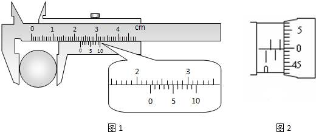
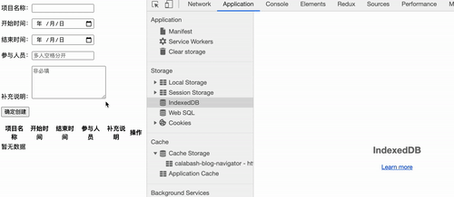

# 浅谈IndexDB：浏览器本地数据库数据存储
* Web SQL Database【多个浏览器已然不支持】
* IndexDB是非关系型数据库
## 数据库的一些概念
### 1. 关系型数据库与非关系型数据库
- 关系型数据库 [更稳重]
* 对一致性要求严格，例如要写100个数据，前99个成功，最后一个失败了，此时事务会回滚到最初状态，这样保证事务结束和开始存储数据处于一致状态。这样的特性非常适合银行这种对数据一致性要求非常高的场景，但同时也牺牲了一部分性能。
- 非关系型数据库 [更灵活]
* 对一致性要求不高，对性能要求偏高【读写频繁】
* 非关系型数据库的数据结构不固定，容易扩展
### 2. 数据库中的事务 - transaction
数据库的事务(transition)，我们可以理解为对数据库的操作，而且专指一个序列上的操作。
eg: 银行转账：一个账户少了钱然后另一个账户钱多了，这两个操作要么都执行，要么都不执行。像这种操作可看成一个事务。
事务的提出主要是为了保证并发情况下保持数据一致性。

关系型数据库中的事务具有下面4个基本特征【ACID特性】：
1. 原子性(Atomicity): 事务中的所有操作作为一个整体提交或回滚；
2. 一致性(Consistemcy): 事务完成时，数据必须是一致的，以保证数据的无损；
3. 隔离性(Isolation): 对数据进行修改的多个事务是彼此隔离的；
4. 持久化(Durability): 事务完成后，它对系统的影响是永久的，该修改即使出现系统故障也将一直保留
### 3. 了解数据库中的游标 - cursor
现实世界的游标卡尺，有刻度，有区域：

数据库中的游标其实也相似。内存条本质上就像一把尺子，我们可以想象上面有很多刻度，然后内存大小就是由这些刻度一个一个堆砌起来的。数据库的事务为了保证数据可以回滚，显然需要一片内存区域存放即将受影响的数据，这个内存区域中的虚表就是数据库的“游标”。
和现实世界的游标卡尺相映射的是：一个刻度表示一行数据，游标就是尺子上的一片区域，想要获取数据库一行一行数据，可以遍历这个游标就好
### 4. 数据库中的锁 - lock
数据库中的“锁”是保证高并发时数据的一致性的一种机制。也就是执行多线程时用于强制限制资源访问。

## 实例：
~~~
// html
<form id="form">
  
项目名称：<input required name="name" type="text" autocomplete="off">
 
  
开始时间：<input required name="begin" type="date">
 
  
结束时间：<input required name="end" type="date">
 
  
参与人员：<input required name="person" type="text" autocomplete="off" placeholder="多人空格分开">
 
  
补充说明：<textarea rows="5" placeholder="非必填" name="remark"></textarea>
 
  
<input type="submit" value="确定创建">

</form>

  <table>
    <thead>
      <tr>
        <th>项目名称</th>
        <th>开始时间</th>
        <th>结束时间</th>
        <th>参与人员</th>
        <th>补充说明</th>
        <th width="30">操作</th>
      </tr>
    </thead>
    <tbody>
    </tbody>
  </table>
  

    加载中...
  

<!-- 列表数据模板 -->
  
<!-- js代码 -->

~~~

