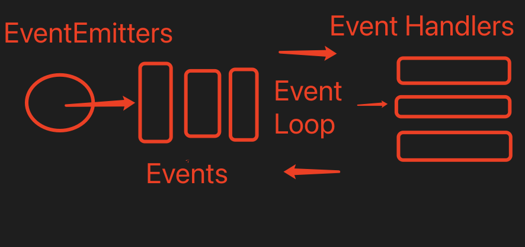
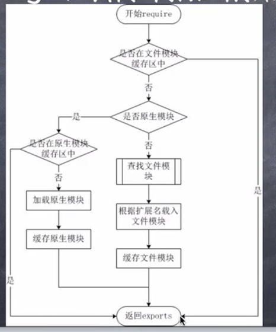

# nodejs 入门

## 什么是 Node.js

- Node.js 的本质是 JavaScript 解析器
- Node.js 是 JavaScript 的运行环境
- Node.js 是一个服务器程序
- Node.js 本身使用 V8 引擎
- Node.js 不是 Web 服务器

### 为什么使用 nodejs

- 为提供高性能的 web 服务
- IO 性能强大
- 事件处理机制完善
- 天然能够处理 DOM
- 社区活跃，生态日趋完善

### nodejs 优势

- 处理大流量数据
- 适合实时交互的应用
- 完美支持对象数据库
- 异步处理大量并发连接

```js
const http = require("http");
http
  .createServer(function(req, res) {
    res.writeHead(200, { "content-type": "text/plan" });
    res.write("hello world");
    res.end();
  })
  .listen(8000);
console.log(111);
```

### Nodejs REPL（交互式解释器） 环境

node
常用命令

- `.help`
- `.exit`
- `.clear`
- `.save`
- `.load` .load ./server.js

### npm

- `npm search express -g`
- `npm help xxx`

## node 回调机制

- 什么是回调
- 阻塞和非阻塞
- node 回调

### 什么是回调

- 函数调用方式分为三类：同步调用、回调和异步调用
- 回调是一种双向调用模式
- 可以通过回调函数来实现回调

### 阻塞和非阻塞

- 阻塞和非阻塞关注的是程序在等待调用结果（消息，返回值）时的状态
- 阻塞就是做不完不准回来
- 非阻塞就是你先做，我先看看有其他事没有，完了告诉我一声

```js
// 阻塞
var fs = require("fs");
var data = fs.readFileSync("data.txt");
console.log(data.toString());
// 非阻塞
var fs = require("fs");
fs.readFile("data.txt", function(err, data) {
  // 匿名函数
  if (err) {
    return console.error(err);
  }
  // 回调
  console.log(data.toString()); // 后
});
console.log("代码执行完毕"); // 先

var fs = require("fs");
const p = new Promise((resolve, reject) => {
  fs.readFile("./index.html", (err, fd) => {
    if (err) {
      reject(err);
    }
    resolve(fd.toString());
  });
});
p.then((data) => {
  return data.substring(20);
}).then((data) => {
  console.log(data);
});
```

## Nodejs 事件驱动机制

### 事件驱动模型



- nodejs 的 api 是异步执行，依据观察者模式实现的

### 事件与事件绑定

```js
// 引入events对象，创建eventEmitter对象
var events = require("events");
var eventEmitter = new events.EventEmitter();
// 绑定事件处理程序
var connectHandler = () => {
  console.log("connected 被调用");
};
eventEmitter.on("connection", connectHandler);
// 触发事件
eventEmitter.emit("connection");
```

## Nodejs 模块化

### 模块化的概念和意义

- 为了让 Nodejs 的文件可以相互调用，Nodejs 提供了一个简单的模块系统
- 模块是 Nodejs 应用程序的基本组成部分
- 文件和模块是一一对应的，一个 Nodejs 文件就是一个模块
- 这个文件可能是 JavaScript 代码，Json 或编译过的 C/C++扩展
- Nodejs 中存在 4 类模块（原生模块和 3 种文件模块）

### Nodejs 的模块加载流程



- 1. 从文件模块缓存中加载
- 2. 从原生模块加载
- 3. 从文件加载

### 模块化代码案例

```js
// hello.js
function Hello() {
  var name;
  this.setName = function(argName) {
    name = argName;
  };
  this.sayHello = function() {
    console.log("hello" + name);
  };
}
module.exports = Hello;
// main.js
var Hello = require("./hello");
hello = new Hello();
hello.setName("333");
hello.sayHello();
```

## Nodejs 函数

```js
function say(word) {
  console.log(word);
}
function execute(someFunction, value) {
  someFunction(value);
}
// 回调函数
execute(say, "hello world!");
// 匿名函数 没有函数名
execute(function(word) {
  console.log(word);
}, "Hello");
```

## nodejs 路由

```js
var url = require("url");
var querystring = require("querystring");
//localhost:8888/start?foo=bar&hello=world
url.parse(string).pathname; // start controller
url.parse(string).query; // foo=bar&hello=world
querystring.parse(queryString)["foo"]; // bar
querystring.parse(queryString)["hello"]; // world
```

```js
// http.js
var http = require("http");
var url = require("url");
function start(route) {
  function onRequest(request, response) {
    var pathname = url.parse(request.url).pathname;
    console.log("request for " + pathname + " received.");
    route(pathname, response);
  }
  http.createServer(onRequest).listen(8888);
  console.log("server has start");
}
exports.start = start;
// router.js
function route(pathname, response) {
  console.log("about to route a request for " + pathname);
  if (pathname === "/") {
    response.writeHead(200, { "Context-Type": "text/plain" });
    response.write("Hello world");
    response.end();
  } else if (pathname === "/config") {
    response.end("index");
  }
}
exports.route = route;
// app.js
var server = require("./http");
var router = require("./router");
server.start(router.route);
```

### get/post 请求

```js
var http = require("http");
var url = require("url");
var util = require("util");
function onRequest(request, response) {
  response.writeHead(200, { "context-type": "text/plain" });
  // util.inspect 展示请求信息
  response.end(util.inspect(url.parse(request.url, true)));
}
http.createServer(onRequest).listen(8888);
console.log("server has start");
```

#### post

```js
var http = require("http");
var querystring = require("querystring");
var util = require("util");
http
  .createServer(function(request, response) {
    var post = "";
    request.on("data", function(chunk) {
      post += chunk;
    });
    request.on("end", function() {
      post = querystring.parse(post);
      response.end(util.inspect(post));
    });
  })
  .listen(3000);
```

## 全局变量

### `__filename`

表示当前正在执行的脚本文件名，输出文件所在位置的绝对路径，且和命令行参数所指定的文件名不一定相同，如果在模块中，返回的值是模块文件的路径

### `__dirname`

表示当前执行脚本所在的目录

### setTimeout / clearTimeout / setInterval/clearInterval

### console

- `console.trace(message[,...])`当前执行代码在堆栈中的调用路径

```js
var counter = 10;
console.log("计数：", counter);
console.time("获取数据");
// ....
console.timeEnd("获取数据");
console.info("程序执行完毕");
// 内存信息
console.memory;
```

### process

process 是全局变量，即 global 对象属性  
它用于描述当前 nodejs 进程状态的对象，提供了一个与操作系统的简单接口。

- exit 当进程准备退出是触发
- beforeExit 当 node 清空事件循环，并没有其他安排的时候触发。通常来说，当没有进程安排时 node 退出，但 beforeExit 的监听器可以异步调用，这样 node 就会继续执行
- uncaughtException 当一个异常冒泡回到事件循环，触发这个事件。如果给异常添加了监听器，默认的操作（打印堆栈跟踪信息并退出）就不会发生
- Signal 事件 当进程收到信号时触发，信号列表详见标准的 POSIX 信号名，如 SIGNT, SIGUSR1 等

```js
process.on("exit", function(code) {
  setTimeout(function() {
    console.log("该段代码永远不会执行");
  }, 0);
  console.log("退出码为: ", code);
});
console.log("程序执行完毕");
```

```js
// 输出到终端
process.stdout.write("hello world！\n");
// 通过参数读取
process.argv.forEach(function(val, index, array) {
  console.log(index + ":" + val);
});
// 获取执行路径
console.log(process.execPath);
// 平台信息
console.log(process.platform);

// 输出当前目录
console.log("当前目录: ", process.cwd());
// 输出当前版本
console.log("当前版本: ", process.version);
// 输出内存使用情况
console.log("当前内存使用情况: ", process.memoryUsage());
```

## 文件系统

Nodejs 提供 一组类似 UNIX（POSIX）标准的文件操作 API.Node 导入文件系统模块(fs)语法

```js
var fs = require("fs");
```

### `fs.readFile()`异步读取，`fs.readFileSync()`同步读取

```js
var fs = require("fs");
// 异步读取
fs.readFile("input.txt", function(err, data) {
  if (err) {
    return console.err(err);
  }
  console.log("异步读取: " + data.toString());
});
// 同步读取
var data = fs.readFileSync("input.txt");
console.log("同步读取：" + data.toString());
console.log("程序执行完毕");
```

### `fs.open(path, flags[, mode], callback)`

- path 路径
- flags 文件打开的行为
  - r+ 以读写模式打开文件，如果文件不存在，抛出异常
- mode 设置文件模式（权限），文件创建的默认权限为 0666(可读，可写)
- callback(err, fd) 回调函数

```js
var fs = require("fs");
// 异步打开
console.log("准备打开文件");
fs.open("input.txt", "r+", function(err, fd) {
  if (err) {
    return console.err(err);
  }
  console.log("文件打开成功");
});
```

### 获取文件信息

```js
var fs = require("fs");
fs.stat("./fs.js", function(err, stats) {
  console.log("是否为文件： " + stats.isFile());
  console.log("是否为目录： " + stats.isDirectory());
});
```

### `fs.writeFile(file, data[, options], callback)`写文件

- file 文件名或文件描述符
- data 要写入文件的数据，可以是 String 字符串，或 Buffer 缓冲对象
- options 一个对象，包含`{encoding, mode, flag}`.默认为`{encoding:"utf8", mode:0666, flag:"w"}`

```js
var fs = require("fs");
console.log("准备写入文件");
fs.writeFile("input.txt", "hhhhha", function(err) {
  if (err) {
    return console.err(err);
  }
  console.log("数据写入成功");
  fs.readFile("input.txt", function(err, data) {
    if (err) {
      return console.err(err);
    }
    console.log("异步读取： " + data.toString());
  });
});
```

### `fs.read(fd, buffer, offset, length, position, callback)` 异步读取文件

- fd 通过`fs.open()`方法返回的文件描述符
- buffer 数据写入缓冲区
- offset 缓冲区写入的写入偏移量
- length 要从文件中读取的字节数
- position 文件读取的起始位置 null ->从当前文件指针的位置读取
- `callback(err, bytesRead, buffer)` bytesRead 表示读取的字节数，buffer 为缓冲区对象

```js
var fs = require("fs");
var buf = new Buffer.alloc(1024);
fs.open("input.txt", "r+", function(err, fd) {
  if (err) {
    return console.err(err);
  }
  fs.read(fd, buf, 0, buf.length, 0, function(err, bytes) {
    if (err) {
      return console.err(err);
    }
    console.log(bytes + "字节被读取");
    // 仅输出读取的字节
    if (bytes > 0) {
      console.log(buf.slice(0, bytes).toString());
    }
    fs.close(fd, function(err) {
      if (err) {
        return console.err(err);
      }
      console.log("文件关闭成功");
    });
  });
});
```

### `fs.close(fd, function(err))`

### `fs.ftruncate(fd, len, callbeck)`异步模式下的文件截取

### `fs.unlink(path, callbeck)` 删除文件

```js
var fs = require("fs");

console.log("准备删除文件！");
fs.unlink("input.txt", function(err) {
  if (err) {
    return console.error(err);
  }
  console.log("文件删除成功！");
});
```

### `fs.mkdir(path[, options], callback)`创建目录

- path 文件路径
- options
  - recursive 是否一递归方式创建目录，默认为 false
  - mode 设置目录权限 默认 0777
- callback(err)

```js
var fs = require("fs");
console.log("创建目录 /tmp/test/");
// 不管/tmp/ 和 /tmp/a/ 目录是否存在
fs.mkdir("/tmp/a/test/", { recursive: true }, (err) => {
  if (err) throw err;
});
```

### `fs.readdirr(path,callbeck(err,files))` 读取目录

- files 为目录下的文件数组列表

### `fs.rmdir(path, callback)`删除目录

## Nodejs 常用工具

```js
const util = require("util");
```

### `util.callbackify`

将 async 异步函数（或一个返回值为 Promise 的函数）转换为遵循异常优先的回调风格函数。

```js
const util = require("util");
async function fn() {
  return "hello world";
}
const callbackFunction = util.callbackify(fn);
callbackFunction((err, ret) => {
  if (err) throw err;
  console.log(ret);
});

function fn() {
  return Promise.rejcet(null);
}
const callbackFunction = util.callbackify(fn);

callbackFunction((err, ret) => {
  // 当Promise被以 null 拒绝时，它被包装为Error并且原始值存储在"reason"中，
  err && err.hasOwnProperty("reason") && err.reason == null;
});
```

### `util.inherits(constructor, superConstructor)`是一个实现对象间原型继承的函数

```js
var util = require("util");
function Base() {
  this.name = "base";
  this.base = 1001;
  this.sayHello = function() {
    console.log("Hello " + this.name);
  };
}
Base.prototype.showName = function() {
  console.log(this.name);
};
function Sub() {
  this.name = "sub";
}
util.inherits(Sub, Base);
var objBase = new Base();
objBase.showName();
objBase.sayHello();
console.log(objBase);
var objSub = new Sub();
objSub.showName();
// Sub 仅继承Base原型中定义的函数，而构造函数内部的base属性和sayHello函数没有被继承。
// objSub.sayHello();
console.log(objSub.base); // undefined
console.log(objSub);
```

### `util.inspect(object, [showHidden], [depth], [colors])`

将任意对象转换为字符串的方法，通常由于调试和错误输出

- showHidden 是可选参数，如果为 true，将会输出更多隐藏信息
- depth 表示最大递归，默认为 2 层，null 为不限递归层数完整遍历对象
- colors 值为 true，输出格式将以 ANSI 颜色编码
- util.inspect 并不是调用`toString`方法

```js
var util = require("util");
function Person() {
  this.name = "ssss";
  this.toString = function() {
    return this.name;
  };
}
var obj = new Person();
console.log(util.inspect(obj));
console.log(util.inspect(obj, true, 2, true));
```

### `util.isArray(object)`

```js
var util = require("util");
util.isArray([]);
util.isArray(new Array());
util.isArray({});
```

### `util.isRegExp(object)`

检查`object`是否是正则表达式

### `util.isDate(object)`

检查`object`是否是一个日期

## web module

```js
// client.js
var http = require("http");
// 用于请求的选项
var options = {
  host: "loaclhost",
  port: "8080",
  path: "/index.html",
};
// 处理响应的回调函数
var callback = function(response) {
  // 不断更新数据
  var body = "";
  response.on("data", function(data) {
    body += data;
  });
  reponse.on("end", function() {
    // 数据接收完成
    console.log(body);
  });
};
// 向服务器发送请求
var req = http.request(options, callback);
req.end();
```

```js
// server.js
var http = require("http");
var fs = require("fs");
var url = require("url");
http
  .createServer(function(request, response) {
    var pathname = url.parse(request.url).pathname;
    fs.readFile(pathname.substr(1), function(err, data) {
      if (err) {
        console.log(err);
        response.writeHead(404, { "Content-Type": "text/html" });
      } else {
        response.writeHead(200, { "Content-Type": "text/html" });
        response.write(data.toString());
      }
      response.end();
    });
  })
  .listen(8080);
```
