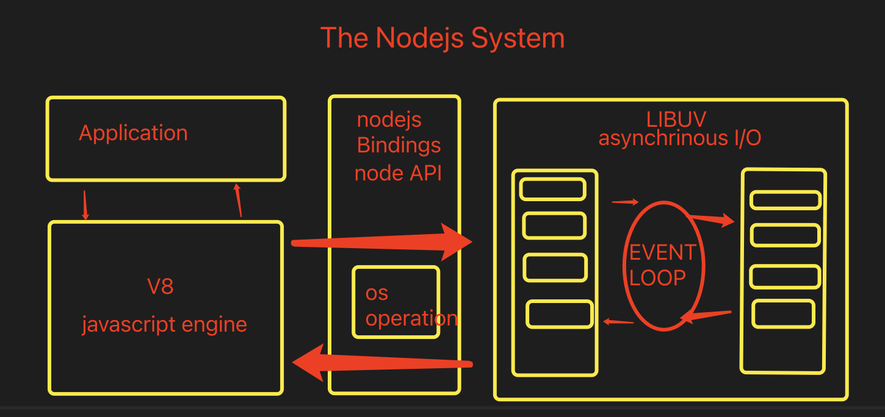

# nodejs 入门

## 什么是 Node.js

- Node.js 的本质是 JavaScript 解析器
- Node.js 是 JavaScript 的运行环境
- Node.js 是一个服务器程序
- Node.js 本身使用 V8 引擎
- Node.js 不是 Web 服务器

### 为什么使用 nodejs

- 为提供高性能的 web 服务
- IO 性能强大
- 事件处理机制完善
- 天然能够处理 DOM
- 社区活跃，生态日趋完善

### nodejs 优势

- 处理大流量数据
- 适合实时交互的应用
- 完美支持对象数据库
- 异步处理大量并发连接

```js
const http = require("http");
http
  .createServer(function(req, res) {
    res.writeHead(200, { "content-type": "text/plan" });
    res.write("hello world");
    res.end();
  })
  .listen(8000);
console.log(111);
```

### Nodejs REPL（交互式解释器） 环境

node
常用命令

- `.help`
- `.exit`
- `.clear`
- `.save`
- `.load` .load ./server.js

### npm

- `npm search express -g`
- `npm help xxx`

## node 回调机制

- 什么是回调
- 阻塞和非阻塞
- node 回调

### 什么是回调

- 函数调用方式分为三类：同步调用、回调和异步调用
- 回调是一种双向调用模式
- 可以通过回调函数来实现回调

### 阻塞和非阻塞

- 阻塞和非阻塞关注的是程序在等待调用结果（消息，返回值）时的状态
- 阻塞就是做不完不准回来
- 非阻塞就是你先做，我先看看有其他事没有，完了告诉我一声

```js
// 阻塞
var fs = require("fs");
var data = fs.readFileSync("data.txt");
console.log(data.toString());
// 非阻塞
var fs = require("fs");
fs.readFile("data.txt", function(err, data) {
  // 匿名函数
  if (err) {
    return console.error(err);
  }
  // 回调
  console.log(data.toString()); // 后
});
console.log("代码执行完毕"); // 先
```

## Nodejs 事件驱动机制

### 事件驱动模型



- nodejs 的 api 是异步执行，依据观察者模式实现的

### 事件与事件绑定

```js
// 引入events对象，创建eventEmitter对象
var events = require("events");
var eventEmitter = new events.EventEmitter();
// 绑定事件处理程序
var connectHandler = () => {
  console.log("connected 被调用");
};
eventEmitter.on("connection", connectHandler);
// 触发事件
eventEmitter.emit("connection");
```

## Nodejs 模块化

### 模块化的概念和意义

- 为了让 Nodejs 的文件可以相互调用，Nodejs 提供了一个简单的模块系统
- 模块是 Nodejs 应用程序的基本组成部分
- 文件和模块是一一对应的，一个 Nodejs 文件就是一个模块
- 这个文件可能是 JavaScript 代码，Json 或编译过的 C/C++扩展
- Nodejs 中存在 4 类模块（原生模块和 3 种文件模块）

### Nodejs 的模块加载流程


- 1. 从文件模块缓存中加载
- 2. 从原生模块加载
- 3. 从文件加载

### 模块化代码案例

```js
// hello.js
function Hello() {
  var name;
  this.setName = function(argName) {
    name = argName;
  };
  this.sayHello = function() {
    console.log("hello" + name);
  };
}
module.exports = Hello;
// main.js
var Hello = require("./hello");
hello = new Hello();
hello.setName("333");
hello.sayHello();
```

## Nodejs 函数

```js
function say(word) {
  console.log(word);
}
function execute(someFunction, value) {
  someFunction(value);
}
// 回调函数
execute(say, "hello world!");
// 匿名函数 没有函数名
execute(function(word) {
  console.log(word);
}, "Hello");
```

## nodejs 路由

```js
var url = require("url");
var querystring = require("querystring");
//localhost:8888/start?foo=bar&hello=world
url.parse(string).pathname; // start controller
url.parse(string).query; // foo=bar&hello=world
querystring.parse(queryString)["foo"]; // bar
querystring.parse(queryString)["hello"]; // world
```

```js
// http.js
var http = require("http");
var url = require("url");
function start(route) {
  function onRequest(request, response) {
    var pathname = url.parse(request.url).pathname;
    console.log("request for " + pathname + " received.");
    route(pathname, response);
  }
  http.createServer(onRequest).listen(8888);
  console.log("server has start");
}
exports.start = start;
// router.js
function route(pathname, response) {
  console.log("about to route a request for " + pathname);
  if (pathname === "/") {
    response.writeHead(200, { "Context-Type": "text/plain" });
    response.write("Hello world");
    response.end();
  } else if (pathname === "/config") {
    response.end("index");
  }
}
exports.route = route;
// app.js
var server = require("./http");
var router = require("./router");
server.start(router.route);
```

### get/post 请求

```js
var http = require("http");
var url = require("url");
var util = require("util");
function onRequest(request, response) {
  response.writeHead(200, { "context-type": "text/plain" });
  // util.inspect 展示请求信息
  response.end(util.inspect(url.parse(request.url, true)));
}
http.createServer(onRequest).listen(8888);
console.log("server has start");
```

#### post

```js
var http = require("http");
var querystring = require("querystring");
var util = require("util");
http
  .createServer(function(request, response) {
    var post = "";
    request.on("data", function(chunk) {
      post += chunk;
    });
    request.on("end", function() {
      post = querystring.parse(post);
      response.end(util.inspect(post));
    });
  })
  .listen(3000);
```
