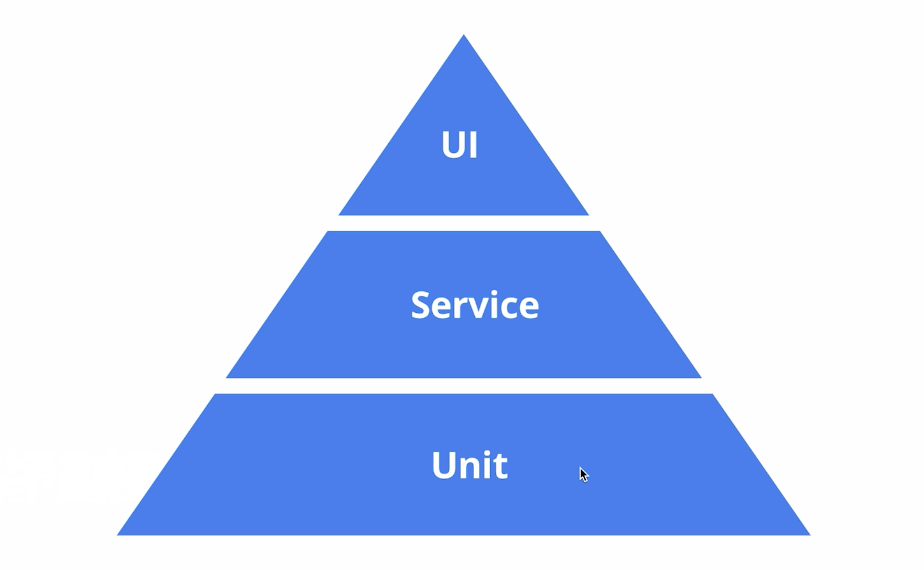
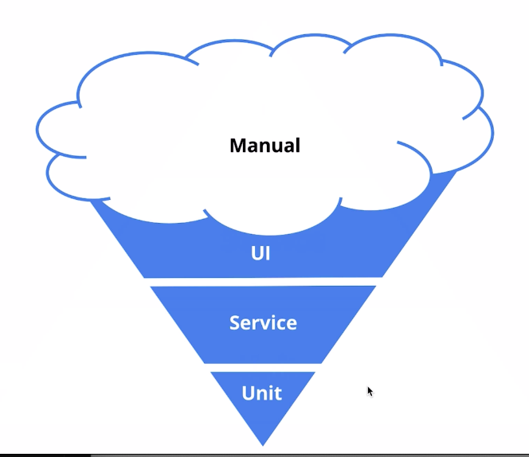

# React 组件开发

具体案例地址[https://github.com/hailiting/atom]

## 完成一个组件库需要考虑的问题

- 代码结构
- 组件需求分析和编码
- 样式解决方案
- 组件测试用例分析和编码
- 代码打包输出和发布
- CI/CD，文档生成等

### 由简入繁，化繁为简

### 代码结构

```file
mycomp/
  README.md
  node_modules/
  package.json
  tsconfig.json
  src/
    components/
      Button/ 【帕斯卡命名方式】
        _styles.scss (组件单独样式)
        button.tsx
        button.test.tsx
        button.stories.tsx
        index.tsx
    styles/
      _variables.scss(各种变量以及可配置设置)
      _mixins.scss(全局mixins)
      _functions.scss(全局function) [_xxx.scss=> 作为模块，不能被编译]
    ...
    index.tsx
```

### 启动`eslink`配置文件

```json
// .vscode/settings.json
{
  "window.zoomLevel": 1,
  "editor.tabSize": 2,
  "javascript.updateImportsOnFileMove.enabled": "never",
  "typescript.updateImportsOnFileMove.enabled": "never",
  "workbench.iconTheme": "vscode-icons",
  "material-icon-theme.folders.theme": "classic",
  "gitlens.advanced.fileHistoryFollowsRenames": false,
  "javascript.validate.enable": false,
  "editor.suggestSelection": "first",
  "vsintellicode.modify.editor.suggestSelection": "automaticallyOverrodeDefaultValue",
  "gitlens.advanced.messages": {
    "suppressFileNotUnderSourceControlWarning": true,
    "suppressGitDisabledWarning": true
  },
  "search.followSymlinks": false,
  "git.enabled": false,
  "git.autorefresh": false,
  "search.exclude": {
    "**/.history": true,
    "**/bower_components": false
  },
  "search.useIgnoreFiles": false,
  "[typescriptreact]": {
    "editor.defaultFormatter": "esbenp.prettier-vscode"
  },
  "markdown-table-formatter.markdownGrammarScopes": [
    "markdown",
    "typescriptreact"
  ],
  "[typescript]": {
    "editor.defaultFormatter": "esbenp.prettier-vscode"
  },
  "[html]": {
    "editor.defaultFormatter": "esbenp.prettier-vscode"
  },
  "editor.formatOnSave": true,
  "editor.formatOnType": true,
  "[javascript]": {
    "editor.defaultFormatter": "esbenp.prettier-vscode"
  },
  "[scss]": {},
  "eslint.enable": true,
  "eslint.alwaysShowStatus": true,
  "editor.codeActionsOnSave": {
    "source.fixAll.tslint": true,
    "source.fixAll.eslint": true
  },
  "dart.openDevTools": "flutter",
  "workbench.editorAssociations": [],
  "breadcrumbs.enabled": true,
  "java.semanticHighlighting.enabled": false,
  "java.configuration.checkProjectSettingsExclusions": false,
  "java.requirements.JDK11Warning": false,
  "explorer.confirmDragAndDrop": false
}
```

### 样式解决方案

- Inline CSS
- CSS in JS
- Styled Component
- Sass/Less
  采用`Sass/Less`

```
npm install sass-loader node-sass --save-dev
npm install --save @types/node-sass
npm install @types/node
```

#### Styled Component

```js
const Button = styled.button`
  font-size: 1em;
  margin: 1em;
  padding: 0.25em 1em;
  border: 2px solid #f00;
  border-radius: 3px;
  /* Adapt the colors based on primary prop */
  background: ${props=>props.primary && '#999'};
  color: ${props=>props.primary ? "white"&& '#eee'};
`
<Button primary>primary</Button>
<Button>default</Button>
```

#### 创建自己组件库的色彩体系

- 系统色板 -> 基础色板+中性色板
- 产品色板 -> 品牌色+功能色板

##### 一个页面需要哪些样式变量分类

- 基础色彩系统
- 字体系统
- 表单
  - input button
- 边框和阴影
- 可配置的开关

##### normalize.css 【提供跨浏览器的高度一致性】

## Button 组件

### 需求分析

- 不同的 ButtonType
  `Primary`, `Default`, `Danger`, `LinkButton`
- 不同的 ButtonSize
  `Normal`, `Small`, `Large`
- Disabled 状态
  `Default`, `LinkButton`

```jsx
<Button
  size="lg"
  type="primary"
  disabled
  href=""?
  className=""?
  autofocus=""?
  ...
>
  {children} mycomp Button
</Button>
```

### 编写

每一个组件在创建的时候都要避免过度设计
从最简单的原型开始

```
npm install classnames --save
npm install @types/classnames --save
```

#### 下拉 input 组件思路

```js
// 做一个项目，先做一个能用的原型，在慢慢添加
import prependOnceListener from "cluster";
const a = ["1", "adf", "122"]; // 要筛选的数组

interface AutoCompleteProps {
  fetchSuggestions: (keyword: string, data: string[]) => string[] | Promise; // 筛选触发【下拉框数据获取】
  onSelect: (item: void) => void; // 返回选中结果
}
const handleChange = (keyword: string) => {
  return a.filter((item) => item.includes(keyword));
  return fetch(`url?keyword=${keyword}`);
};
const handleSelect = (item: string) => {
  console.log(item);
};
<AutoComplete fetchSuggestions={handleChange} onSelect={handleSelect} />;
```

#### upload 组件

```js
// 需求分析
// upload 本身自己就有属于自己的生命周期
// 开始 -> 点击按钮、选择文件 -> beforeUpload(file) -> onProgress(event, file) -> onChange(file)->success/error -> callback(onSuccess/onError)

<Upload
  action="xxx.com/upload" // upload地址
  beforeUpload={() => {}}
  onProgress={() => {}}
  onChange={() => {}}
  onSuccess={() => {}}
  onError={() => {}}
  onRemoved={() => {}}
>
  <Button>click to upload</Button>
</Upload>
```

##### `xhr`和`$.ajax`

```js
// 原生的xhr
const xhr = new XMLHttpRequest();
xhr.open("GET", "http://test.me");
xhr.responseType = "json";

xhr.onload = function() {
  console.log(xhr.response);
};

xhr.onerror = function() {
  console.log("error");
};
xhr.send();

// $.ajax
$.ajax({
  type: "POST",
  url: "xxx.xx/xx",
  data: {},
  dataType: "json",
  success: function() {},
  error: function() {},
});

// fetch
/**
 * 1. 只对网络请求报错，对400，500都当做请求成功
 * 2. 默认不带cookie，需配置 withCredentials
 * 3. 不支持about，不支持超时控制
 * 4. 没法原生监测请求进度
 */
fetch("xxx.xx/xx")
  .then(function(response) {
    return response.json();
  })
  .then(function(data) {
    console.log(data);
  })
  .catch(function(e) {
    console.log("error la");
  });
// axios
import React, { FC, useState, useEffect } from "react";
import axios from "axios";
const App: FC = (props) => {
  const [title, setTitle] = useState("");
  useEffect(() => {
    axios
      .get("https://jsonplaceholder.typicode.com/todos/1", {
        headers: {
          "X-Requested-With": "XMLHttpRequest",
        },
        responseType: "json",
      })
      .then((res) => setTitle(res.data.title));
  }, []);

  return <h3>{title}</h3>;
};
export default App;
```

开源的免费请求接口

- `JSONPlaceholder`
- `https://designer.mocky.io/design`

### 组件测试

- 编写高质量代码
- 更早的发现 bug,减少成本
- 让重构和升级更加容易和可靠
- 让开发流程更加敏捷

### 测试金字塔

- jestjs[jestjs.io]
- @testinig/library[https://testing-library.com/docs/intro]

```
npm install --save-dev @testing-library/react

"@testing-library/jest-dom": "^4.2.4",
"@testing-library/react": "^9.3.2",
"@testing-library/user-event": "^7.1.2",
```

` __tests__``.test.``.spec. `  
`flex`布局，

#### 理想状态



#### 实际状态



####

`npx jest ./jest.test.js --watch`
断言

```js
// Common Matchers
test("1+2", () => {
  expect(1 + 2).toBe(4);
});
test("object assignment", () => {
  const data = { one: 1 };
  data["two"] = 2;
  expect(data).toEqual({ one: 1, two: 2 });
});
// Truthiness
test("null", () => {
  const n = null;
  expect(n).toBeNull();
  expect(n).toBeDefined();
  expect(n).not.toBeUnndefined();
  expect(n).not.toBeTruthy();
  expect(n).toBeFalsy();
});

// numbers
test("two plus two", () => {
  const value = 2 + 2;
  expect(value).toBeGreaterThan(3);
  expect(value).toBeGreaterThanOrEqual(3.5);
  expect(value).toBeLessThan(5);
  expect(value).toBeLessThanOrEqual(4.5);

  // tobe and toequal are equivalent for numbers
  expect(value).toBe(4);
  expect(value).toEqual(4);
});
// strings
test("there is no I in team", () => {
  expect("team").not.toMatch(/I/);
});
text("but there is a 'stop' in Christoph", () => {
  expect("Christoph").toMatch(/stop/);
});
// Arrays and iterables
const shoppingList = [
  "diapers",
  "kleenex",
  "trash bags",
  "paper towels",
  "beer",
];
test("the shopping list has beer on it", () => {
  expect(shoppingList).toContain("beer");
  expect(new Set(shoppingList)).toContain("beer");
});

// Exceptions
function compileAndroidCode() {
  throw new Error("you are using the wrong JDK");
}
test("compiling android goes as expected", () => {
  expect(compileAndroidCode).toThrow();
  expect(compileAndroidCode).toThrow(Error);
  expect(compileAndroidCode).toThrow(/JDK/);
});
```

## 添加

### 当前项目的缺点

- create-react-app 入口文件不适合管理组件库
- 缺少行为追踪和属性调试功能

### 组件完美开发工具应有的特点

1. 能够展示不同组件
2. 能追踪组件的行为并具有属性调试功能
3. 可以为组件自动生成文档和属性列表

### storybook [build bulletproog ul componnents faster]

`npx -p @storybook/cli sb init --type react`

## 结尾

需要什么类型的文件给各环境使用

### 打包工具 module boundler 原型过程

```
TypescriptFiles.tsx ----tsc---> ES6 modules.jsx ----
入口文件的引用需要的文件 index.tsx ---- module bundler 【webpack rollup...】 ---> 浏览器可以使用的一个或多个js文件
```

### Javascript 模块格式

#### `UMD`

可兼容 AMD 浏览器等 js 环境

```js
(function(root, factory) {
  if (typeof define === "function" && define.amd) {
    define(["b"], factory);
  } else if (typeof exports === "object") {
    module.exports = factory(require("b"));
  } else {
    root.returnExports = factory(root.b);
  }
});
```

#### ESModules 模块 vs CommonJS

##### tree-shaking 优化

### typescript-> ESModules

```js
import { Button } from "mycompship";
```

1. `from mycompship` => `package.json`里的`module`和`main`字段控制

```json
...
  "main": "dist/index.js",
  "module": "dist/index.js",
...
```

2. tsconfig.build.json

```json
{
  "compilerOptions": {
    "outDir": "dist", // 打包的地址
    "module": "esnext", // 打包的module
    "target": "es5", // 让浏览器支持ES5
    "declaration": true, // 获得 ts props 提示检查
    "jsx": "react", // 语法糖
    "moduleResolution": "Node",
    "allowSyntheticDefaultImports": true // 支持defult import方式
  },
  "include": [
    "src" // 想打包的文件地址
  ],
  "exclude": ["src/**/*.test.tsx", "src/**/*.stories.tsx", "src/setupTests.ts"] // 需要排除的文件
}
```

3. `package.json`

```json
...
  "build": "npm run clean && npm run build-ts && npm run build-css",
  "clean": "rimraf ./dist",
  "build-ts": "tsc -p tsconfig.build.json",
  "build-css": "node-sass ./src/styles/index.scss ./dist/index.css",
...
```

4. 调试

- `npm link` 创建短连接
- `npm link mycompship` （mycompship 为未知数）
- 两个版本 react 冲突的问题 `npm link ../myapp/node_module/react from mylib`
  ```json
  // package.json
  // 不会被安装，会出现warn提示
  "peerDependencies":{
    "peerDependencies": {
      "react": ">=16.8.0",
      "react-dom": ">=16.8.0"
    },
  }
  ```

5. lint

```json
// package.json
"scripts": {
  "start": "node scripts/start.js",
  "lint": "eslint --ext js,ts,tsx src --max-warnings 5",
  "build": "npm run clean && npm run build-ts && npm run build-css",
  "clean": "rimraf ./dist",
  "build-ts": "tsc -p tsconfig.build.json",
  "build-css": "node-sass ./src/styles/index.scss ./dist/index.css",
  "test": "node scripts/test.js",
  "test:nowatch": "cross-env CI=true node scripts/test.js",
  "test:generate-output": "jest --json --outputFile=.jest-test-results.json",
  "storybook": "npm run test:generate-output && npm run dev-storybook",
  "dev-storybook": "start-storybook -p 9009 -s public",
  "build-storybook": "npm run test:generate-output &&  build-storybook -s public",
  "prepublishOnly": "npm run test:nowatch && npm run lint && npm run build"
},
```

6. 发版前的代码检查

```json
// package.json
"husky": {
  "hooks": {
    "pre-commit": "npm run test:nowatch && npm run lint"
  }
},
```

7. CI/CD 【持续集成/持续交付/持续部署（自动化完成测试验证部署）】

```
组件库 ---gitpush--->  运行测试（单元测试以及e2e测试）---测试通过---> npm publish -- 成功--> build文档静态文件
 --- 成功 --->  上传至服务器 -----成功----> 生成新的文档站点
```

注册登录`travis`[travis-ci.com], 添加 github 账户，在项目根目录新建`.travis.yml`

```yml
language: node_js
node_js:
  - "stable"
cache:
  directories:
    - node_modules
env:
  - CI=true
script:
  - npm run build-storybook
deploy:
  provider: pages
  skip_cleanup: true
  github_token: $github_token
  local_dir: storybook-static
  on:
    branch: master
```

[pages.github.com] github 提供的静态文件站点

### 上传到 npm

- 下载别人编写的第三方包到本地使用
- 下载并安装别人编写的命令行程序本地使用
- 将自己编写的包或命令行程序上传到 npm 服务器

1. 注册、登录 npmjs.com/signup

- npm whoami 检查是否登录
- npm config ls 查看当前的代理 【注册源得是默认的 不能是淘宝的】
  `npm config set registry http://registry.npm.taobao.org/`
  `npm config set registry https://registry.npmjs.org/`
  `npm get registry`
- npm adduser 【logged in as mycompmute on https://registry.npmjs.org/ -> 这个地址是对的】

2. package.json

```json
version: "0.1.0", // 版本号： 主版本   次版本   修订号
description: "",
author: "",
license: "MIT",
homepage: "./",
repository:{
  "type": "git",
  "url": "xxx"
},
dependencies: {
  // 严格控制生成环境依赖
},
files: [
  "dist"
], // 把哪些文件上传上去
private: true, // 是否是私有的
scripts: {
  "prepublish": "npm run build"
}
```

3. npm publish
