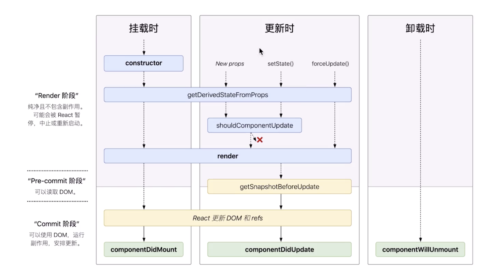

# React\_组件生命周期及单向数据流

## 生命周期



- `Render`阶段
  纯净且不包含副作用，可能会被 React 暂停，中止或重新启动
- `Pre-commit`阶段
  可以读取 dom
- `Commit`阶段
  可以使用 DOM, 运行副作用，安排更新

```js
export default class MyApp extends React {
  constructor(props) {
    super(props);
    this.state = { data: new Date() };
  }
  // 在渲染前调用
  componentWillMount() {}
  // 在第一次渲染后调用，只在客户端。之后组件已经生成了对应的DOM结构。
  // 常用于初始render后获得数据，开启定时器
  componentDidMount() {}
  // props更新后被调用，初始化render时不会被调用
  componentWillReceiveProps() {}
  // 返回一个布尔值。在组件收到新的props或state被调用。常做优化项
  shouldComponentUpdate() {}
  // 在组件接收到新的props或state但没有render时被调用。初始化不会被调用
  componentWillUpdate() {}
  // 在组件完成更新后立即调用，在初始化时不会调用
  componentDidUpdate() {}
  // 在组件从DOM中移除时调用，常用于clear线程，定时器
  componentWillUnmount() {}
}
```

### 挂载时

```js
# Render
constructor
getDerivedStateFromProps [new Props  setState()  forceUpdate()]
render
# Pre-commit
React更新DOM和refs
# Commit
componentDidMount
```

### 更新时：

```js
# Render
getDerivedStateFromProps [new Props  setState()  forceUpdate()]
shouldComponentUpdate
render
# Pre-commit
getSnapshotBeforeUpdate
React更新DOM和refs
# Commit
componentDidUpdate
```

### 卸载时

```js
# Commit
componentWillUnmount
```

## 状态提示和单向数据流

### 修改状态

#### 更改`state`的方法

```js
this.setState((prevState, props) => ({
  counter: prevState + props.incement,
}));
```

#### 状态的更新是异步的

### 单向数据流

任何状态始终由某些特定组件所有。  
该状态导出的任何数据或 UI 只能影响树中下方的组件【状态通常被认为是局部或封装在一个组件。除了拥有他的组件外，其他的不能访问】。  
组件间得知状态，也只能用过父子组件间的通信实现。
