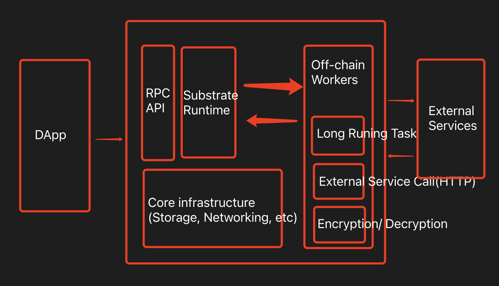

# substrate_Rust 进阶第四课

- Offchain Features 引入原因
- Offchain Features 的架构
- Offchain Worker 的功能
- 如何实现一个 Offchain Worker
- Offchain Worker 的 lifecycle
- Offchain Worker 的编程模式
- 示例：查看 Offchain Worker 的跨块效果
- 示例：使用 local storage 存储
- 示例：在 Offchain Worker 中，获取外部 http 接口 json 数据
- 示例：在 Offchain Worker 中，向链上发起签名交易
- 示例：在 Offchain Worker 中，向链上发起不签名交易

- Substrate 密码学
- 介绍及代码前期衔接

  - Send Signed Transaction
  - Send Unsigned Transaction
  - Unsigned Transaction with signed payload
  - 发送 HTTP 请求及 JSON 解析
  - Off-chain worker 存储数据库
  - FRAME 权益证明相关模块介绍
  - im-online

- 5. 构思一个应用场景，描述如何使用 Offchain Features 三大组件去实现它

  dome todo
  https://github.com/paritytech/substrate/blob/master/frame/examples/offchain-worker/src/tests.rs -->

https://github.com/miketang84/oneblockplus_offchain_lesson/blob/cb33bc4a0f49a9a603de65b6c26df35c3e441c59/substrate-node-template-7/runtime/src/lib.rs -->

## 作业

- 1. 在 Offchain Worker 中，使用 Offchain Indexing 特性实现从链上向 Offchain Storage 中写入数据
- 2. 使用 js sdk 从浏览器 frontend 获取到前面写入 Offchain Storage 的数据
- 3. 回答链上随机数（如前面 Kitties 示例中）与链下随机数的区别

- 4. 在 Offchain Worker 中，解决向链上发起不签名请求时剩下的那个错误，参考： https://github.com/paritytech/substrate/blob/master/frame/example/offchain-worker/src/lib.rs
- 5. 构思一个应用场景，描述如何使用 Offchain Features 三大组件去实现它

- 以`ocw-example`为基础，把它拷到 assignment 目录里来修改，最后提交这个代码库
- 利用`offchain worker`取出 DOT 当前对 USD 的价格，并把写到一个 Vec 的存储里，自己选一种方法提交回链上，并在代码注释为什么用这种方法提交回链上最好。只保留当前最近的 10 个价格，其他价格丢弃（就是 Vec 的长度长到 10 后，再插入一个值时，要先丢弃最早的那个值）
- 获取当前 DOT 价格`https://api.coincap.io/v2/assets/polkadot`

```bash
git clone --branch polkadot-v0.9.25 https://github.com/substrate-developer-hub/substrate-node-template

cargo build --release

cargo test -p pallet-template
```

## Offchain Features 引入原因

### Ethereum Node

- Ethereum Node -----`[Event listener]`--->Offchain Daemon----`Transaction via rpc`---> Etherum Node

### Substrate Offchain



### 原因

- Substrate Offchain Worker 的优势
  - 1. 集成度更高，链上链下代码统一管理，在一个节点内，从而维护性更好
  - 2. 链下代码经过共识验证，保证分发的可靠性，保证大家执行的是同一份代码，防止潜在的作恶行为
  - 3. 链下代码的可升级性->与 Substrate 链上代码共享同一份 forkless 升级策略；
  - 4. 从 Offchain Worker 向链上发交易，不走对外的 rpc 通道，这样能实现更灵活更高效的交易处理

## Offchain Features 的架构

https://mp.weixin.qq.com/s/tyTdn1CM7iVE90UDRRv0JQ

- 三大组件
  - Offchain Worker
    - Offchain Worker 可以直接读取链上的数据（状态），但不能写
    - Offchain Worker 可以提交新的交易来实现对链上状态的更新
    - Offchain Worker 可以请求外部服务，获取相应的数据，（异步）更新链上状态或本地存储
  - Offchain Storage
    - 链上代码可以向 Offchain Storage 中写数据，但不能读
    - 外层 node 和 rpc 可以直接读取链上存储数据和 Offchain Storage 中存储的数据
    - 外层 node 和 rpc 可以直接向 Offchain Storage 中写数据，但不能直接向链上存储写数据（必须通过发交易更改链上状态）
  - Offchain Indexing
    - 1. 所有修改状态的操作，都提交到链上处理，但链上不一定存储所有信息，可以通过 Offchain Indexing 存一部分到 local storage（Offchain Storage）

## Offchain Worker 的功能(仅链下使用)

- 提交签名或未签名的交易(可以是结果)到链上
- 可以做 https/http 的请求
- 可以访问本地的 keystore，对交易签名验证
- 可以访问本地的 localstorage
- 可以使用随机数采集器
- 可以访问本地的时间（linux）
- 可以使用 sleep 和 resume work

## 如何实现一个 Offchain Worker

### 1

- 给 pallet-template 添加 offchain worker hook
- 在 offchain worker 中打印信息，观察日志出现的时机

```rs
#[pallet::hooks]
impl<T: Config> Hooks<BlockNumberFor<T>> for Pallet<T> {
  fn offchain_worker(block_number: T::BlockNumber) {
    // 在 Imported 后执行
    // offchain Worker 在块导入之后执行
    log::info!("Hello World from offchain workers!: {:?}", block_number);
  }
}
```

### 2 lifecycle

- 同时打开多个 hooks, on_initialize, on_idle, on_finalize, offchain_worker
- 在各个 hooks 中打印信息，观察日志出现的时机，逻辑 offchain worker 的执行时机

```rs
#[pallet::hooks]
impl<T: Config> Hooks<BlockNunberFor<T>> for Pallet<T> {
  fn on_initialize(_n: T::BlockNumber)->Weight{
    log::info!("in on_initialize");
    0
  }
  fn on_idle(_n: T::BlockNumber, _remaining_weight: Weight)->Weight {
    log::info!("in on_idle");
    0
  }
  fn on_finalize(_n: T::BlockNumber) {
    log::info!("in on_finalize");
  }
    fn offchain_worker(block_number: T::BlockNumber){
    log::info!("Hello World from offchain workers: {:?}", block_number);
  }
}
```

### 3

- 在 offchain worker 中 sleep 一段时间，观察 offchain worker 的跨块执行效果

```rs
#[pallet::hooks]
impl<T: Config> Hooks<BlockNumberFor<T>> for Pallet<T> {
  fn offchain_worker(block_number: T::BlockNumber) {
    log::info("Hello World from offchain workers!: {:?}", block_number);
    let timeout = sp_io::offchain::timestamp()
      .add(sp_runtime::offchain::Duration::from_millis(8000));
    sp_io::offchain::sleep_until(timeout);
    log::info!("leave from offchain workers!: {:?}", block_number);
  }
}
```

- 定时器流模式（定时重入）
- 与响应式 Reaction 模式的区别，需要注意编程模式上的变化

### 使用 Local Storage 存储

LocalStorage 的几个作用

- Offchain Worker 可直接读写 Local Storage
- 链上代码可通过 Indexing 功能直接向 Local Storage 写入数据，但不能读
- 可用于 Offchain Worker tasks 之间的通信和协调，注意由于可能同时存在多个 Offchain worker, 因此可能对存储的访问需要 lock

### 4

- 设计为在奇数块向 Local Storage 写数据，偶数块读取数据，并检查
- 可以学到：如何获取链下随机数，如何对 BlockNumber 类型进行数字运算，如何获取链下时间，如何生成存储 key,如何写链下存储，如何读链下存储，如何清理存储 key

DOC https://crates.parity.io/

```rs
#[pallet::hooks]
impl<T: Config> Hooks<BlockNumberFor<T>> for Pallet<T> {
  fn offchain_worker(block_number: T::BlockNumber){
    log::info!("Hello World from offchain workers!: {:?}", block_number);
    if block_number %2u32.into()!= Zero::zero() {
      // odd
      let key = Self::derive_key(block_number);
      let val_ref = StorageValueRef::persistent(&key);
      // get a local random value
      let random_slice = sp_io::offchain::random_seed(); // [u8; 32]
      // get a local timestamp
      let timestamp_u64 = sp_io::offchain::timestamp().unix_millis(); // 毫秒
      // combine to a tuple and print it
      let value = (random_slice, timestamp_u64);
      log::info!("in odd block, value to write: {:?}", value);
      val_ref.set(&value);
    } else {
      // even  前面的奇数块存进去的值
      let key = Self::derive_key(block_number - 1u32.into());
      let mut val_ref = StorageValueRef::persistent(&key);
      // get from db by key
      if let Ok(Some(value)) = val_ref.get::<([u8; 32], u64)>(){
        log::info!("in even block, value read: {:?}", value);
        // 把块清掉
        val_ref.clear();
      }
    }
    log::info!("Leave from offchain works!: {:?}", block_number);
  }
}
impl<T: Config> Pallet<T>{
  #[deny(clippy:: clone_double_ref)]
  fn derive_key(block_number: T::BlockNumber)->Vec<u8>{
    block_number.using_encoded(|encoded_bn| {
      // 自定义前缀 node-template::storage::
      b"node-template::storage::"
      .iter()
      .chain(encoded_bn)
      .copied()
      .collect::<Vec<u8>>()
    })
  }
}

```

### 5

- 在示例 4 的基础上，使用 mutate 方法对数据进行原子更改
- 知识点：新的原子操作修改方法（不再使用之前手动锁的方式），学习配套的错误处理模式

```rs
#[cfg(feature="runtime-benchmarks")]
mod benchmarking;
use sp_runtime::{
  offchain::{
    storage::{MutateStorageError, StorageRetrievalError, StorageValueRef},
  },
  traits::Zero
}
...
#[pallet::hooks]
impl<T: Config> Hooks<BlockNumberFor<T>> for Pallet<T> {
  fn offchain_worker(block_number: T::BlockNumber){
    log::info!("Hello World from offchain workers!: {:?}", block_number);
    if block_number %2u32.into()!= Zero::zero() {
      // odd
      let key = Self::derive_key(block_number);
      let val_ref = StorageValueRef::persistent(&key);
      // get a local random value
      let random_slice = sp_io::offchain::random_seed(); // [u8; 32]
      // get a local timestamp
      let timestamp_u64 = sp_io::offchain::timestamp().unix_millis(); // 毫秒
      // combine to a tuple and print it
      let value = (random_slice, timestamp_u64);
      log::info!("in odd block, value to write: {:?}", value);

      // change
      struct StateError;
      // mutate 接一个闭包  val->之前的key的值
      let res = val_ref.mutate(|val: Result<Option<[u8;32], u64>, StorageRetrievalError>| -> Result<_, StateError>{
        match val {
          Ok(Some(_))=>Ok(value),
          _ => Ok(value),
        }
      });
      match res {
        Ok(value)=>{
          log::info!("in odd block, mutate successfully: {:?}", value);
        },
        Err(MutateStorageError::ValueFunctionFailed(_))=>(),
        Err(MutateStorageError::ConcurrentModification(_))=>(),
      }
    } else {
      // even  前面的奇数块存进去的值
      let key = Self::derive_key(block_number - 1u32.into());
      let mut val_ref = StorageValueRef::persistent(&key);
      // get from db by key
      if let Ok(Some(value)) = val_ref.get::<([u8; 32], u64)>(){
        log::info!("in even block, value read: {:?}", value);
        // 把块清掉
        val_ref.clear();
      }
    }
    log::info!("Leave from offchain works!: {:?}", block_number);
  }
}
...
```

### 6

获取外部 http 接口 JSON 数据

- 学会在 Offchain Worker 中发起 https 请求，获取数据（boilerplate）
- 学会如何使用 serde_json 解析获取到的 json 数据
- 学习 serde 的类型转换和调试相关知识

```rs
...
use sp_runtime::{
  offchain:: {
    http, Duration,
  }
}
use serde::{Deserialize, Deserializer};

#[frame_support::pallet]
pub mod pallet {
  use super::*;
  use frame_support::pallet_prelude::*;
  use frame_system::pallet_prelude::*;
  use sp_std::vec::Vec;

  #[derive(Deserialize, Encode, Decode)]
  struct GithubInfo {
    #[serde(deserialize_with="de_string_to_bytes")]
    login: Vec<u8>,
    #[serde(deserialize_with="de_string_to_bytes")]
    blog: Vec<u8>,
    public_repos: u32,
  }
  pub fn de_string_to_bytes<'de, D>(de: D)->Result<Vec<u8>, D::Error> where D: Deserializer<'de>,{
    let s: &str = Deserialize::deserialize(de)?;
    Ok(s.as_bytes().to_vec())
  }
  use core::{convert::TryIndo, fmt};
  // Debug format
  impl fmt::Debug for GithubInfo {
    fn fmt(&self, f: &mut fmt::Formatter<'_>)->fmt::Result {
      write!(
        f,
        "{{ login: {}, blog: {}, public_repos: {} }}",
        sp_std::str::from_utf8(&self.login).map_err(|_| fmt::Error)?,
        sp_std::str::from_utf8(&self.blog).map_err(|_| fmt::Error)?,
        &self.public.repos
      )
    }
  }
  #[pallet::pallet]
  #[pallet::generate_store(pub(super) trait Store)]
  pub struct Pallet<T>(_);

  #[pallet::config]
  pub trait Config: frame_system::Config {
    type Event: From<Event<Self>> + IsType<<Self as frame_system::Config>::Event>;
  }
  #[pallet::weight(10_000+T::DbWeight::get().reads_writes(1,1))]
  pub fn cause_error(origin: OriginFor<T>)->DispatchResult {
    let _who = ensure_signed(origin)?;
    match <Something<T>>::get(){
      None=>return Err(Error::<T>::NoneValue.into()),
      Some(old)=>{
        let new=old.checked_add(1).ok_or(Error::<T>::StorageOverflow)?;
        <Something<T>>::put(new);
        Ok(())
      }
    }
  }

}
impl<T: Config> Hooks<BlockNumberFor<T>> for Pallet<T>{
  fn offchain_worker(block_number: T::BlockNumber){
    log::info!("Hello world from offchain workers!: {:?}", block_number);
    if let Ok(info) = Self::fetch_github_info(){
      log::info!("Github Info: {:?}", info);
    }else {
      log::info!("Error while fetch github info!");
    }
    log::info!("Leave from offchain workers! {:?}", block_number);
  }

}
impl<T: Config> Pallet<T>{
  // #[deny(clippy:: clone_double_ref)]
  // fn derive_key(block_number: T::BlockNumber)->Vec<u8>{
  //   block_number.using_encoded(|encoded_bn| {
  //     // 自定义前缀 node-template::storage::
  //     b"node-template::storage::"
  //     .iter()
  //     .chain(encoded_bn)
  //     .copied()
  //     .collect::<Vec<u8>>()
  //   })
  // }
  fn fetch_github_info()->Result<GithubInfo, http::Error>{
    // prepare for send request
    let deadline = sp_io::offchain::timestamp().add(Duration::from_millis(8_000));
    let request = http::Request::get("https://api.github.com/orgs/substrate-developer-hub");
    let pending = request
      .add_header("User-Agent", "Substrate-Offchain-Worker")
      .deadline(deadline).send().map_err(|_| http::Error::IoError)?;
    let response = pending.try_wait(deadline).map_err(|_| http::Error::DeadlineReached)??;
    if response.code != 200 {
      log::warn!("Unexpected status code: {}", response.code);
      return Err(http::Error::Unknown)
    }
    let body = response.body().collect::<Vec<u8>>();
    let body_str = sp_std::str::from_utf8(&body).map_err(|_| {
      log::warn!("No UTF8 body");
      http::Error::Unknown
    })?;
    // serde_json -> Deserialize 字符串处理
    let gh_info: GithubInfo = serde_json::from_str(body_str).map_err(|_| http::Error::Unknown)?;
    Ok(gh_info)
  }
}
```

### 7. 在 Offchain Worker 中，向链上发起签名交易

- 1. Node, runtime, pallet 都需要修改
- 2. 大部分都是 boilerplate 代码，非常固定，不需要理解每个地方，重点理解原理和整个流程
- 3. 签名交易，需要有账户给它签名，交易的执行会向整个账户收`tx fee`
- 4. 文档`https://crates.parity.io/sc_service/index.html`

#### Node

```rs
// node/src/service.rs
...
let client = Arc::new(client);

if config.offchain_worker.enabled {
  let keystore = keystore_container.sync_keystore();
  // 把账户注入上去  pallet才能获取到 offchain才能使用
  sp_keystore::SyncCryptoStore::sr25519_generate_new(
    &*keystore,
    node_template_runtime::pallet_template::KEY_TYPE,
    Some("//Alice"),
  ).expect("Creating key with account Alice should succeed.");
}

let telemetry = telemetry.map(|(worker, telemetry)| {
  task....
})
...
```

#### runtime

<!-- https://github.com/miketang84/oneblockplus_offchain_lesson/blob/cb33bc4a0f49a9a603de65b6c26df35c3e441c59/substrate-node-template-7/runtime/src/lib.rs -->

```rs
// runtime/src/lib.rs
...
impl pallet_sudo::Config for Runtime {
  type Event = Event;
  type Call = Call;
}

impl<LocalCall> frame_system::offchain::CreateSignedTransaction<LocalCall> for Runtime where Call: From<LocalCall>,
{
  fn create_transaction<C: frame_system::offchain::AppCrypto<Self::Public, Self::Signature>>(
    call: Call,
    public: <Signature as sp_runtime::traits::Verify>::Signer,
    account: AccountId,
    index: Index,
  ) -> Option<(
    Call,
    <UncheckedExtrinsic as sp_runtime::traits::Extrinsic>::SignaturePayload,
  )> {
    let period = BlockHashCount::get() as u64;
    let current_block = System::block_number()
      .saturated_into::<u64>()
      .saturated_sub(1);
    let tip = 0;
    let extra: SignedExtra = (
      frame_system::CheckSpecVersion::<Runtime>::new(),
      frame_system::CheckTxVersion::<Runtime>::new(),
      frame_system::CheckGenesis::<Runtime>::new(),
      frame_system::CheckEra::<Runtime>::from(generic::Era::mortal(period, current_block)),
      frame_system::CheckNonce::<Runtime>::from(index),
      frame_system::CheckWeight::<Runtime>::new(),
      pallet_transaction_payment::ChargeTransactionPayment::<Runtime>::from<tip>,
    );
    #[cfg_attr(not(feature="std"), allow(unused_variables))]
    let raw_payload = SignedPayload::new(call, extra)
                      .map_err(|e| {
                        debug::native::warn!("SignedPayload err: {:?}", e);
                      })
                      .ok()?;
    let signature = raw_payload.using_encoded(|payload| C::sign(payload, public))?;

    let address = account;
    let (call, extra, _) = raw_payload.deconstruct();
    Some((call, (address, signature, extra)))
  }
}
...
impl pallet_template::Config for Runtime {
  type Event = Event;
  type AuthorityId = pallet_template::crypto::OcwAuthId;
}
...
```

#### Pallet

```rs
// template/lib.rs
...
use frame_system::{
  offchain:: {
    AppCrypto, CreateSignedTransaction, SendSignedTransaction,Signer
  }
}
use sp_core::crypto::KeyTypeId;
pub const KEY_TYPE: KeyTypeId = KeyTypeId(*b"ocwd");

pub mod crypto {
  use super::KEY_TYPE;
  use sp_core::sr25519::Signature as Sr25510Signature;
  use sp_runtime::{
    app_crypto::{app_crypto, sr25519},
    traits::Verify,
    MultiSignature, MultiSigner,
  };
  app_crypto!(sr25519, KEY_TYPE);
  pub struct OcwAuthId;
  impl frame_system::offchainn::AppCrypto<MultiSigner, MultiSignature> for OcwAuthId {
    type RuntimeAppPublic = Public;
    type GenericSignature = sp_core::sr25510::Signature;
    type GenericPublic = sp_core::sr25519::Public;
  }
  impl frame_system::offchain::AppCrypto<<Sr25519Signature as Verify>::Signer, Sr25519Signature> for OcwAuthId{
    type RuntimeAppPublic = Public;
    type GenericSignature = sp_core::sr25519::Signature;
    type GenericPublic = sp_core::sr25519::Public;
  }
}

#[frame_support::pallet]
pub mod pallet {
  ...
  #[pallet::call]
  impl<T: Config> Pallet<T> {
    ...
    pub fn submit_data(origin: OriginFor<T>, payload:Vec<u8>)-> DispatchResultWithPostInfo {
      let who = ensure_signed(origin)?;
      log::info!("in submit_data call: {:?}", payload);
      Ok(().into())
    }
  }

  #[pallet::hooks]
  impl<T:Config> Hooks<BlockNumberFor<T>> for Pallet<T>{
    fn offchain_worker(block_number: T::BlockNumber){
      log::info!("Hello world from offchain workers!: {:?}", block_number);
      let payload: Vec<u8> = vec![1, 2,3,4,5,6,7,8];
      // 发送签名交易
      _ = Self::send_signed_tx(payload);
      log::info!("Leave from offchain workers!: {:?}", block_number);
    }
    fn on_initialize(_n: T::BlockNumber) -> Weight {
      log::info!("in on_initialize");
      0
    }
    fn on_finalize(_n: T::BlockNumber){
      log::info!("in on_finalize!");
    }
    fn on_idle(_n: T::BlockNumber, _remaining_weight:Weight)->Weight{
      log::info!("in on_idle!");
      0
    }
  }
  impl<T: Config> Pallet<T> {
    fn send_signed_tx(payload: Vec<u8>)->Result<(), &'static str> {
      // 找账户 Vec
      let signer = Signer::<T, T::AuthorityId>::all_accounts();
      if !signer.can_sign(){
        return Err("No local accounts available. Consider adding one via `author_insertKey` RPC.")
      }
      // 不能直接 call
      // send_signed_transaction 签名交易
      let results = signer.send_signed_transaction(|_account| {
        // 结构体
        Call::submit_data { payload: payload.clone() }
      });

      for (acc, res) in &results {
        match res {
          Ok(())=> log::info!("[{:?}] Submitted data:{:?}", acc.id, payload),
          Err(e)=>log::error!("[{:?}] Failed to submit transaction: {:?}", acc.id, e),
        }
      }
      Ok(())
    }
  }
}

```

当前区块签名-> 下一个区块执行

### 8 在 Offchain Worker 中， 向链上发起不签名交易

- 要改 runtime 和 pallet
- 大部分都是 boilerplate 代码
- 不签名交易，无 tx fee, 因为找不到人收费
- `#[pallet::validate_unsigned], TransactionValidity, ValidTransaction, ensure_none`等
- 每个块的不签名交易不能太多，Substrate 不鼓励发不签名交易

```rs
// runtime/src/lib.rs
...
impl pallet_sudo::Config for Runtime {
  ...
}
impl<C> frame_system::offchain::SendTransactionTypes<C> for Runtime where Call: From<C>,
{
  type Extrinsic = UncheckedExtrinsic;
  type OverarchingCall = Call;
}
...
```

```rs
// pallet/template/src/lib.rs
...
mod benchmarking;
use frame_system::offchain::{
  SubmitTransaction,
};
use sp_runtime::{
  transaction_validity::{InvalidTransaction,TransactionValidity,ValidTransaction}
};
...
pub mod pallet {
  ...
  #[pallet::config]
  pub trait Config: frame_system::Config + frame_system::offchain::SendTransactionTypes<Call<Self>>{
    type Event: From<Event<Self>> + IsType<<Self as frame_system::Config>::Event>;
  }
  ...
  #[pallet::call]
  impl<T: Config> Pallet<T> {
    ...
    #[pallet::weight(0)]
    pub fn submit_data_unsigned(origin:OriginFor<T>, n: u64) -> DispatchResult {
      ensure_none(origin)?;
      log::info!("in submit_data_unsigned: {:?}", n);
      Ok(())
    }
  }

  #[pallet::hooks]
  impl<T:Config> Hooks<BlockNumberFor<T>> for Pallet<T> {
    fn offchain_worker(block_number: T::BlockNUmber){
      log::info!("Hello World from offchain workers!: {:?}", block_number);
      let value: u64 = 42;
      let call = Call::submit_data_unsigned {n:value};
      _ = SubmitTransaction::<T, Call<T>>::submit_unsigned_transaction(call.into())
      .map_err(|_| {
        log::error!("Failed in offchain_unsigned_tx");
      });
      log::info!("Leave from offchain workers!: {:?}", block_number);
    }
  }

  #[pallet::validate_unsigned]
  impl<T:Config> ValidateUnsigned for Pallet<T> {
    type Call = Call<T>;
    fn validate_unsigned(_source: TransactionSource, call: &Self::Call)->TransactionValidity {
      if let Call::submit_data_unsigned {n: _} = call {
        // let provide = b"submit_xxx_unsigned".to_vec()
        Validtransaction::with_tag_prefix("ExampleOffchainWorker")
        .priority(10_000)
        .and_provides(1)
        .longevity(3)
        .propagate(true)
        .build()
      } else {
        InvalidTransaction::Call.into()
      }
    }
  }
}
```
