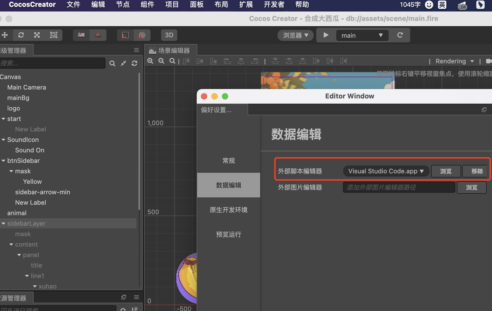
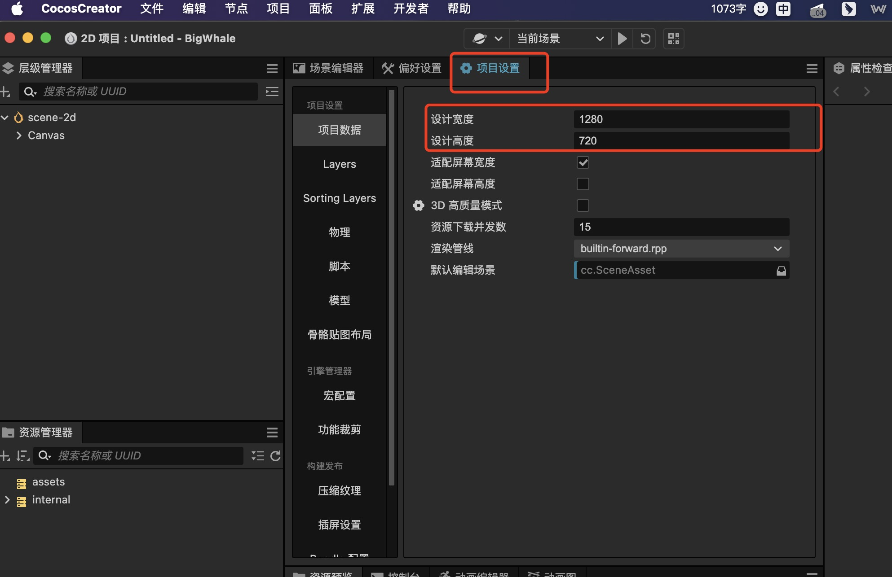

# Cocos Create

- Cocos 诞生地的地名
- vscode
  - 源码目录：/Applications/Cocos/Creator/3.8.3/CocosCreator.app/Contents/Resources/resources/3d/engine
  - command + p `node.ts`脚本文件

## 下载和安装

- 安装 Cocos Dashboard
- 安装不同版本的 Cocos Creator
- 安装 VS Code
- 设置默认编辑器
  
- 项目设置
  

## update v3 优化写法

```ts
import { _decorator, Component, Label, Node, v3, Vec3 } from "cc";
const { ccclass, property } = _decorator;
@ccclass("Test")
export class Test extends Component {
  curPos = v3();
  start() {}
  update(deltaTime: number) {
    this.node.getPosition(this.curPos);
    // deltaTime=1/电脑帧数
    this.curPos.x += 100 * deltaTime;
    this.node.setPosition(this.curPos);
  }
}
```

## 事件

https://docs.cocos.com/creator/3.8/manual/zh/engine/event/

```ts
import {
  _decorator,
  Component,
  EventKeyboard,
  EventTouch,
  Input,
  input,
  Node,
  UITransform,
  v3,
} from "cc";
const { ccclass, property } = _decorator;

@ccclass("NodeEvent")
export class NodeEvent extends Component {
  start() {
    // Node.EventType.TOUCH_START
    // Node.EventType.TOUCH_MOVE
    // Node.EventType.TOUCH_END
    // Node.EventType.TOUCH_CANCEL
    this.node.on(Node.EventType.TOUCH_START, this.onTouchStart, this);
    this.node.on(Node.EventType.TOUCH_END, this.onTouchEnd, this);
    this.node.on(Node.EventType.TOUCH_MOVE, this.onTouchMove, this);

    input.on(Input.EventType.KEY_DOWN, this.onKeyDown, this);
  }
  onKeyDown(event: EventKeyboard) {
    console.log(event.keyCode);
  }
  onTouchStart(event: EventTouch) {
    this.node.setScale(0.9, 0.9);
    const uiPos = event.getUILocation();

    const transform = this.node.getComponent(UITransform);
    const nodePos = transform.convertToNodeSpaceAR(v3(uiPos.x, uiPos.y, 0));
    console.log({ nodePos });
    const p = nodePos.x > 0 ? 50 : -50;
    this.node.setPosition(this.node.position.x + p, this.node.position.y);
  }
  onTouchEnd(event: EventTouch) {
    // console.log({ event });
    // const uiPos = event.getUILocation();
    // console.log({ uiPos });
    this.node.setScale(1, 1);
  }
  onTouchMove(event: EventTouch) {
    const delta = event.getUIDelta();
    const dx = delta.x;
    const dy = delta.y;
    const x = this.node.position.x;
    const y = this.node.position.y;
    this.node.setPosition(x + dx, y + dy);
  }
  update(deltaTime: number) {}
}
```

### 设备像素比 getUi => window.devicePixelRatio

- window.devicePixelRatio
  - 表示设备的物理像素与 css 像素的比例
    - 如果 devicePixelRatio 的值是 2，那么意味着每个 css 像素实际上占用了`2x2=4`的虚拟像素

## 缓动系统

缓动函数
https://docs.cocos.com/creator/3.8/manual/zh/tween/tween-function.html

```js
import {
  _decorator,
  Color,
  Component,
  EventTouch,
  Label,
  Node,
  Tween,
  tween,
  Vec3,
} from "cc";
const { ccclass, property } = _decorator;
type IObj = { n: number; x: number; y: number; z: number };
@ccclass("root")
export class root extends Component {
  @property(Node) button: Node;
  @property(Node) labelNode: Node;
  lastTapTime: number;
  private animationTween: Tween<object> | null = null; // 初始化动画变量
  start() {
    this.button.on(
      Node.EventType.TOUCH_START,
      (event: EventTouch) => {
        this.button.setScale(0.9, 0.9);
      },
      this
    );
    // this.button.on(
    //   Node.EventType.TOUCH_END,
    //   (event: EventTouch) => {
    //     this.button.setScale(1, 1);
    //     this.myAnimation();
    //   },
    //   this
    // );
    this.button.on(
      Node.EventType.TOUCH_END,
      (event: EventTouch) => {
        this.button.setScale(1, 1);
        const curTime = Date.now();
        if (curTime - this.lastTapTime <= 300) {
          Tween.stopAllByTag(1111);
          //  Tween.stopAllByTag(2222);
          if (this.animationTween) {
            this.animationTween.stop();
            this.animationTween = null;
          }
        } else {
          this.startAnimation();
        }
        this.lastTapTime = curTime;
      },
      this
    );
  }
  startAnimation() {
    // tween(this.kuokuo)
    //   // 1 => 1s
    //   .to(1, { position: v3(0, 200, 0) })
    //   .start();
    const color = new Vec3(255, 255, 255);
    const obj: IObj = { n: 0, x: 255, y: 255, z: 255 };
    const comp = this.labelNode;
    const label = this.labelNode.getComponent(Label);
    if (this.animationTween) {
      this.animationTween.stop();
    }
    // tween(obj)
    //   .to(
    //     3,
    //     { n: 1000 },
    //     {
    //       onUpdate: (target: { n: number }, ratio) => {
    //         label.string = `${target.n.toFixed(0)}`;
    //         console.log(target, ratio);
    //       },
    //       easing: "elasticInOut",
    //     }
    //   )
    //   .union()
    //   .repeatForever()
    //   .start();
    tween(obj)
      .tag(1111)
      .to(
        1,
        { n: 200 },
        {
          onUpdate: (target: IObj, ratio) => {
            label.string = `${target.n.toFixed(0)}`;
          },
          easing: "elasticInOut",
        }
      )
      .call(() => {
        console.log(1111);
        this.animationTween = tween(obj)
          //   .tag(2222)
          .repeatForever(
            tween(obj)
              .to(
                0.5,
                { n: 0, x: 10, y: 140, z: 0 },
                {
                  onUpdate: (target: IObj, ratio) => {
                    comp.setPosition(0, target.n);
                    label.color = new Color(target.x, target.y, target.z);
                  },
                  easing: "quintOut",
                }
              )
              .to(
                0.5,
                { n: 200, x: 102, y: 40, z: 20 },
                {
                  onUpdate: (target: IObj, ratio) => {
                    comp.setPosition(0, target.n);
                    label.color = new Color(target.x, target.y, target.z);
                  },
                  easing: "quintIn",
                }
              )
          )
          .start();
      })
      .start();
  }

  update(deltaTime: number) {}
}
```

## 预制体，计时器，碰撞系统

```tsx
import {
  _decorator,
  Collider,
  Collider2D,
  Component,
  Contact2DType,
  Director,
  director,
  EventKeyboard,
  Input,
  input,
  instantiate,
  IPhysics2DContact,
  KeyCode,
  Label,
  Node,
  Prefab,
} from "cc";
const { ccclass, property } = _decorator;

@ccclass("Egg")
export class Egg extends Component {
  @property(Node) player: Node;
  @property(Node) hensRoot: Node;
  @property(Node) eggsRoot: Node;
  @property(Node) eggPrefab: Prefab;
  @property(Label) scoreLabel: Label;
  playerPosIndex = 2;
  hansPosXArr = [];
  score = 0;
  hp = 100;
  start() {
    this.initData();
    this.inputEvent();
    this.startCreateEggs();
    this.openCollider2DEvent();
  }
  openCollider2DEvent() {
    const comp = this.player.getComponent(Collider2D);
    comp.on(
      Contact2DType.BEGIN_CONTACT,
      (
        selfCollider: Collider2D,
        otherCollider: Collider2D,
        contract: IPhysics2DContact | null
      ) => {
        console.log("Dddddd");
        director.once(
          Director.EVENT_AFTER_PHYSICS,
          () => {
            otherCollider.node.destroy();
            this.score += 1;
            this.renderLabel();
          },
          this
        );
      }
    );
  }
  renderLabel() {
    this.scoreLabel.string = `${this.score} 分`;
  }
  initData() {
    for (let i = 0; i < this.hensRoot.children.length; i++) {
      const hen = this.hensRoot.children[i];
      this.hansPosXArr[i] = hen.position.x;
    }
    this.renderLabel();
    this.renderPlayerPos();
  }

  inputEvent() {
    input.on(Input.EventType.KEY_DOWN, this.onKeyDown, this);
  }
  startCreateEggs() {
    this.schedule(() => {
      this.createEgg();
    }, 2);
  }
  createEgg() {
    const randomIndex = Math.floor(Math.random() * 5);
    const egg = instantiate(this.eggPrefab);
    this.eggsRoot.addChild(egg);
    egg.setPosition(this.hansPosXArr[randomIndex], this.hensRoot.position.y);
  }
  movePlayer(dir: -1 | 1) {
    this.playerPosIndex += dir;
    if (this.playerPosIndex < 0) {
      this.playerPosIndex = 4;
    }
    if (this.playerPosIndex > 4) {
      this.playerPosIndex = 0;
    }
    this.renderPlayerPos();
  }
  renderPlayerPos() {
    const x = this.hansPosXArr[this.playerPosIndex];
    const y = this.player.position.y;
    this.player.setPosition(x, y);
  }
  onKeyDown(event: EventKeyboard) {
    switch (event.keyCode) {
      case KeyCode.KEY_A:
        // 左移
        this.movePlayer(-1);
        break;
      case KeyCode.KEY_D:
        // 右移
        this.movePlayer(1);
        break;
    }
  }
  update(deltaTime: number) {
    for (let i = 0; i < this.eggsRoot.children.length; i++) {
      const egg = this.eggsRoot.children[i];
      const x = egg.position.x;
      const y = egg.position.y - 150 * deltaTime;
      egg.setPosition(x, y);
      if (i !== 0) {
        if (y < -1200) {
          egg.destroy();
        }
      }
    }
  }
}
```
