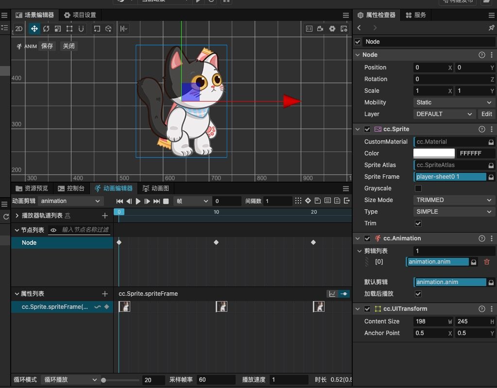

# 动画的基本原理

- 用

```ts
class A extends cc.Component {
  _nDirectionX: number = 1;
  _nDirectionY: number = 1;
  update(de: number) {
    if (
      (this._label.node.x ≥ 480 && this._nDirectionX > 0) ||
      (this._label.node.x < 480 && this._nDirectionX < 0)
    ) {
      this._nDirectionX = -this._nDirectionX;
    }
    if ((this._label.node.y ≥ 480 && this._nDirectionY > 0) ||
      (this._label.node.y < 480 && this._nDirectionY < 0)) {
      this._nDirectionY = -this._nDirectionY;
    }
    this._label.node.x += this._nDirectionX;
    this._label.node.y += this._nDirectionY;
  }
}
```

抛物线动画

```ts
const G: number = 9.8;
const PLAY_SPEED = 10;
class A extends cc.Component {
  _nA: number = 0; // 初始角度
  _nV0: number = 0; // 初始速度
  _nVx: number = 0; // X轴速度
  _nVy: number = 0; // Y轴速度
  _nT: number = 0; // 时间T
  start() {
    this._nA = 60; // 夹角 初始角度
    this._nV0 = 80; // 斜线的长度 初始力量

    this._nVx = this._nV0 * Math.cos((this._nA / 180) * Math.PI);
    this._nVy = this._nV0 * Math.sin((this._nA / 180) * Math.PI);
  }
  update(nDeltaT: number) {
    //
    nDeltaT = nDeltaT * PLAY_SPEED;
    this._nT += nDeltaT; // 走过的时间
    // 水平匀速运动
    this._oLabel.node.x += this._nVx * nDeltaT; // X轴要走的距离
    // 自由落体
    this._oLabel.node.y += (this._nVy - G * this._nt) * nDeltaT;
  }
}
```

## 帧动画



## 骨骼动画

- Spine https://zh.esotericsoftware.com/
- DragonBones 龙骨 https://istvanszep.thinkific.com/courses/animate-your-game-characters-for-free-with-inkscape-and-dragonbones?coupon=startdragonbones

### 动画类

```js
class A extends Component {
  start(): void {
    cc.Canvas.instance.node.on(cc.Node.EventType.TOUCH_END, () => {
      let oSk = cc.find("Canvas/Hero_1").getComponent(sp.Skeleton);
      // 哪个轨道   名字   是否循环
      const oTrackEntry = oSk.setAnimation(1, "Attk", false);
      oSk.setTrackCompleteListener(oTrackEntry, () => {
        oSk.clearTrack(1);
      });
    });
  }
}
```

- convertToNodeSpaceAR: 将一个点从世界坐标转换到节点的本地坐标系下
  - 返回一个新的 `Vec2` 对象，表示转换后的本地坐标

```ts
private mouseHandle(oEvent: EventMouse) {
  switch (oEvent.getButton()) {
    case 0: {
      this.hero.attack();
      break;
    }
    case 2: {
      const camera = find("Canvas/Camera").getComponent(Camera);
      const location = oEvent.getLocation();
      const screenPos = v3(location.x, location.y);
      const worldPos = camera.screenToWorld(screenPos);
      // console.log({ worldPos: worldPos.toString() });
      const oMoveToV3 = this.node
        .getComponent(UITransform)
        .convertToNodeSpaceAR(worldPos);
      this.hero.moveTo(oMoveToV3);
      // this.hero.moveToRigidbody(oMoveToV3);
      break;
    }
  }
}
```
