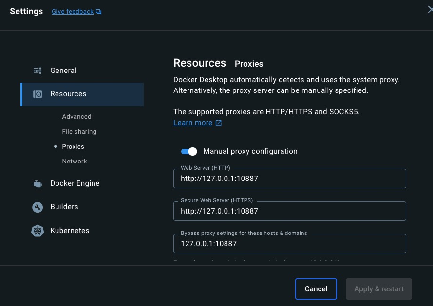

# Docker 客户端登录问题

```bash
docker login -u username --password-stdin <<< "password"
```

## 因为代理没加载到的问题

- 1. 代理要全局
- 2. Docker 客户端打开前代理就要设置为全局
     
- 3. Docker 客户端配置：
  - Resources -> Proxies 设置成代理
  - Docker Engine
    ```json
    {
      "builder": {
        "gc": {
          "defaultKeepStorage": "20GB",
          "enabled": true
        }
      },
      "experimental": false,
      "proxies": {
        "http-proxy": "http://127.0.0.1:10887",
        "https-proxy": "http://127.0.0.1:10887",
        "no-proxy": "localhost,127.0.0.1"
      },
      "registry-mirrors": ["http://f1361db2.m.daocloud.io"]
    }
    ```
