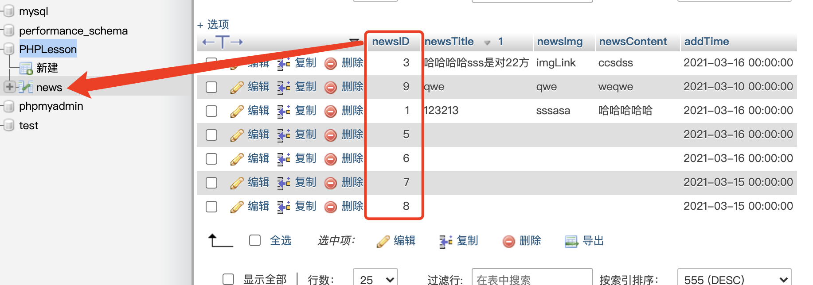
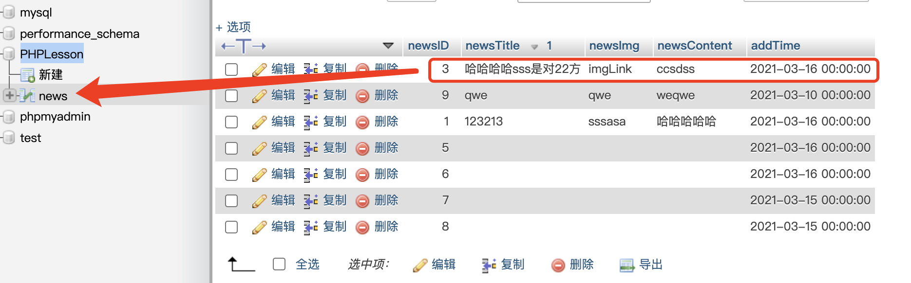
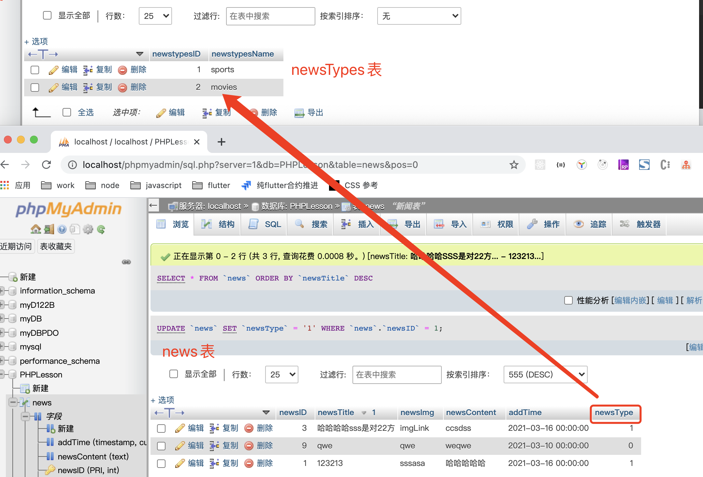

# MySQL 中的关键字

字段、属性、列、记录（元祖）、表、外键

## 字段【列】

某一事物的一个特征，或属性，在这里，`newsID`就是`news`表的一个属性

## 记录【元祖】：事物特征的组合，可以描述一个具体的事物

通过一条记录，news 的一条消息就相当清除了

## 表

记录的组合，表示同一类事物的组合。  
表，相当于具有相似特征事物的集合。

## 主键：能唯一标识信息的事物

防止冗余

## 外键

一个执行另一个表的指针  
此时的外键如同指向"newsType"表中某唯一记录的地址指针。

