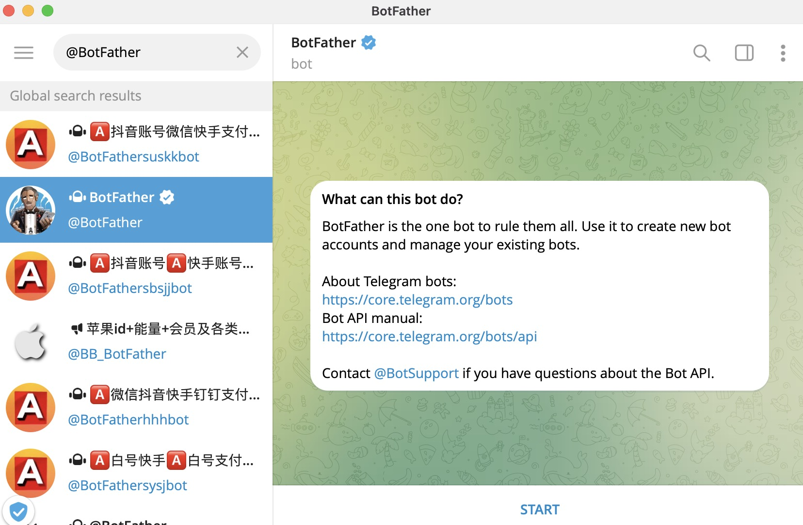
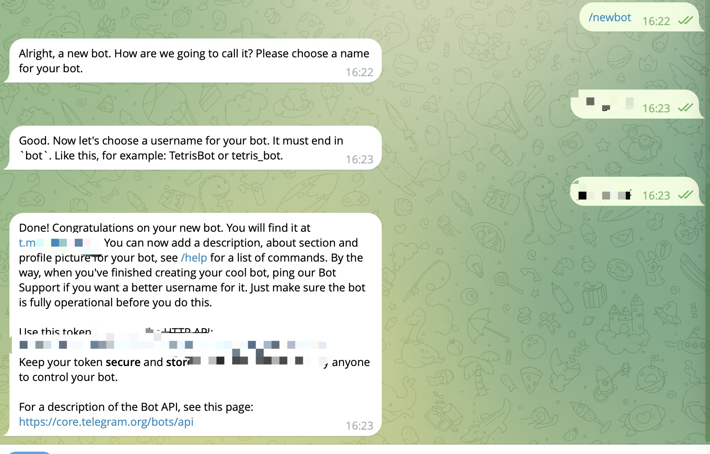

# telegram bot

- 1.  `@BotFather`
      
- 2. `/newbot`
- 3. name
     

## Telegraf.js

Telegraf.js 是一个专为 Nodejs 设计的现代 Telegram Bot API 框架

```js
import { Telegraf } from "telegraf";
import { message } from "telegraf/filters";

const bot = new Telegraf(token);

bot.on(message("text"), (ctx) => ctx.reply("Hello"));

// Start webhook via launch method (preferred)
bot.launch({
  webhook: {
    // Public domain for webhook; e.g.: example.com
    domain: webhookDomain,

    // Port to listen on; e.g.: 8080
    port: port,

    // Optional path to listen for.
    // `bot.secretPathComponent()` will be used by default
    path: webhookPath,

    // Optional secret to be sent back in a header for security.
    // e.g.: `crypto.randomBytes(64).toString("hex")`
    secretToken: randomAlphaNumericString,
  },
});
```
