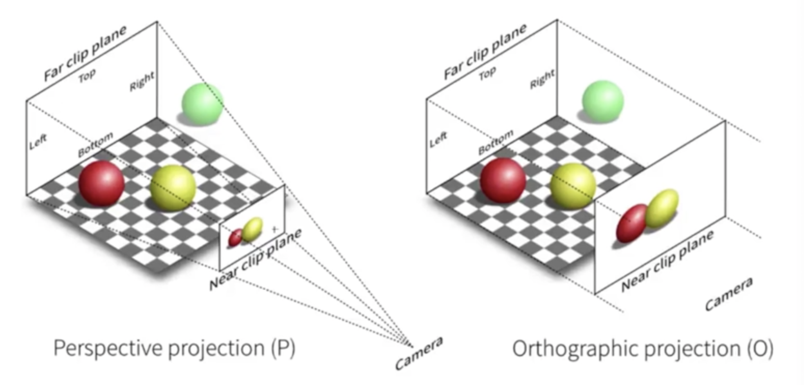

# 简单实现

## 创建 threejs 渲染器

```js
~(function () {
  // 1. 创建场景和摄像机
  const scene = new THREE.Scene();
  // 2. 创建摄像机
  // const camera = new THREE.PerspectiveCamera("视角","指投影窗口的长宽比","表示从距离摄像机多远的位置开始渲染","表示距离摄像机多远的位置截止渲染 1000");
  const camera = new THREE.PerspectiveCamera(
    75,
    window.innerWidth / window.innerHeight,
    0.1,
    1000
  );
  // 创建threeJS渲染器
  // antialias: true 抗锯齿
  const renderer = new THREE.WebGLRenderer({ antialias: true, alpha: true });
  // 设置渲染器场景的大小
  renderer.setSize(window.innerWidth, window.innerHeight);
  // 把渲染器添加到我们页面
  document.body.appendChild(renderer.domElement);

  // 创建基础几何模型
  // const geometry = new THREE.BoxGeometry("x轴的长","y轴的长","z轴的长")
  const geometry = new THREE.BoxGeometry(2, 2, 2);
  // 创建贴图
  const texture = new THREE.TextureLoader().load("img/bg_image_01.svg");
  // 创建材质
  // const material = new THREE.MeshBasicMaterial({ color: 0x00ff00 });
  const material = new THREE.MeshBasicMaterial({
    map: texture,
    transparent: true,
  });
  // 创建网络对象
  const cube = new THREE.Mesh(geometry, material);
  // 把网络对象添加到场景中
  scene.add(cube);
  function animate() {
    requestAnimationFrame(animate);
    // 网格旋转
    cube.rotation.x += 0.01;
    cube.rotation.y += 0.01;
    // 渲染器渲染，场景和摄像机
    renderer.render(scene, camera);
  }
  animate();
  // 摄像机空间Z轴位置
  camera.position.z = 10;
  // 响应式
  window.addEventListener("resize", () => {
    // 初始化摄像机
    camera.aspect = window.innerWidth / window.innerHeight;
    camera.updateProjectionMatrix();
    // 初始化渲染器尺寸
    renderer.setSize(window.innerWidth, window.innerHeight);
  });
})();
```

### 摄像机的两个方式


