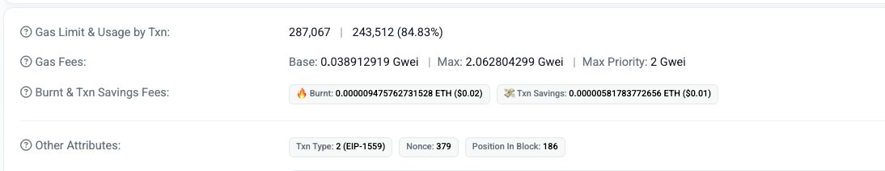

# 以太坊客户端

## 什么是以太坊客户端

- 以太坊客户端是一个软件应用程序，它实现以太坊规范并通过 P2P 网络与其他以太坊客户端进行通信。如果不同的以太坊客户端符合参考规范和标准化通信协议，则可以进行相互操作
- 以太坊是一个开源项目，由“黄皮书”正规规范定义。除了各种以太坊的改进提案，此正式规范还定义了以太坊客户端的标准行为
- 因为以太坊有明确正式规范，以太网客户端有了许多独立开发的软件实现，它们之间又可以彼此交互

## 常见的客户端

- 执行层：Geth(Go实现) Nethermind(C#实现) Erign(go) Reth(Rust)
  - 当共识层收到其他节点广播的区块时，会通过 Engine API 将区块交给执行层进行验证。执行层重新执行其中的所有交易，确保结果正确，并将验证结果返回给共识层。
- 共识层：Prysm(Go) Lighthouse(Rust实现)
  - 当共识层被选为出块者时，它会通过 Engine API 通知执行层构建新区块。执行层从交易池中挑选交易并执行，生成“执行负载”（Execution Payload）后返回给共识层。

## 基于以太坊规范的网络

- 存在各种基于以太坊规范的网络，这些网络基于符合以太坊“黄皮书”中定义的形式规范，但它们之间可能相互也可能不相互操作
- 这些基于以太坊的网络中有： 以太坊，以太坊经典，Ella，Expanse，Ubiq，Musicoin 等等
- 虽然大多数在协议级别兼容，但这些网络通常具有特殊要求，以太坊客户端软件的维护人员、需要进行微小更改、已支持每个网络功能或属性

## 以太坊的多种客户端

### Geth go-ethereum(Go)

- 官方推荐，开发使用最多
- Geth 是由以太坊基金会积极开发的 Go 语言实现的，因此被认为是以太坊客户端的“官方”实现
- 通常，每一个基于以太坊的区块链都有自己的 Geth 实现
- 地址:https://github.com/ethereum/go-ethereum

### parity(Rust) 最轻便，在历次以太网网络攻击中表现卓越

地址:https://github.com/ethcore/parity/releases

### cpp-ethereum(C++)

地址:https://github.com/ethereum/cpp-ethereum

### pyethapp(python)

地址:https://github.com/heikoheiko/pyethapp

### ethereumjs-lib(javascript)

地址:https://github.com/ethereumjs/ethereumjs-lib

### EthereumJ/Harmony(Java)

地址:https://github.com/ethereum/ethereumj

## 以太坊全节点

- 全节点是整个主链的一个副本，存储并维护链上的所有数据，并随时验证新区块的合法性
- 区块链的健康和扩展弹性，取决于具有许多独立操作和地理上分散的全节点。每个全节点都可以帮助其他新节点获取区块数据，并通过所有交易和合约的独立验证。
- 运行全节点将耗费巨大成本，包括硬件资源和带宽。
- 以太坊开发不需要实时网络（主网）上运行全节点。可以使用测试网络的节点来替代，也可以用本地私链，或者使用服务商提供基于云的以太坊客户端；这些几乎都可以执行所有操作。

## 远程客户端和轻节点

### 远程客户端

不存储区块链的本地副本或验证块和交易。这些客户端一般只提供钱包功能，可以创建和广播交易。远程客户端可以用于连接到现有网络，MetaMask 就是一个这样的客户端

### 轻节点

不保存链上的区块历史数据，只保存区块链当前的状态，轻节点可以对块和交易进行验证。

## 全节点的优缺点

### 优点：

- 为以太网络的灵活性和抗审查性提供有力支持
- 权威地验证所有交易
- 可以直接与公共区块链上的任何合约交互
- 可以离线查询区块链状态（帐户，合约等）
- 可以直接把自己的合约部署到公共区块链上

### 缺点：

- 需要巨大的硬件和宽带资源，而且会不断增长
- 第一次下载往往需要几天才能完全同步
- 必须及时维护、升级并保持在线状态以同步区块

## 公共测试网络节点的优缺点

### 优点：

- 一个 testnet 节点需要同步和存储更少的数据，约 10GB，具体取决于不同的网络
- 一个 testnet 节点一般可以在几个小时内完全同步
- 部署合约或进行交易只需要发送测试以太，可以从“水龙头”免费获得
- 测试网络是公共区块链，有许多其他用户和合约运行（区别于私链）

### 缺点：

- 测试网络上使用测试以太，没有价值，因此无法测试交易对手的安全性，因为没有任何利害关系
- 测试网络上的测试无法涵盖所有真实主网特性。例如，交易费用虽然是发送交易所必须的，但由于 gas 免费，因此 testnet 上往往不会考虑，而且一般来说，测试网络不会像主网那样经常拥堵

## 本地私链的优缺点

### 优点：

- 磁盘上几乎是没有数据的，也不同步别的数据，是一个完全“干净”的环境
- 无需获取测试以太，你可以任意分配以太，也可以随时自己挖矿获得
- 没有其他用户，也没有其他合约，没有任何外部干扰

### 缺点：

- 没有其他用户意味着与公链的行为不同。发送的交易并不存在空间或交易顺序的竞争
- 除自己外没有矿工意味着挖矿更容易预测，因此无法测试公链上发生的某些情况
- 没有其他合约，意味着你必须部署要测试的所有内容，包括所有的依赖项和合约库

## 运行全节点的要求

#### 最低要求

- 双核以上 CPU
- 硬盘存储可用空间至少 80GB
- 如果是 SSD，需要 4GB 以上 RAM，如果是 HDD，至少 8GB RAM
- 8 MB/s 下载宽带

#### 推荐配置

- 四核以上的快速 CPU
- 16GB 以上的 RAM
- 500GB 以上可用空间的快速 SSD
- 25+ MB/s 下载宽带

### JSON-RPC

- 以太坊客户端提供了 API 和一组远程调用(RPC)命令，这些命令被编码为 JSON。这被称为 JSON-RPC API。本质上，JSON-RPC API 就是一个接口，允许我们编写的程序使用以太坊客户端作为网关，访问以太坊网络和链上数据。
- 通常，RPC 接口作为一个 HTTP 服务，端口设定为 8545。处于安全原因，默认情况下，它仅限于接受来自 localhost 链接
- 要访问 JSON-RPC API，我们可以使用编程语言编写专用库，例如 JavaScript 的 web3.js
- 或者也可以手动构建 HTTP 请求并发送和接受 JSON 编码的请求，如

```
$ curl -X POST -H "Content-Type: application/json" --data '{"jsonrpc":"2.0", "method":"web3_clientVersion","params":[],"id":1}' http://localhost:8545

$ curl -X POST -H "Content-Type: application/json" --data '{"jsonrpc":"2.0", "method":"eth_blockNumber","params":[],"id":1}' http://localhost:8545
```

## 钱包权重规则（多链钱包开发）

多链钱包中会存在多个钱包（多链、多账户），「获取哪一个」由**派生路径**和**链/账户标识**决定，开发时需遵守以下协议，才能在不同链、不同客户端间一致地选出同一「钱包」（同一账户）。

### 「获取哪一个」由什么决定

- **链**：先按链选（BTC、ETH、各 L2 等），对应派生路径里的 `coin_type'`。
- **账户**：同一链下可有多个账户，对应路径里的 `account'`（通常 0、1、2…）。
- **用途**：外部收款与找零分开，对应 `change`（0=收款，1=找零）。
- **地址索引**：同一账户下多个地址，对应 `address_index`（常用 0 为「默认」）。

因此：**选链 → 选账户 → 选地址**，三者确定后就能唯一确定「哪一个钱包」；实现上即确定一条 BIP-44 派生路径。

### 需要遵守的协议

| 协议 / 规范          | 作用                                                                                                                                                                                          |
| -------------------- | --------------------------------------------------------------------------------------------------------------------------------------------------------------------------------------------- |
| **BIP-39**           | 助记词生成与恢复种子；同一助记词在不同客户端应得到相同种子，多链共用一套助记词。                                                                                                              |
| **BIP-32**           | HD 分层确定性派生：从种子推导子密钥，路径一致则得到同一私钥/地址；多链、多账户都基于同一棵派生树。                                                                                            |
| **BIP-44**           | 多币种路径格式：`m/44'/purpose'/coin_type'/account'/change/address_index`；约定各层含义，保证「选哪条链、哪个账户、哪个地址」有统一规则。                                                     |
| **SLIP-44**          | 各链的 `coin_type` 注册表（如 BTC=0、ETH=60）；多链钱包按 SLIP-44 选 `coin_type` 才能与其它钱包、扫描器、浏览器一致。 [注册表](https://github.com/satoshilabs/slips/blob/master/slip-0044.md) |
| **EIP-155**          | 以太坊链 ID 参与签名，防重放；多链环境下必须按 chainId 区分链，避免在 A 链签的 tx 在 B 链被接受。                                                                                             |
| **EIP-55**           | 以太坊地址大小写校验和；展示与校验地址时遵循，避免错误地址。                                                                                                                                  |
| **CAIP-2 / CAIP-10** | 链无关的链 ID（CAIP-2）与账户 ID（CAIP-10：`chain_id:address`）；WalletConnect、多链 dApp 常用，用于唯一标识「哪条链上的哪个钱包」。                                                          |

### 实践要点

- **同一助记词 + 同一派生路径** → 得到**同一个**钱包（同一私钥/地址）；不同客户端、不同链只要遵守 BIP-32/44 和 SLIP-44，就能复现同一账户。
- **选链**：用 SLIP-44 的 `coin_type`（及 EVM 链的 chainId）确定链；**选账户**：用 BIP-44 的 `account'` 和 `address_index`；**选哪一个** = 定好这条路径并只对该路径做派生与展示。

## gas

### EIP1559 费用规则

- **Gas Price 分为两部分**：基础费(base fee) 和优先费(小费 Tip / Priority Fee)
  - 根据区块使用率，系统**动态调节**基础费用 base fee（网络忙则涨，闲则降）
  - 基础费**用于销毁**（不归矿工），进入链上「烧毁」逻辑
  - 优先费由用户自行设置，作为矿工/验证者的**小费**，激励打包你的交易
- **EIP1559 主要解决的问题**
  - 避免矿工作恶（矿工无法通过自成交人为拉高 gas）
  - 降低通胀或通缩：烧掉 base fee → 见 [ultrasound.money](https://ultrasound.money/)
  - 体验改善：base fee 按**实际消耗**扣除，用户设好上限后不会被多收费（旧版需频繁调 gas 或承受高价）

- **Gas 设置（你设的是「预算上限」）**
  - **gas limit**：这笔交易最多允许消耗多少 gas 单位（算力上限）
  - **max fee**：愿意为每单位 gas 支付的**最大总单价**（base fee + tip 的单价上限）
  - **max priority fee**：愿意给矿工/验证者的**优先费上限**（每 gas 的小费上限）

#### 用一笔真实交易对照理解（Txn Type: 2，EIP-1559）


| 项目 | 含义 | 图中示例值 |
| -------------------------- | ---------------------------------------- | ---------------------------- |
| **Gas Limit** | 你设定的「燃料上限」 | 287,067 |
| **Usage by Txn 实际消耗** | 链上真实用掉的 gas | 243,512（约 84.83%） |
| **Gas Fees: Base** | 该区块的**基础费**（系统定，会烧掉） | 0.038912919 Gwei |
| **Gas Fees: Max** | 你设的**最大总单价**（max fee） | 2.062804299 Gwei |
| **Gas Fees: Max Priority** | 你设的**优先费上限**（小费） | 2 Gwei |
| **Burnt** | 本笔交易中 base fee 被**销毁**的 ETH | ≈ 0.00000948 ETH（约 $0.02） |
| **Txn Savings** | 因实际 fee 低于 max fee 而**少付**的 ETH | ≈ 0.00000582 ETH（约 $0.01） |

- **实际扣费**：每单位 gas 你付的是 `min(max fee, base fee + 实际给的 tip)`；多出来的部分不会扣，即「Txn Savings」。
- **Burnt** 对应文档里说的「基础费用于销毁」：图中这笔钱的 base 部分被烧掉，不归矿工；只有你给的 tip（优先费）归验证者。
  - Burnt 243512\*0.038
- 实际小费单价 = min(maxPriorityFee, maxFee − baseFee)
  - Base ≈ 0.039 Gwei，Max ≈ 2.063 Gwei，Max Priority = 2 Gwei
  - 空间 = 2.063 − 0.039 ≈ 2.024 Gwei
  - min(2, 2.024) = 2，所以实际小费单价 = 2 Gwei（被 max priority 限制住了）
  - 实际小费总额 ≈ 2 × 243,512 ≈ 487,024 Gwei ≈ 0.000487 ETH（给矿工/验证者的部分）

### EIP 4844（Proto-Danksharding） L2上有

- **目的**：为 L2 Rollup 提供更便宜的数据可用性，是通往完整 Danksharding 的过渡方案。
- **Blob 承载交易（blob-carrying transactions）**
  - 一种新交易类型，可携带约 128KB 的 blob 数据（由 4096 个 32 字节的域元素组成）。
  - 每个区块最多约 16 个 blob，总 blo b 容量约 2MB。
- **特性**
  - Blob 数据对 EVM 不可见：EVM 只能访问对 blob 的承诺，不能直接读取 blob 内容。
  - 临时存储：blob 在约 18 天（约 2 周）后被清除，足够 L2 验证批次，同时控制节点存储。
  - 使用 KZG（Kate-Zaverucha-Goldberg）多项式承诺，可验证 blob 中某段数据存在而无需公开完整数据。
- **效果**：L2（如 Optimism、Arbitrum）数据可用性成本显著下降；ZK Rollup 成本可降低约 40–100 倍量级。
