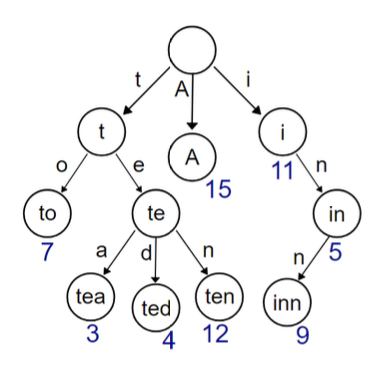
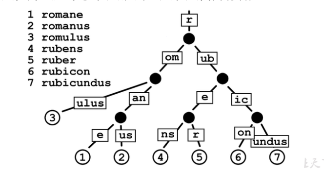
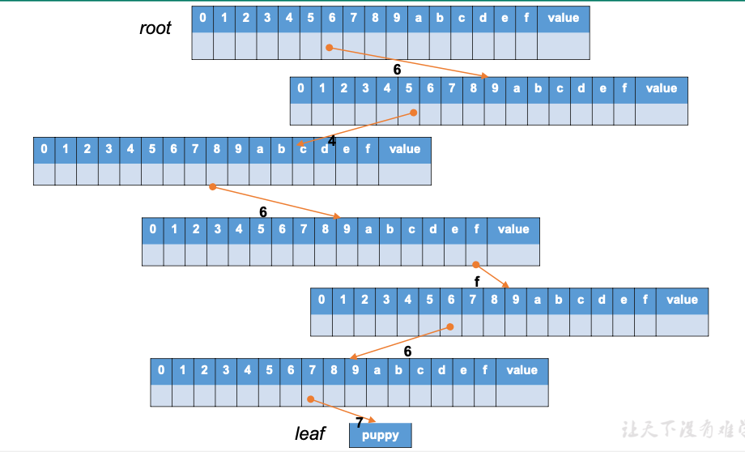
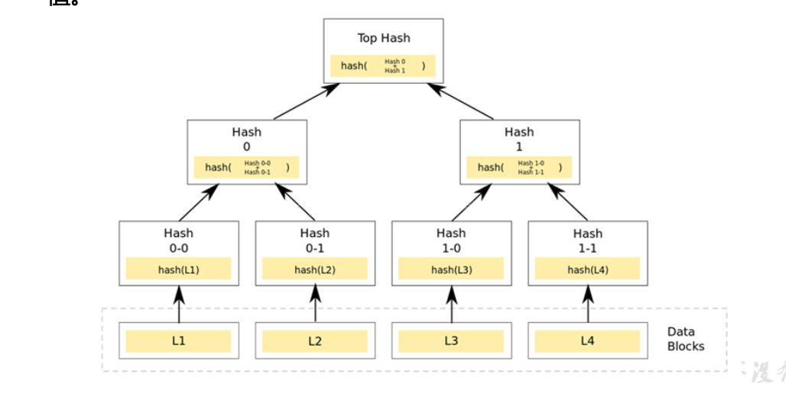
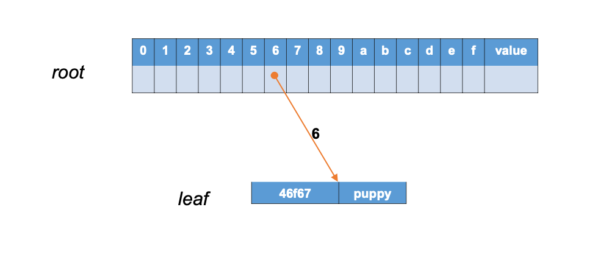
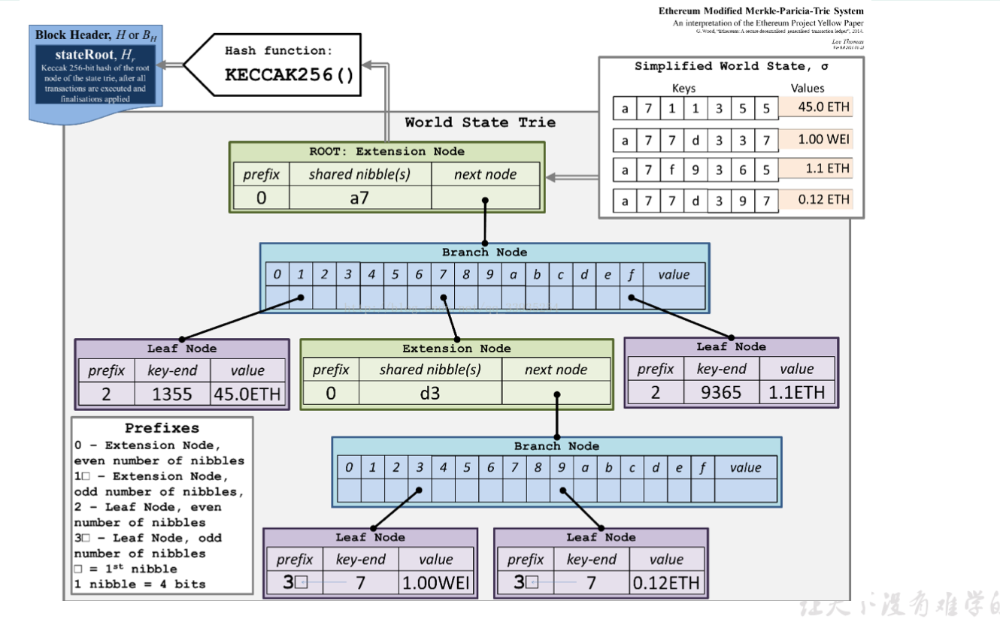
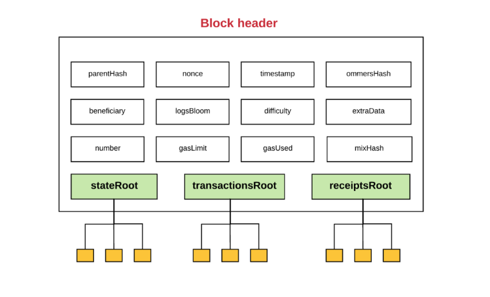
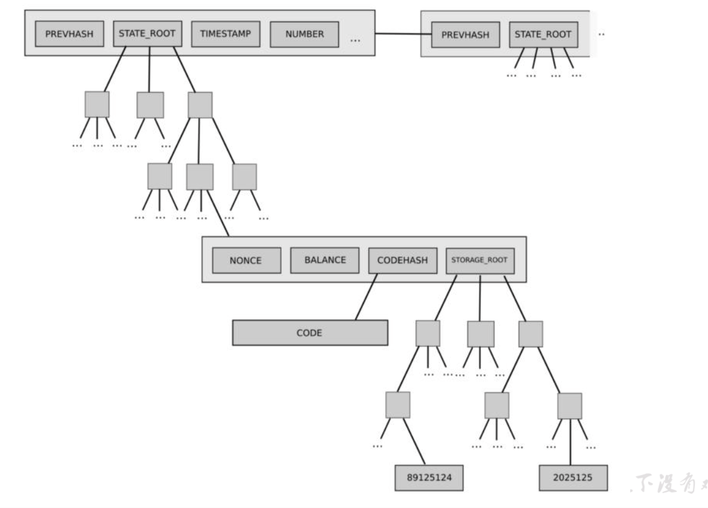

# MPT Merkel-Patricia Tree

梅克尔-帕特里夏树

## 什么是 MPT

- Merker Patricia Tree(MPT)，翻译为梅克尔-帕特里夏树
- MPT 提供了一个基于密码学验证的底层数据结构，用来存储键值对（key-value）关系
- MPT 是完全确定性的，这是指在一颗 MPT 上一组键值对 是唯一确定的 。相同内容的键可以保证找到相同的值，并且有同样的根哈希（root hash）
- MPT 的插入、查找、删除操作的时间复杂度都是`O(log(n))`，相对于其他基于复杂比较的树结构（比如红黑树），MPT 更容易理解，也更易于编码的实现

### 从字典树（Trie）说起

- 字典树（Trie）也称前缀树（prefix tree），属于搜索树，是一种 有序的树数据结构
- 字典树用于存储动态的集合或映射，其中的键通常是字符串
  

### 基数树（Radix Tree）

- 基数树 又叫压缩 前缀树（companct prefix tree），是一种空间优化后的字典树，其中如果一个节点只有唯一的子节点，那么这个子节点就会与父节点合并存储
  

#### 基数树节点

在一个标准的基数树里，每个节点存储的数据如下：
`[i0,i1,...,in,value]`

- 这里的 i0,i1,...,in 表示定义好的字母表中的字符，字母表中共有 n+1 个字符，这课树的基数（radix）就是 n+1
- value 表示这个字节中最终存储的值
- 每一个 i0 到 in 的“槽位”，存储的或者是 null，或者说是指向另一个节点的指针
- 用节点的访问路径表示 key,用节点的最末位存储 value，这就实现了一个基本的键值存储

#### 例子

- 我们有一个键值对`{"dog":"puppy"}`，现在希望通过键 dog 访问它的值；我们采用 16 进制的 Hex 字符作为字符集
- 首先我们将“dog”转换为 ASCII 码，这样就得到了字符集中的表示 64 6f67，这就是树结构中对应的键
- 按照键的字母序，即`6->4->6->f->6->7`，构建树中的访问路径
- 从树的跟节点（root）出发，首先读取索引值（index）为 6 的插槽中存储的值，以它为键访问到对应的子节点
- 然后取出子节点索引值为 4 的插槽中的值，以它为键访问下一层节点，直到访问完所需要的路径
- 最终访问的叶子节点，就存储了我们想要查找的值，即"puppy"
  

#### 基数树的问题

**数据校验**

- 基数树节点之间的连接方式是指针，一般是用 32 位或 64 位的内存地址作为指针的值，比如 C 语言就是这么做的。但这种直接存地址的方式无法提供对数据内容的校验，而这在区块链这样的分布式系统中非常重要。
  **访问效率**
- 基数树的另一个问题是低效。如果我们只想存一个 bytes32 类型的键值对，访问路径长度就是 64（在以太坊定义的 Hex 字符集吓）；每一级访问的节点都至少需要存储 16 个节点，这样就需要至少 1k 字节的额外空间，而且每次查找和删除都必须完整地执行 64 次下探访问。

### 梅克尔树（Merkel Tree）

- 也被称为哈希树（Hash Tree），以数据块的 hash 值作为叶子节点存储值。梅克尔树的非叶子节点存储其子节点内容串联拼接后的 hash 值。
  

### 帕特里夏树（Patricia Tree）

- 如果一个基数树的“基数”（radix）为 2 或 2 的整数次幂，就被称为“帕特里夏树”，有时也直接认为帕特里夏树就是基数树
- 以太坊中采用 Hex 字符作为 key 的字符集，也就是基数为 16 的帕特里夏树
- 以太坊中的树结构，每个节点可以有最多 16 个子节点，在加上 value，所以共有 17 个“插槽”（slot）位置
- 以太坊中的帕特里夏树加入了一些额外的数据结构，主要是为了解决效率问题

### MPT(Merkel Patricia Tree)

- 梅克尔-帕特里夏树是梅克尔和帕特里夏树的结合
- 以太坊中的实现，对 key 采用 Hex 编码，每个 Hex 字符就是一个 nibble（半字节）
- 遍历路径时对一个节点只访问它的一个 nibble，大多数节点是一个包含 17 个元素的数组；其中 16 个分别以 hex 字符作为索引值，存储路径中下一个 nibble 的指针；另一个存储如果 路径到此已遍历结束，需要返回的最终值。这样的节点叫做“分支节点”（branch node）
- 分支节点的每个元素存储的是指向下一级节点的指针。与传统做法不同，MPT 是用所指向节点的 hash 来代表这个指针的；每个节点将下个节点的 hash 作为自己存储内容的一部分，这样就实现了 Merkel 树结构，保证了数据校验的有效性

### MPT 节点分类

**MPT 中的节点有以下几类**

- 空节点（null）：表示空字符串
- 分支节点（branch）： 17 个元素的节点，结构为`[v0, .... v15,vt]`
- 叶子节点（leaf）：拥有两个元素，编码路径`encodedPath`和值`value`
- 扩展节点（extension）：拥有两个元素，编码路径 encodedPath 和键 key

### MPT 中数据结构的优化

- 对于 64 个字符的路径长度，很有可能在某个节点处会发现，下面至少有 一段路径没有分叉；而这很难避免
- 我们 当然可以依然用标准的分支节点来表示，强制要求这个节点必须有完整的 16 个索引，并给没有用到的那 15 个位置全部赋值为空值；但这样有点蠢
- 通过设置“扩展节点”，就可以有效地缩短访问 路径，将冗长的层级关系压缩成一个键值对，避免不必要的空间浪费
- 扩展节点（extension node）的内容形式是`[encodedPath, key]`其中 encodedPath 包含下面不分叉的那部分路径，key 是指向 下一个节点的指针（hash，即在底层 db 中 的存储位置）
- 叶子节点（leaf node）： 如果在某个节点后就没有了分叉路径，那这是一个叶子节点，它的第二个元素就是自己的 value
  

### 紧凑编码（compact coding）

- 路径压缩的处理相当于实现了压缩前缀树的功能；不过路径表示的是 hex 字符串（nibbles），而存储却是以字节（byte）为单位的，相当于 浪费了一倍的存储空间
- 我们可以采用一种紧凑编码（compact coding）方式，将两个 nibble 整合在一个字节中保存，这就避免了不必要的 浪费
- 这里就会带来一个问题，可能 nibble 总数是一个奇数，而数据总是以字节形式存储的，所以 无法区分`nibble 1`和 `nibbles 01`；这就使我们必须分别处理奇偶两种情况
- 为了区分路径长度的奇偶性，我们在 encodedPath 中引入标识位

### Hex 序列的压缩编码规则

- 我们在 encodedPath 中，加入一个 nibble 作为前缀，它的后两位用来标识节点类型和路径长度的奇偶性

  | Hex 字符 | 二进制位(bits) | 节点类型 | 路径长度 |
  | -------- | -------------- | -------- | -------- |
  | 0        | 0000           | 扩展     | 偶       |
  | 1        | 0001           | 扩展     | 奇       |
  | 2        | 0010           | 叶子     | 偶       |
  | 3        | 0011           | 叶子     | 奇       |

- MPT 中还有一个可选的“结束标识”（用 T 表示），值为 0x10(十进制的 16)，它仅能在路径末尾出现，代表节点是一个最终节点（叶子节点）
- 如果路径是奇数，就与前缀 nibble 凑成整字节；如果是偶数，则前缀 nibble 后补 0000 构成整字节

#### 编码实例

- `[1,2,3,4,5,...]`不带结果位，奇路径
  - `11 23 45`
- `[0,1,2,3,4,5,...]`不带结束位，偶路径
  - `00 01 23 45`
- `[0,f,1,c,b,8,10]`带结束位 T 的偶路径
  - `20 0f 1c b8`
- `[f,1,c,b,8,10]`带结束位 T 的奇路径
  - `3f 1c b8`

#### MPT 树结构示例

- 假设我们要构建一个存储了以下键值对的 MPT 树
  - `("do","verb"),("dog","puppy"),("doge","coin"),("horse","stallion")`
- 首先我们会把所有的路径（`path`）转成 ASCII 码表示的`bytes`：
  - `<64 6f>`: `verb`
  - `<64 6f 67>`: `puppy`
  - `<64 6f 67 65>`: `coin`
  - `<64 6f 72 73 65>`: `stallion`
- 然后我们就可以用在底层 db 中存储的以下键值对，构建出 MPT 树
  - `rootHash`: `[<16>, hashA]`
  - `hashA`: `[<>,<>,<>,<>,hashB,<>,<>,<>,hashC,<>, <>, <>, <>, <>, <>, <>, <> ]`
  - `hashC`: `[<20 6f 72, 73, 65>, "stallion"]`
  - `hashB`: `[<00 6f>, hashD]`
  - `hashD`: `[<>,<>,<>,<>,<>,<>,hashE, <>, <>, <>, <>, <>, <>, <>, <>, <>,"verb"]`
  - `hashE`: `[<17>, hashF]`
  - `hashF`: `[<>,<>,<>,<>,<>,<>,hashG, <>, <>, <>, <>, <>, <>, <>, <>, <>, 'puppy']`
  - `hashG`: `[<35>, "coin"]`

### 以太坊中树结构

- 以太坊中所有的 merkel 树都是 MPT
- 在一个区块的头部（block head）中，有三个 MPT 树根：
  - stateRoot: 状态树的树根
  - transactionRoot: 交易树的树根
  - receiptsRoot: 收据树的树根

### 以太坊中树结构

- 状态数(state trie)
  - 世界状态数，随时更新；它存储的键值对（path, value）可以表示为`(sha3(ethereumAddress), rlp(ethereumAccount))`
  - 这里的 account 是 4 个元素构成的数组: `[nonce, balance,storageRoot,codeHash]`
- 存储树(storage trie)
  - 存储树是保存所有合约数据的地方；每个合约账户都有一个独立隔离的存储空间
- 交易树（transaction trie）
  - 每个区块都会有单独的交易数，他的路径（path）是 rlp(transactionIndex)，只有在挖矿时才能确定；一旦 出块，不再更改
- 收据树（receipts trie）
  - 每个区块也有自己的收据树；路径也表示为 rlp(transactionIndex)
    
