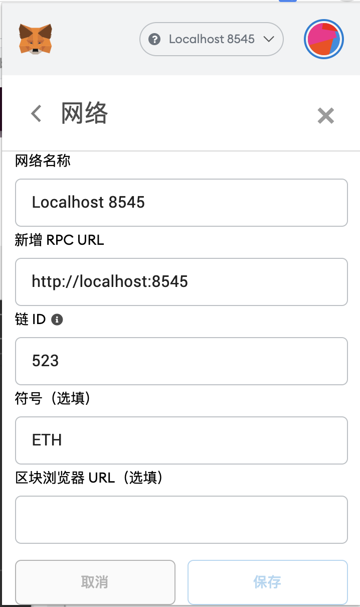

# MetaMask 报错集

## 链接私有网络调用合约方法时报错

### `[ethjs-rpc] rpc error with payload Error: invalid sender`

**原因：MetaMask 配置私有网络时，设置的 chainId 与私有网络不一致导致的**

#### 解决办法：

1. 查询以太坊私链的 network，我这里使用的是 geth,查询方法如下

```js
> web3.version
{
  api: "0.20.1",
  ethereum: undefined,
  network: "523", // 我这里的 network 是523  所以 mateMask 的chainId得设置为523
  node: "Geth/v1.10.2-stable/darwin-amd64/go1.16.3",
  whisper: undefined,
  getEthereum: function(callback),
  getNetwork: function(callback),
  getNode: function(callback),
  getWhisper: function(callback)
}
```

设置-> localhost ->

