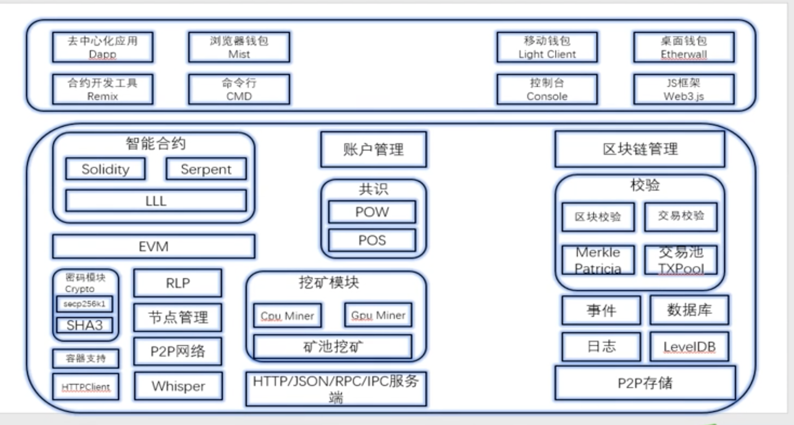

# 以太坊入门

- 以太坊背景
  - 为了解决比特币只能应用于支付领域而设计的一种公链
- 概念
  - 以太坊是一个建立区块链技术之上的去中心化应用平台，允许任何人在该平台中建立和使用去中心化应用，被称为区块链 2.0
- 优缺点
  - 优点
    - 以太坊平台对底层的区块链进行封装，让区块链开发者可以直接在上层应用平台进行开发，只需要专注于应用本身的开发，降低开发难度
    - 账户模型
      - bitcoin: UTXO 模型（Unspent Transaction Output）【定位就是最底层的应用】【防止双花】
      - Ethereum: 账户模型【定位是通用计算】
    - 共识
      - POW+POS 共识机制，避免了比特币的能耗问题
      - Ethash 是以太坊基于 POW 工作量证明的一个共识引擎（也叫挖矿算法）（前身是 Dagger Hashimoto）
    - 智能合约：和比特币相比，以太坊引入的是一个图灵完备的智能合约开发语言
  - 缺点
    - TPS 低，不适合快速大量的交易
    - 以太坊网络节点不适合存储大文件 【IPFS 可避开】
- 钱包与浏览器
  - [mist](https://ethereum.org/en/)
  - [imToken](https://token.im/download)
  - ...
- 以太坊架构
  

- 以太坊核心概念
  - 账户
    - 外部账户
      - 管理以太币的账号
    - 合约账号
      - 合约账号被存储在账号中的合约代币控制
    - 区别
      - 控制方不同，合约账户由合约代码控制，外部账户由私钥控制
      - 外部账户不包含代码，合约账户包含合约代码
    - 结构属性
      - nonce 发的多少次交易
        - 外部账户 -> 该账户地址发送的交易数量，出现在交易字段中，防止双花
        - 合约账户 -> 该账户所创建的合约数量
      - balance
      - storageRoot【MPT 的根节点 hash】
      - codeHash
        - 外部账户： 空
        - 内部账户： 合约账户里的 evm code 编译后的字节码
  - EVM: 以太坊虚拟机，以太坊智能合约的运行环境
  - 交易: 从外部账户发出的消息（签名数据包）
    - 交易内容
      - 消息接收者
      - 用于确认发送者的签名
      - 账户余额
      - 发送的额外数据
      - GAS
    - TPS(交易吞吐量)
      - 以太坊每秒处理的交易数量
    - Gas
      - 燃料-> 手续费
      - gas 不够会触发 out-of-gas,调用的所有状态都会回滚
      - Gaslimit: 最多允许他消耗多少个 gas【这时候 gas 当成一个单位】
      - Gasprice: 每一个 gas 的单价 （单位是平台币），以 gwei 表示，是系统选择优先级的一个衡量标准之一【还有币龄的概念，交易存在时间】
      - gasused: 实际消耗的 gas 数量 d
      - 在交易执行过程中，如果实际消耗的 gas 小于 gaslimit，gas 会以 ether 的方式退还给交易发起者
  - 以太坊交易就是一个正确的状态转换
  - 事件: 利用现有的规则解析日志记录
  - 共识:
    - 以太坊 POW(ethash)+POS
  - 叔区块：
    - 从比特币意义上来说，就是一个废区块
    - 概念：符合了难度条件，但在区块交易中没有被确认的区块
