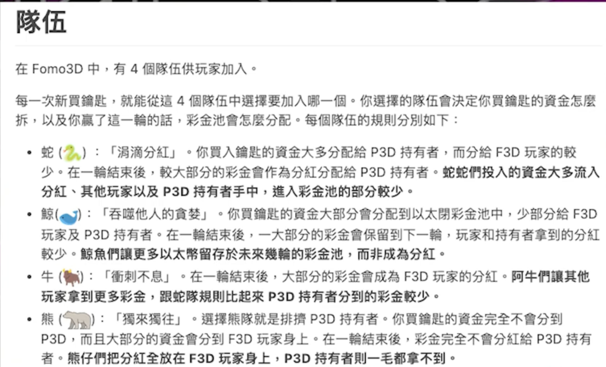

# 以太坊上的 Fomo3D 项目剖析

Fomo3D（常写作 FOMO3D）是 2018 年以太坊上极具话题度的一款链上「倒计时夺金」类 DApp，由 **Team JUST** 推出。它在 CryptoKitties 之后再次把主网 gas 与公众注意力推到高点，也成为后来讨论 **链上博弈、MEV、区块空间竞争** 时的经典案例。下文从产品设计、经济分配、博弈结构到争议事件做结构化梳理（仅供技术史与机制学习，不构成任何投资建议）。

## 1. 项目定位与历史背景

- **定位**：全链透明规则下的多人博弈游戏；营销上强调「恐惧错过」（FOMO）心理，配合实时公开的奖池与倒计时，形成极强的传播与参与冲动。
- **时代背景**：2018 年公链与 DApp 实验密集期，用户已习惯用 MetaMask 直接与合约交互；ETH 作为原生资产既是门票也是奖池计价单位，链上数据可公开审计。
- **生态关系**：同一团队体系内还有 **PoWH3D（P3D）** 等「分红型」代币设计，Fomo3D 的资金流与 P3D 持有者的分红叙事相互绑定，扩大了参与者基数与讨论面。

## 2. 核心玩法（Classic / Long 版逻辑要点）

不同版本在时长与参数上有差异，但公众讨论最多的 **Classic（偏「长跑」）** 大致可概括为：

1. **钥匙（Key）**  
   用户向合约支付 ETH 购买「钥匙」。钥匙价格随已售数量上升（早期资料与代码分析多提到近似 **平方根型** 的涨价曲线），越晚买入单价越高，强化「再不买就更贵」的预期。

2. **倒计时**  
   每有人买入钥匙，全局倒计时会被延长（常见描述为每次约 **+30 秒**），且存在 **上限**（例如总计时不超过约 **24 小时** 一类的硬顶，具体以合约为准）。倒计时归零时，**当前轮结束**。

3. **最后一单**  
   轮次结束时，**最后一次成功买入钥匙的地址** 在规则上获得本轮大奖池的主要份额（「谁是最后一个按下按钮的人」）。

4. **持续分红与旁路分配**  
   单次买入的金额通常被拆成多路：给当前轮已有钥匙持有者的「即时分红」、团队/社区金库、生态内其它模块（如 P3D 相关分红）、空投池等。精确比例与分支逻辑以部署合约为准；多篇复盘提到 **终局奖池** 大致存在「大头给终局赢家、其余按规则分给玩家/生态」的结构（例如流传较广的分析中有 **约 48% 量级给最终赢家**、另有固定比例进社区/基金、剩余部分按阵营或规则再分配等说法——**务必以链上代码与当时部署版本为准**）。

5. **阵营（Team）**  
   玩家可选择不同「队伍」，影响分红与终局分配在玩家之间的再分配细节，用来制造策略差异与社群话题（如 Snek、Whale 等命名阵营）。

此外还有节奏更快的变体（常被称作 **Short / Quick** 一类），核心仍是「买钥匙—延时—终局分奖」，但时间尺度与参数不同，适合不同风险偏好的人群围观或参与。

## 3. 代币经济与「像不像庞氏」的讨论

从金融学视角，Fomo3D 同时具备：

- **博彩特征**：明确随机性弱、主要依赖他人后续投入与时间博弈，终局赢家高度集中。
- **资金盘特征**：后入者的支付中有显著部分作为「分红」流向前序参与者与生态代币持有者；只要持续有新资金与买入，系统显得「永远能玩下去」。

因此社区与媒体常把它放在 **「庞氏 / 赌博 / 社会实验」** 的交叉地带讨论。链上优势在于：**规则事先写在合约里**，资金流可追溯；劣势在于：**规则不等于风险可控**，参与者仍可能面临高价接盘、流动性枯竭、合约复杂度带来的理解偏差等。

## 4. 博弈结构：为何能引爆 gas 与注意力

可用极简博弈直觉概括：

- **消耗战（War of Attrition）色彩**：大家都在等「别人最后一秒再冲」，但最后一秒往往最贵、也最容易被抢跑。
- **公开信息下的 FOMO**：奖池与时间在链上实时可读，浏览器里每秒变化都在刺激参与。
- **多目标优化**：有人为分红刷量，有人为博终局大奖，有人为刷空投或配合其它合约交互；目标不一致会放大波动。

这些因素叠加，使得在热门阶段 **主网拥堵、gas 飙升** 成为常态，也让「链上游戏」第一次被大量非技术用户直观感受到成本。

## 5. 著名争议：终局与「区块填充 / 抢跑」叙事

2018 年 8 月前后，第一轮大奖在链上结算，公开报道与后续技术分析普遍提到：

- 中奖地址之一为 **`0xa169…f85`**（常见报道写法），奖池规模在当时约合 **数百万美元量级** 的 ETH（报道数字因币价与统计口径略有出入）。
- 社区与研究者指出：在关键时间窗口附近，出现 **大量高 gas 交易占据区块空间** 的模式，使得其它玩家交易难以被打包，从而 **提高「成为最后一笔成功买入」的垄断性」**。这类手法常被归纳为 **Smart Contract / Block Stuffing**（区块填充）或与 **抢跑、排序权** 相关的讨论——其本质是 **谁愿意为区块空间付更高价、或与出块排序更亲近，谁就更有机会改写「最后一单」的结果**。

**启示（放到今天的语境）**：

- 早在「MEV」成为行业热词之前，Fomo3D 就把 **「排序即权力」** 暴露给大众：链上规则公平，但 **打包顺序并不承诺公平**。
- 对产品设计者：若终局依赖「最后一笔交易」，则天然与 **区块生产者激励、公共内存池竞争** 绑定，需要假设攻击者有经济动机去操纵 inclusion。
- 对研究者：这是从游戏 DApp 理解 **共识层与激励层如何影响应用层结果** 的教科书级样本。

## 6. 安全与工程层面常被提到的点

- **合约复杂度**：分红、多池、阵营、跨模块（F3D/P3D）耦合，提高审计与形式化验证成本；历史上 Team JUST 系列项目也常被安全公司作为案例样本分析。
- **前端与钓鱼**：热度高时仿盘、假站点极多，用户资产风险往往不在合约逻辑而在 **URL / 授权 / 假合约地址**。
- **升级与分叉**：仿盘与「二代 Fomo」层出不穷，地址与规则各不相同，讨论时需 **核对合约地址与源码版本**。

## 7. 小结：Fomo3D 在以太坊史上的意义

| 维度 | 可带走的结论 |
|------|----------------|
| 产品 | 把倒计时 + 透明金库 + 社交传播做成可组合模板，影响后续大量「夺金类」仿盘 |
| 经济 | 链上可审计的「分红 + 终局大奖」双引擎，放大了资金盘与博彩的链上实验边界 |
| 基础设施 | 以真实资金压力测试了主网吞吐与 gas 市场，并让开发者严肃看待 **终局交易排序** |
| 监管与伦理 | 不同法域对博彩、非法集资的认定不同；链上透明不改变 **合规与投资者保护** 议题 |

---

**参考与延伸阅读（链上复盘与机制分析，英文为主）**：

- [FOMO3D — Game-Theoretic Equilibrium | Amber Group](https://medium.com/amber-group/fomo3d-game-theoretic-equilibrium-60482a159f34)
- [What We Learned from Fomo3D — Quantstamp](https://medium.com/quantstamp/what-we-learned-from-fomo3d-part-2-be891ca7ceb8)
- [The Anatomy of a Block Stuffing Attack | Onur Solmaz](https://solmaz.io/2018/10/18/anatomy-block-stuffing/)
- [Code Analysis of FOMO3D Pricing And Dividends](https://medium.com/@hayeah/code-analysis-of-fomo3d-pricing-and-dividends-6fb267bbf7a7)

若你希望把本文再「落地」一层，可以下一步补：**主网合约地址表（F3D / P3D / 各版本）**、**关键函数级调用路径图**，或 **某一具体区块范围内交易序列的复盘**；需要的话说明你想侧重「产品机制」还是「链上取证」即可。
