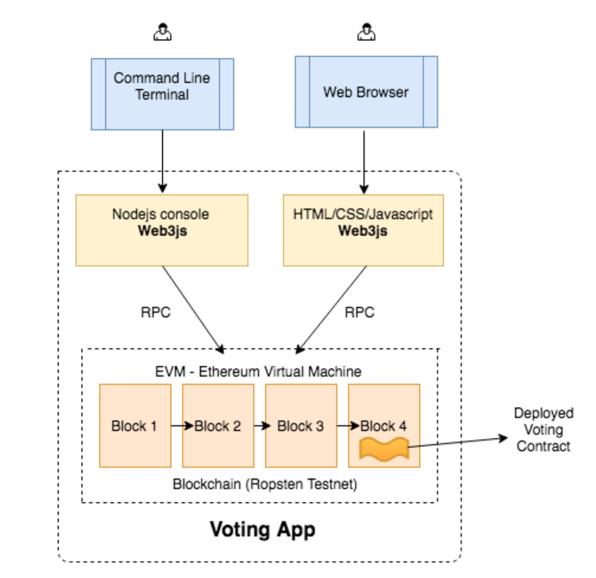

# 基于 token 的投票 - 用 truffle 构建简单投票 DApp

在“简单投票 Dapp”中，我们是构建了一个模拟区块链（ganache）上实现的一个投票合约，并且成功地通过 nodejs 控制台和网页与合约进行交互。  
在本案例里，将实现以下内容：

- 安装叫 truffle 的以太坊 dapp 框架，它会被用于编译和部署我们的合约。
- 给“简单的 dapp”上做一些更新来适配 truffle
- 编译合约，并将其部署到自己的测试私链。
- 通过 truffle 控制台和网页与合约进行交互
- 对合约进行扩展，加入 token 并能够购买 token 的功能
- 对前端进行扩展，通过网页前端购买 token，并用这些 token 为候选者投票



## 准备工作

### 用 Geth 启动私链

```js
> nohup geth --datadir ./myChain/ --networkid 15 --rpc --rpcapi="db,eth,net,web3,personal,miner" --rpcport 8545 --rpcaddr 127.0.0.1 --rpccorsdomain "*" 2>output.log --allow-insecure-unlock
> geth --datadir ./myChain/ --rpc  --rpcapi="db,eth,net,web3,personal,miner" --networkid 523 --nodiscover console 2>eth_output.log --allow-insecure-unlock


```

- `--datadir`: 指定区块链数据的存储目录，这里我们就在`./myChain/`目录启动
- `rpc`: 启用 `HTTP-RPC` 服务器
- `rpcport 8545 --recaddr 127.0.0.1`: 这是我们将要用 web3js 库与区块链服务器（geth）进行通信的服务器主机地址和监听端口
- `rpccorsdomain value`: 允许跨域请求和域名列表（逗号分离，浏览器强制）

> 本文里的节点`node`，`geth`，区块链软件(`blockchain software`)，区块链服务器(blockchain server)，客户端(client)，实际上指的都是同一个
> **如果我们直接链接测试网络，可以用下面的命令**

```js
>nohup geth --testnet --syncmode fast --rpc --rpcapi db,eth,net,web3,personal --cache=1024 --rpcport 8545 --rpcaddr 127.0.0.1 --rpccorsdomain "*" 2>output.log &
```

- `testnet`: 就是告诉`geth`启动并连接到最新的 测试 网络。我们所链接的网络是 Ropsten.
- `syncmode fast`: 用 fast 模式同步区块链

启用 Rinkeby 测试网络

```js
> geth --rinkeby --syncmode "fast" --rpc --rpcapi db,eth,net,web3,personal --cache=1024 --rpcport 8545 --rpcaddr 127.0.0.1 --rpccorsdomain "*" --allow-insecure-unlock
```

- `Full Sync`: 从周围节点获取 block headers, block bodies,并且从初始化区块开始重演每一步交易以验证每一个状态。
- `Fast Sync`: 从周围节点获取 block headers, block bodies, 但不会重演交易（只拿 receipts）。这样就会拿到所有状态的快照（不验证），从此跟全节点一样参与到网络中。
- `Light Sync`: 只拿当前状态（没有历史账本数据）。如果要验证一笔交易，就必须从另外的全节点处获取历史数据。

### 工作流：

基于以太坊的去中心化应用，workflow 可能是这样的：

- Development(开发环境)：Ganache
- Staging/Testing(模拟/测试环境)：Ropsten, Rinkeby, Kovan or your own private network
- Production(生产环境)：Mainnet

## Truffle

开发前，先启动 geth

### 安装

truffle 是一个 dapp 的开发框架，它可以使得 dapp 的构建和管理非常容易。

```js
> npm install -g truffle
> truffle -v                           ──(四, 610)─┘
Truffle v5.3.9 - a development framework for Ethereum

```

然后我们创建一个空目录，在下面创建 truffle 项目

```js
> mkdir simple_voting_by_truffle_dapp
> cd simple_voting_by_truffle_dapp
> npm install -g webpack
> truffle unbox webpack
```

- `truffle init`: 在当前目录初始化一个新的 truffle 空项目（项目文件只有 truffle-config 和 truffle.js; contracts 目录只有 Migrations.sol;migrations 目录只有 1_initial_migration.js）
- `truffle unbox`: 直接下载一个`truffle.box`，即一个预先构建好的 truffle 项目；
  - unbox 的时间会相对长一点，完成之后应该看到这样的提示
  ```js
  Unbox successsful, Sweet!
  ```

### truggle 简介

Truffle 是目前最流行的以太坊 DApp 开发框架，（按官网说法）是一个世界级的开发环境和测试框架，也是所有使用了 EVM 的区块链的资产管理通道，它基于 JavaScript，致力于让以太坊上的开发变的简单。  
Truffle 有以下功能：

- 内置的智能合约编译，链接，部署和二进制文件的管理
- 合约自动测试，方便快速开发
- 脚本化，可扩展的部署与发布框架
- 可部署到任意数量公网或私链的网络环境管理功能
- 使用 EthPM 和 NPM 提供的包管理，使用 ERC190 标准
- 与合约直接通信的直接交互控制台(写完合约就可以命令行里验证了)
- 可配的构建流程，支持紧密集成
- 在 Truffle 环境里支持执行外部脚本

### truffle 的客户端

测试可以到测试网，也可以到私链上，私链推荐使用以下两种方式

- Ganache
- truffle develop

**Ganache**
Ganache 的前身是 testRPC
**truffle develop**
truffle develop 是 truffle 内置的客户端，`> truffle develop`直接开启客户端。
需要注意的是：truffle develop 里执行 truffle 命令的时候需要省略前面的 truffle，比如`truffle compile`只要敲`compile`就好。

## 创建 Voting 项目

```js
>  ls
README.md contracts node_modules test webpack.config.js truffle.js app migrations
> ls app/
index.html  javascripts stylesheets
> ls contracts/
ConvertLib.sol MetaCoin.sol Migrations.sol
> ls migrations/
1_initial_migration.js 2_deploy_contracts.js
```

- app/ - 应用文件运行的默认目录，这里包括推荐的 JavaScript 文件和 css 样式文件目录，但你可以完全决定如何使用这些目录
- contract/ - Truffle 默认的合约文件存放目录
- migrations/ - 部署脚本文件的存放目录
- test/ - 用来测试应用和合约的测试文件目录
- truffle.js - Truffle 的配置文件

```js
rm contracts/ConvertLib.sol contracts/MetaCoin.sol
```

找到 truffle.js，将端口号从`7545`改为`8545`，因为私链及 ganache 默认端口是这个。

## Migration

### Migration 概念

迁移文件用于将合约部署到区块链上。truffle 将会部署和跟踪所有的部署。
`Migrations`(迁移)是 JavaScript 文件，这些文件负责暂存部署的任务，并假定部署需求会随着时间的推移而改变。随着项目的发展，我们应该创建新的迁移脚本，来改变链上的合约状态。所有运行过的 migration 历史记录，都会通过特殊迁移合约记录在链上。
**1_initial_migration.js**
第一个迁移`1_inital_migration.js`向区块链部署一个叫`Migration`的合约，并用于存储你已经部署的最新合约。每次你运行 migration 时，truffle 会向区块链查询获取最新已部署好的合约，然后部署尚未部署的任何合约。然后会更新`Migrations`合约中的`last_completed_migration`字段指向最新部署的合约。可以简单的当他是一个数据库表。里面有一列`last_completed_migration`，该列总是保持最新状态。
**migration 文件命名要求**

- 前缀必须是一个数字，用于标记迁移是否运行成功
- 后缀是一个描述词汇，只是单纯为提高可读性，方便理解

在脚本的开始，我们用`artifacts.require()`方法告诉 truffle 需要进行部署迁移的合约，这跟 node 里的 require 很类似。不过需要注意 ，最新的官方文档告诫，应该传入定义的合约名称，而不要给 文件名称，因为一个`.sol`文件中可能包含多个 contract。
`migration js`里的`exports`的函数，需要接收一个`deployer`对象作为第一个参数。这个对象在部署发布的过程中，主要用来提供清晰的语法支持，同时提供一些通用的合约部署职责，比如保存部署的文件以备稍后使用。deployer 对象是用来暂存（stage）部署任务的主要操作接口。
像所有其它 Truffle 中的代码一样，Truffle 提供了代码的合约抽象层（contract abstractions），并且进行初始化，以方便可以便利与以太坊的网络交互。这些抽象接口都是部署流程的一部分。

```js
// 2_deploy_contracts.js
const ConvertLib = artifacts.require("ConvertLib");
const MetaCoin = artifacts.require("MetaCoin");

module.exports = function(deployer) {
  deployer.deploy(ConvertLib);
  deployer.link(ConvertLib, MetaCoin);
  deployer.deploy(MetaCoin);
};
```

### 更新 truffle 配置文件

```js
// truffle-config.js
// 应用到所有migration 全局变量
// 2_deploy_contracts.js 如果不设置gas  将是470000
module.exports = {
  networks: {
    development: {
      host: "localhost",
      port: 8545,
      network_id: "*", // Match any network id
      gas: 5000000,
    },
  },
  compilers: {
    solc: {
      settings: {
        optimizer: {
          enabled: true, // Default: false
          runs: 200, // Default: 200
        },
      },
    },
  },
};
```

## 合约代码

```js
> cp ../simple_voting_dapp/Voting.sol contracts/
> ls contracts/
Migrations.sol Voting.sol
```

```js
// Voting.sol
// SPDX-License-Identifier: MIT
pragma solidity >0.4.22;

contract Voting {
    struct voter {
        address voterAddress;
        uint256 tokensBought;
        uint256[] tokensUsedPerCandidate;
    }
    mapping(address => voter) public voterInfo;
    mapping(bytes32 => uint256) public votesReceived;
    bytes32[] public candidateList;
    uint256 public totalTokens;
    uint256 public balanceTokens;
    uint256 public tokenPrice;

    constructor(
        uint256 tokens,
        uint256 pricePerToken,
        bytes32[] memory candidateNames
    ) public {
        candidateList = candidateNames;
        totalTokens = tokens;
        balanceTokens = tokens;
        tokenPrice = pricePerToken;
    }

    function buy() public payable returns (uint256) {
        uint256 tokensToBuy = msg.value / tokenPrice;
        require(tokensToBuy <= balanceTokens);
        voterInfo[msg.sender].voterAddress = msg.sender;
        voterInfo[msg.sender].tokensBought += tokensToBuy;
        balanceTokens -= tokensToBuy;
        return tokensToBuy;
    }

    function totalVotesFor(bytes32 candidate) public view returns (uint256) {
        return votesReceived[candidate];
    }

    function voteForCandidate(bytes32 candidate, uint256 votesInTokens) public {
        uint256 index = indexOfCandidate(candidate);
        require(index != uint256(-1));
        if (voterInfo[msg.sender].tokensUsedPerCandidate.length == 0) {
            for (uint256 i = 0; i < candidateList.length; i++) {
                voterInfo[msg.sender].tokensUsedPerCandidate.push(0);
            }
        }
        uint256 availableTokens =
            voterInfo[msg.sender].tokensBought -
                totalTokensUsed(voterInfo[msg.sender].tokensUsedPerCandidate);
        require(availableTokens >= votesInTokens);
        votesReceived[candidate] += votesInTokens;
        voterInfo[msg.sender].tokensUsedPerCandidate[index] += votesInTokens;
    }

    function totalTokensUsed(uint256[] memory _tokensUsedPerCandidate)
        private
        pure
        returns (uint256)
    {
        uint256 totalUsedTokens = 0;
        for (uint256 i = 0; i < _tokensUsedPerCandidate.length; i++) {
            totalUsedTokens += _tokensUsedPerCandidate[i];
        }
        return totalUsedTokens;
    }

    function indexOfCandidate(bytes32 candidate) public view returns (uint256) {
        for (uint256 i = 0; i < candidateList.length; i++) {
            if (candidateList[i] == candidate) {
                return i;
            }
        }
        return uint256(-1);
    }

    function tokensSold() public view returns (uint256) {
        return totalTokens - balanceTokens;
    }

    function voterDetails(address user)
        public
        view
        returns (uint256, uint256[] memory)
    {
        return (
            voterInfo[user].tokensBought,
            voterInfo[user].tokensUsedPerCandidate
        );
    }

    function transferTo(address payable account) public {
        account.transfer(address(this).balance);
    }

    function allCandidates() public view returns (bytes32[] memory) {
        return candidateList;
    }
}
```

- `candidateList`储存所有候选者
- 定义一个 voter 是`struct`数据类型，`struct`类型里有`getter`和 `setter`方法获取这些属性
  - address voterAddress
  - uint tokensBough 已经购买的所有 token
  - uint[] tokensUsedPerCandidate 候选者投票所用的 token
- voterInfo 是一个 mapping, 给定一个投票人的账户地址，就可以显示他的信息
- Tokens: 需要有存储发行 token 总量的合约变量，还需要存储所有剩余 token 和每个 token 价格

## 编译智能合约

```js
> truffle compile
```

## 创建账户

```js
> truffle console
> web3.eth.personal.newAccount("verystrongpassword")
> web3.eth.personal.unlockAccount("0xf1DE2d4c9DA3201B82402b4c3cD06E7E128A1430","verystrongpassword", 15000)
> web3.eth.getBalance("0xf1DE2d4c9DA3201B82402b4c3cD06E7E128A1430").then(function(res){console.log(web3.utils.fromWei(`${res}`, "ether"))})
```

#### buy 函数

```js
  function buy() payable public returns (uint){
    uint tokensToBuy = msg.value/tokenPrice;
    require(tokensToBuy<=balanceTokens);
    voterInfo[msg.sender].voterAddress=msg.sender;
    voterInfo[msg.sender].tokensBought += tokensToBuy;
    balanceTokens-=tokensToBuy;
    return tokensToBuy;
  }
```

- tokenPrice 每一个 token 的价钱
- balanceTokens 合约可用 token 总和
- msg.value 以太的值
- tokensToBuy 基于以太的值和 token 的价格，可以计算出你所有的 token，并 将这些 token 赋予购买人，购买人的地址通过 msg.sender 可以获取
- 返回总共买了多少 token

##### 用 truffle 控制台调用 buy 的一个案例，参数传入一个 options 对象

- web3 v0.2.x 的用法

```js
truffle(development) >
  Voting.deployed().then(function(contract) {
    contract.buy({
      value: web3.toWei("1", "ether"),
      from: web3.eth.accounts[1],
    });
  });
```

- web3 v1.0

```js
contract.buy().send({ options });
```

如果是消息调用的话应该是

```js
contract.method().call({ options });
```

## 部署

```js
> truffle compile
Compiling Migrations.sol...Compiling Voting.sol...Writing
> truffle migrate
```

```js
var Voting = artifacts.require("Voting");
module.exports = function(deployer) {
  deployer.deploy(Voting, 10000, web3.utils.toWei("0.01", "ether"), [
    web3.utils.fromAscii("Alice", 32),
    web3.utils.fromAscii("Bob", 32),
    web3.utils.fromAscii("Cary", 32),
  ]);
};
```

- 1. 一个候选人(比如 Alice)有多少投票?
- 2. 一共初始化了多少 token?
- 3. 已经售出了多少 token?
- 4. 购买 100 token
- 5. 购买以后账户余额是多少?
- 6. 已经售出了多少?
- 7. 给 Alice 投 25 个 token，给 Bob 和 Cary 各投 10 个 token。
- 8. 查询你所投账户的投票人信息(除非用了其他账户，否则你的账户默认是 web3.eth.accounts[0])
- 9. 现在每个候选人有多少投票?
- 10. 合约里有多少 ETH?(当你通过 ETH 购买 token 时，合约接收到的 ETH)

```js
Voting.deployed().then(function(instance) {
  instance.totalVotesFor.call("Alice").then(function(i) {
    console.log(i);
  });
  console.log(
    instance.totalTokens.call().then(function(v) {
      console.log(v);
    })
  );
  console.log(
    instance.tokensSold.call().then(function(v) {
      console.log(v);
    })
  );
  console.log(
    instance.buy({ value: web3.toWei("1", "ether") }).then(function(v) {
      console.log(v);
    })
  );
});
web3.eth.getBalance(web3.eth.accounts[0]);
Voting.deloyed().then(function(instance) {
  console.log(
    instance.voteForCandidate("Alice", 25).then(function(v) {
      console.log(v);
    })
  );
  console.log(
    instance.voteForCandidate("Cary", 10).then(function(v) {
      console.log(v);
    })
  );
  console.log(
    instance.voterDetails.call(web3.eth.accounts[0]).then(function(v) {
      console.log(v);
    })
  );
  function(instance){
    instance.totalVotesFor.call("Alice").then(function(i){
      console.log(i)
    })
  }
});
web3.eth.getBalance(Voting.address).toNumber()
```

### 出现问题和解决方案

1. 如果由于 gas 不足而部署失败，尝试将`migrations/2_deploy_contracts.js`里面的`gas account`增加至 500000。比如：`deployer.deploy(Voting, ["Rama","Nick","Jose"], {gas: 500000})`;
2. 如果有多个账户，并且更喜欢自选一个账户，而不是`accounts[0]`，可以在`truffle.js`中指定想要使用的账户地址，在 network_id 后面添加`from: your address`，truffle 将会使用你指定的地址来部署和交互。

## 控制台和网页交互

如果部署顺利，可以通过控制台和网页与合约进行交互。

**app/index.html**
用上个`index.html`替换`app/index.html`内容。

````html
<!DOCTYPE html>
<html>
  <head>
    <title>Hello World DApp</title>
    <link
      href="https://fonts.googleapis.com/css?family=Open+Sans:400,700"
      rel="stylesheet"
      type="text/css"
    />
    <link
      href="https://maxcdn.bootstrapcdn.com/bootstrap/3.3.7/css/bootstrap.min.css"
      rel="stylesheet"
      type="text/css"
    />
    <style>
      .margin-top-3 {
        margin-top: 3em;
      }
    </style>
  </head>
  <body class="container">
    <h1>A Simple Hello World Voting Application</h1>
    <div class="col-sm-7 margin-top-3">
      <h2>Candidates</h2>
      <div class="table-responsive">
        <table class="table table-bordered">
          <thead>
            <tr>
              <th>Candidate</th>
              <th>Votes</th>
            </tr>
          </thead>
          <tbody id="candidate-rows">
            <tr>
              <td>Alice</td>
              <td id="candidate-1"></td>
            </tr>
            <tr>
              <td>Bob</td>
              <td id="candidate-2"></td>
            </tr>
            <tr>
              <td>Cary</td>
              <td id="candidate-3"></td>
            </tr>
          </tbody>
        </table>
      </div>
      <div class="container-fluid">
        <h2>Vote for Candidate</h2>
        <div id="msg"></div>
        <input
          type="text"
          id="candidate"
          placeholder="Enter the candidate name"
        />
        <br />
        <br />
        <input
          type="text"
          id="vote-tokens"
          placeholder="Total no. of tokens to vote"
        />
        <br />
        <br />
        <a onclick="App.voteForCandidate()" class="btn btn-primary">Vote</a>
      </div>
    </div>
    <div class="col-sm-offset-1 col-sm-4 margin-top-3">
      <div class="row">
        <h2>Token Stats</h2>
        <div class="table-responsive">
          <table class="table table-bordered">
            <tr>
              <td>Tokens For Sale</td>
              <td id="tokens-total"></td>
            </tr>
            <tr>
              <td>Tokens Sold</td>
              <td id="tokens-sold"></td>
            </tr>
            <tr>
              <td>Price Per Token</td>
              <td id="token-cost"></td>
            </tr>
            <tr>
              <td>Balance in the contract</td>
              <td id="contract-balance"></td>
            </tr>
          </table>
        </div>
      </div>
      <div class="row margin-top-3">
        <h2>Purchase Tokens</h2>
        <div class="col-sm-12">
          <div id="buy-msg"></div>
          <input
            type="text"
            id="buy"
            class="col-sm-8"
            placeholder="Number of tokens to buy"
          />&nbsp;
          <div onclick="App.buyTokens()" class="btn btn-primary">Buy</div>
        </div>
      </div>
      <div class="row margin-top-3">
        <h2>Lookup Voter Info</h2>
        <div class="col-sm-12">
          <input
            type="text"
            id="voter-info"
            class="col-sm-8"
            placeholder="Enter the voter address"
          />&nbsp;
          <a href="#" onclick="App.lookupVoterInfo()" class="btn btn-primary"
            >Lookup</a
          >
          <div class="voter-details row text-left">
            <div id="tokens-bought" class="margin-top-3 col-md-12"></div>
            <div id="votes-cast" class="col-md-12"></div>
          </div>
        </div>
      </div>
    </div>
  </body>
  <script src="https://code.jquery.com/jquery-3.1.1.slim.min.js"></script>
  <script src="./index.js"></script>
</html>

**app/scripts/index.js** ```js import "../styles/app.css"; import { default as
Web3 } from "web3"; import { default as contract } from "truffle-contract";
import voting_artifacts from "../../build/contracts/Voting.json"; var Voting =
contract(voting_artifacts); let candidates = { Alice: "candidate-1", Bob:
"candidate-2", Cary: "candidate-3", }; window.voteForCandidate =
function(candidate) { let candidateName = $("#candidate").val(); try {
$("#msg").html( "Vote has been submitted. The vote count will increment as soon
as the vote is recorded on the blockchain. Please wait." );
$("#candidate").val(""); Voting.deployed().then(function(contractInstance) {
contractInstance .voteForCandidate(candidateName, { gas: 140000, from:
web3.eth.accounts[0], }) .then(function() { let div_id =
candidates[candidateName]; return contractInstance.totalVotesFor
.call(candidateName) .then(function(v) { $("#" + div_id).html(v.toString());
$("#msg").html(""); }); }); }); } catch (err) { console.log(err); } };
$(document).ready(function() { if (typeof web3 !== "undefined") {
console.warn("Using web3 detected from external source like Metamask");
window.web3 = new Web3(web3.currentProvider); } else { console.warn( "No web3
detected. Falling back to http://localhost:8545. You should remove this fallback
when you deploy live, as it's inherently insecure. Consider switching to
Metamask for development. More info here:
http://truffleframework.com/tutorials/truffle-and-metamask" ); window.web3 = new
Web3( new Web3.providers.HttpProvider("http://localhost:8545"); ); }
Voting.setProvider(web3.currentProvider); let candidateNames =
Object.keys(candidates); for(var i=0;i<candidateNames.length;i++){ let name =
candidateNames[i]; Voting.deployed().then(function(contractInstance){
contractInstance.totalVotesFor.call(name).then(function(v){
$("#"+candidates[name]).html(v.toString()); }) }) } });
````

```js
// app.js  web3 1.+
import Web3 from "web3";
import votingArtifact from "../../build/contracts/Voting.json";

let candidates = {
  Alice: "candidate-1",
  Bob: "candidate-2",
  Cary: "candidate-3",
};
const App = {
  web3: null,
  account: null,
  voting: null,
  tokenPrice: null,
  start: async function() {
    const { web3 } = this;
    try {
      const networkId = await web3.eth.net.getId();
      const deployedNetwork = votingArtifact.networks[networkId];
      this.voting = new web3.eth.Contract(
        votingArtifact.abi,
        deployedNetwork.address
      );
      const accounts = await web3.eth.getAccounts();
      this.account = accounts[0];
      this.loadCandidatesAndVotes();
    } catch (error) {
      console.error("Нет подключения", error);
    }
  },
  loadCandidatesAndVotes: async function() {
    const { totalVotesFor } = this.voting.methods;
    let candidateNames = Object.keys(candidates);
    for (var i = 0; i < candidateNames.length; i++) {
      let name = candidateNames[i];
      var count = await totalVotesFor(this.web3.utils.asciiToHex(name)).call();
      console.log(count);
      $("#" + candidates[name]).html(count);
    }
  },
  lookupVoterInfo: function() {
    let address = $("#voter-info").val();
    const { voterDetails } = this.voting.methods;
    console.log(address);
    voterDetails(address)
      .call()
      .then(function(v) {
        $("#tokens-bought").html("Total Tokens bought: " + v[0].toString());
        let votesPerCandidate = v[1];
        $("#votes-cast").empty();
        $("#votes-cast").append("Votes cast per candidate: <br>");
        let allCandidates = Object.keys(candidates);
        for (let i = 0; i < allCandidates.length; i++) {
          $("#votes-cast").append(
            allCandidates[i] + ": " + votesPerCandidate[i] + "<br>"
          );
        }
      });
  },
  buyTokens: async function() {
    let tokensToBuy = $("#buy").val();
    const { tokenPrice, buy } = this.voting.methods;
    tokenPrice()
      .call()
      .then(function(v) {
        App.tokenPrice = parseFloat(App.web3.utils.fromWei(v.toString()));
        $("#token-cost").html(App.tokenPrice + " Ether");

        let price = tokensToBuy * App.tokenPrice;
        $("#buy-msg").html("Purchase order has been submitted. Please wait.");
        buy()
          .send({
            value: App.web3.utils.toWei(`${price}`, "ether"),
            from: App.account,
          })
          .then(function(v) {
            console.log(v);
            $("#buy-msg").html(``);
            App.web3.eth.getBalance(App.account, function(error, result) {
              $("#contract-balance").html(
                App.web3.utils.fromWei(result.toString()) + " Ether"
              );
            });
          });
      });
  },
  voteForCandidate: async function() {
    let candidateName = $("#candidate").val();
    let voteTokens = $("#vote-tokens").val();
    $("#msg").html(
      "Vote has been submitted. The vote count will increment as soon as the vote is recorded on the blockchain. Please wait."
    );
    $("#candidate").val("");
    $("#vote-tokens").val("");
    const { totalVotesFor, voteForCandidate } = this.voting.methods;
    await voteForCandidate(
      this.web3.utils.asciiToHex(candidateName),
      this.web3.utils.toHex(voteTokens)
    ).send({
      gas: 140000,
      from: App.account,
    });
    let div_id = candidates[candidateName];
    var count = await totalVotesFor(
      this.web3.utils.asciiToHex(candidateName)
    ).call();
    $("#" + div_id).html(count);
    $("#msg").html("");
  },
};
window.App = App;
window.addEventListener("load", function() {
  if (window.ethereum) {
    App.web3 = new Web3(window.ethereum);
    window.ethereum.enable();
  } else {
    console.warn("Нет web3 провайдера!");
    App.web3 = new Web3(
      new Web3.providers.HttpProvider("http://127.0.0.1:8545")
    );
  }
  App.start();
});
```

代码中优先使用 Mist 和 MetaMask 提供的 web3 实例，如果没有则从本地环境创建一个。
**Voting.deployed()**
`Voting.deployed()`返回一个合约实例，truffle 的每一个调用会返回一个`promise`，所以使用`.then()`。

### 控制台交互

需要重新打开一个新的 console

```js
> truffle console
> Voting.deployed()
.then(function(contractInstance){
  contractInstance.voteForCandidate("Alice")
  .then(function(v){
      console.log(v);
    });
});
> Voting.deployed()
  .then(function(contractInstance){
    contractInstance.totalVotesFor
      .call("Alice")
      .then(function(v){
        console.log(v);
      });
  });
```

## 测试

**solidity 写单元测试**
**JavaScript 写功能测试**

### solidity

```js
// TestVoting.sol
// SPDX-License-Identifier: MIT
pragma solidity >0.4.22 <0.6.0;
import "truffle/Assert.sol";
import "truffle/DeloyedAddress.sol";
import "../contracts/Voting.sol";
contract TestVoting {
  uint public initialBalance = 2 ether;
  function testInitialTokenBalanceUsingDeployedContract() public {
    Voting voting = Voting(DeployedAddresses.Voting());
    uint expected= 10000;
    Assert.equal(voting.balanceTokens(), expected, "1000 Tokens not  initialized for sale");
  }
  function testBuyTokens() public {
    Voting voting = Voting(DeployedAddresses.Voting());
    voting.buy.value(1 ether)();
    Assert.equal(voting.balanceTokens(), 9900, "9900 tokens should have been available");
  }
}
```

- `Assert.sol`: 断言库，常用方法：`equal`,`notEqual`,`isAbove`,`isBelow`,`isAtLeast`,`isAtMost`,`isZero`,`isNotZero`
- `DeloyedAddress`: 一个 truffle 框架的帮助库，调用`DeployedAddress.()`即可获取部署合约的地址
- `truffle test test/TestVoting.sol`运行测试

### JavaScript

Truffle 使用了 Mocha 测试框架和 Chai 用于断言

```js
// voting.js
var Voting = artifacts.require("./Voting.sol");
contract("Voting", function(accounts) {
  it("should be able to buy tokens", function() {
    var instance;
    var tokensSold;
    var userTokens;
    return Voting.deployed()
      .then(function(i) {
        instance = i;
        return i.bug({
          value: web3.toWei(1, "ether"),
        });
      })
      .then(function() {
        return instance.tokensSold.call();
      })
      .then(function() {
        tokensSold = balance;
        return instance.voterDetails.call(web3.eth.accounts[0]);
      })
      .then(function(tokenDetails) {
        userTokens = tokenDetails[0];
      });
    assert.equal(balance.valueOf(), 100, "100 tokens were not sold");
    assert.equal(userTokens.valueOf(), 100, "100 tokens were not sold");
  });
  it("should be able to vote for candidates", function() {
    var instance;
    return Voting.deployed()
      .then(function(i) {
        instance = i;
        return i.buy({ value: web3.toWei(1, "ether") });
      })
      .then(function() {
        return instance.voteForCandidate("Alice", 3);
      })
      .then(function() {
        return instance.voterDetails.call(web3.eth.accounts[0]);
      })
      .then(function(tokenDetails) {
        assert.equal(
          tokenDetails[1][0].valueOf(),
          3,
          "3 tokens were not used for voting to Alice"
        );
      });
  });
});
```

- `truffle test test/voting.js`
