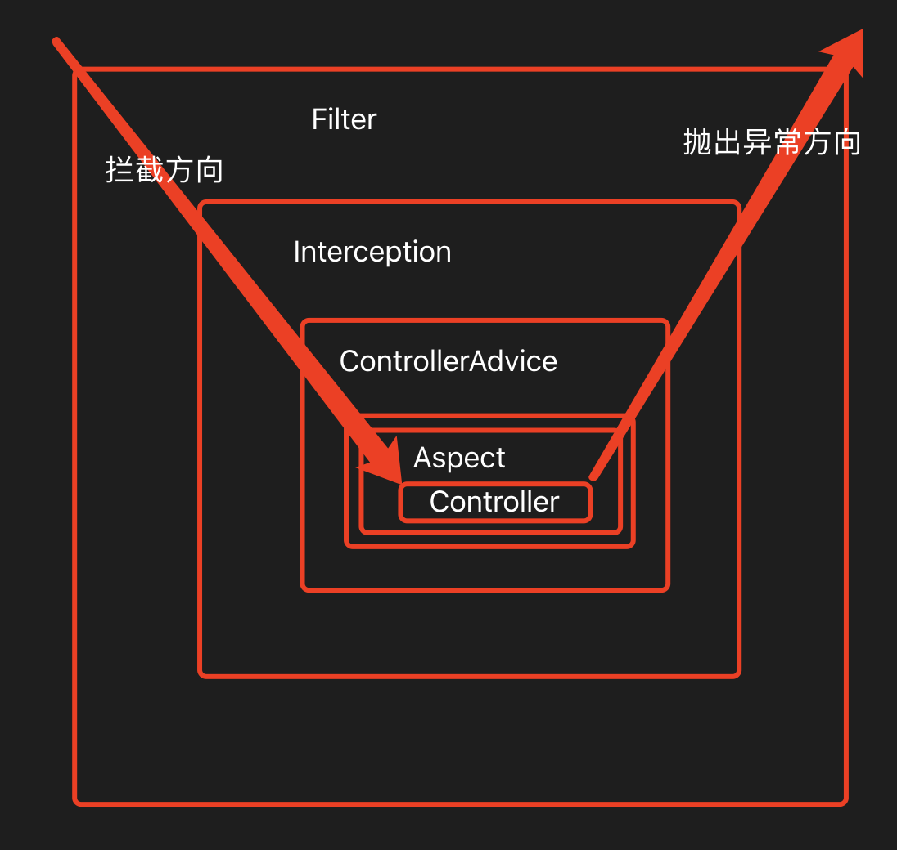

# AOP 面向切面编程

AOP(Aspect Oriented Prograamming)的缩写。通过预编译方式和运行期间动态代理实现程序功能的统一维护的技术。AOP 是 OOP 的延续，是函数式编程的一种衍生泛型。并没有确切规定如何实现 AOP 协议的代码。
利用 AOP 对业务逻辑的各个部分进行隔离，从而使业务逻辑部分之间的耦合度降低，提高程序的可重用性，同时提高开发效率。

##### 实例

现有两个模块
`/static/register` 和 `/user/**`， `register`不需要鉴权，`/user/**`需要鉴权， 两个模块都需要 log, OOP 的写法是，在每个 url 对应的 Controller 里写对应的代码，增加了代码冗余和复杂度，
而使用 AOP, 在中间加一层鉴权逻辑，而不是去业务 Controller，就可以一个方法多个使用

```Java
// AOP
protected void configure(HttpSecurity http) throws Exception{
  http
  .authorizeRequests()
  .antMatchers("/static","/register").permitAll()
  .antMatchers("/user/**").hasRoles("USER", "ADMIN")
}
```

**AOP 的写法，对原有的代码毫无入侵性，可以把与业务无关的事情，放到代码外去做**

## filter(过滤器)与 AOP(拦截器)和拦截器(interceptor)的区别

1. 拦截器是基于`反射机制`的，过滤器是基于`函数回调`
2. 过滤器 filter：
   过滤器可以拦截到方法的请求和响应（ServletRequest request, ServletRequest response），并对请求响应做出像响应的过滤操作，比如设置字符编码，鉴权操作等。
   拦截器 interceptor：
   拦截器可以方法执行之前（preHandle）和方法执行之后（afterCompletion）进行操作，回调操作（postHandle），可以获取执行的方法和名称，请求（HttpServletRequest）
   Aop 切片
   Aop 操作可以对操作进行横向拦截，最大的优势在于他可以获取执行方法参数，对方法进行统一的处理，常见使用日志，事务，请求参数安全验证等



### 入口方向和返回方向

```js
// 入口
request -> 过滤器 -> 拦截器 -> controllerAdvice -> Aop -> controller
// 返回
response <- 过滤器 <- 拦截器 <- controllerAdvice <- Aop <- controller
```
