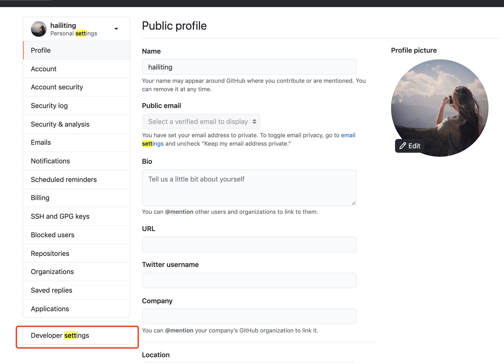
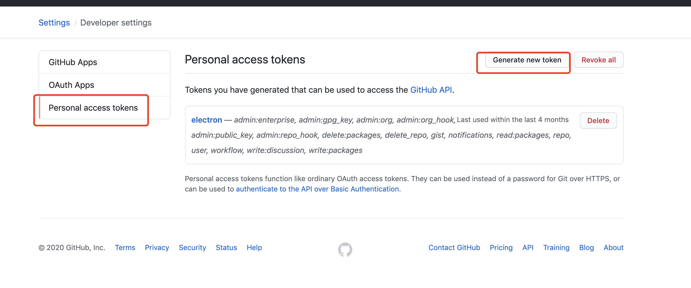

# travis 持续部署与发布

`travis`[https://travis-ci.com/]

## 根目录新建`.travis.yml`

```yml
language: node_js # 构建工具
node_js:
  - "stable" # node稳定版本
cache:
  directories:
    - node_modules # 依赖所存在的文件夹
env:
  - CI=true # 环境变量
script:
  - npm run build-storybook # 运行的命令 默认 npm test
deploy: # https://docs.travis-ci.com/user/deployment/pages/
  provider: pages
  skip_cleanup: true
  github_token: $github_token # 设置github来完成
  local_dir: storybook-static # 默认是build
  on:
    branch: master # 哪一个分支变动触发deploy
# 如果根目录有yarn.lock.js文件，travis优先使用yarn安装
```

## 设置 github



####

官方文档[https://developer.github.com/apps/building-github-apps/creating-a-github-app/]

个人中心 -> Developer settings-> Personal access tokens【创建成功的 token 之后就看不到了】


注意，`.travis.yml`的 deploy 里的`$github_token`就是 name
