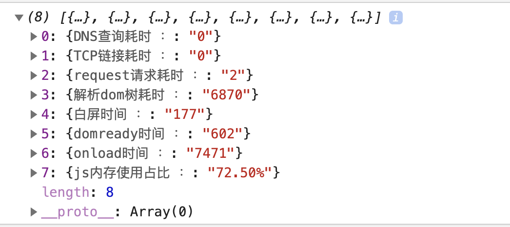

# webpack之前端性能优化

## 优化之前，可以在项目里引入``webpack-bundle-analyzer``分析SPA项目
~~~
// 引入
npm i --save-dev webpack-bundle-analyzer
// 使用
var BundleAnalyzerPlugin = require("webpack-bundle-analyzer").BundleAnalyzerPlugin;
plugins: [
  new BundleAnalyzerPlugin({
    /**
    * 可以是 server static 或 disabled
    * 在 server 模式下，分析器将启动HTTP服务器来显示软件包报告
    * 在 static 模式下，会生成一个带报告的HTML文件
    * 在 disabled 模式下，可以使用这个插件来将 generateStatsFile 设置为true，从而生成 Webpack Stats JSON 文件
    */
    analyzerMode: "server",
    /** 将在 server 模式下使用主机启动HTTP服务器 */
    analyzerHost: "127.0.0.1",
    /** 将在 server 模式下使用端口启动HTTP服务器 */
    analyzerPort: 8888,
    /**
    * 路径捆绑，将在 static 模式下生成报告文件
    * 相对于捆绑输出目录
    */
    reportFilename: "report.html",
    /**
    * 模块大小默认显示在报告中
    * 可选值 stat parsed gzip 
    */
    defaultSizes: "parsed",
    /**
    * 在浏览器自动打开报告
    */
    openAnalyzer: true,
    /** 如果为true，则Webpack stats Json 文件将在bundle输出目录中生成 */
    generateStatsFile: false,
    /** 相对于捆绑输出目录 */
    statsFilename: "stats.json",
    statsOptions: null,
    logLevel: "info", // 日志级别，可是 信息 警告 错误  默认
  })
]
~~~
## 具体方案
### 1. 把第三方代码库分离，用externals将第三方库以CDN的方法引入，加快webpack的打包速度
~~~
// 优化前
entry: {
  entry: "./src/main.js",
  vendor: ["react", "redux"]
},
output: {
  path: config.build.assetsRoot,
  filename: utils.assetsPath("js/[name].[chunkhash].js"),
  chunkFilename: utils.assetsPath("js/[id].[chunkhash].js")
}
// 优化后
entry: {
  entry: "./src/main.js",
},
output: {
  path: config.build.assetsRoot,
  filename: "[name].js",
  libraryTarget: "umd",
  publicPath: process.env.NODE_ENV === "production"?config.build.assetsPublicPath:config.dev.assetsPublicPath
},
externals: {
  react: "react",  /^react$/
  redux: "redux",  /^redux$/
}
// 在html里引入CDN资源

~~~
#### tips:
  - externals中的key是import中使用的
  - externals中的value是window下调用的
### 2. 抽取公共代码到 vendor 中
~~~
// webpack < 3
new webpack.optimize.CommonsChunkPlugin({
  name: "vendor",
})
// webpack 4
optimization: {
splitChunks: {
  chunks: "async",
  minSize: 30000, // 30kb 模块的最小体积
  minChunk: 1, // 模块的最小被引用次数
  maxAsyncRequests: 5,  // 按需加载的最大并行请求数
  maxInitialRequests: 3, // 一个入口最大并行请求数
  automaticNameDelimiter: "~", // 文件名的连接符
  name: true,
  cacheGroups: {
    vendors: {
      test: /[\\/]node_modules[\\/]/,
      priority: -10
    },
    default: {
      minChunks: 2,
      priority: -20,
      reuseExistingChunk: true
    }
  }
} 
}
~~~
### 3. 和1差不多，dll: 将每个页面都会引用的且基本不会改变的依赖包，如react/react-dom 等在抽离出来，不让其他模块变化污染dll库的hash缓存
### 4. manifest: 抽离webpack运行时（runtime）代码
~~~
const commonOptions = {
  chunks: 'all',
  reuseExistingChunk: true
}
{
  namedChunks: true,
  moduleIds: 'hashed',
  runtimeChunk: {
    name: 'manifest'
  },
  splitChunks: {
    maxInitialRequests: 5,
    cacheGroups: {
      polyfill: {
        test: /[\\/]node_modules[\\/](core-js|raf|@babel|babel)[\\/]/,
        name: 'polyfill',
        priority: 2,
        ...commonOptions
      },
      dll: {
        test: /[\\/]node_modules[\\/](react|react-dom)[\\/]/,
        name: 'dll',
        priority: 1,
        ...commonOptions
      },
      commons: {
        name: 'commons',
        minChunks: Math.ceil(pages.length / 3), // 至少被1/3页面的引入才打入common包
        ...commonOptions
      }
    }
  }
}
~~~
