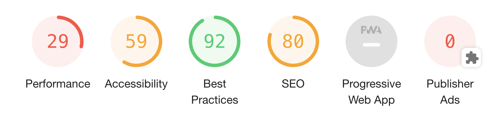
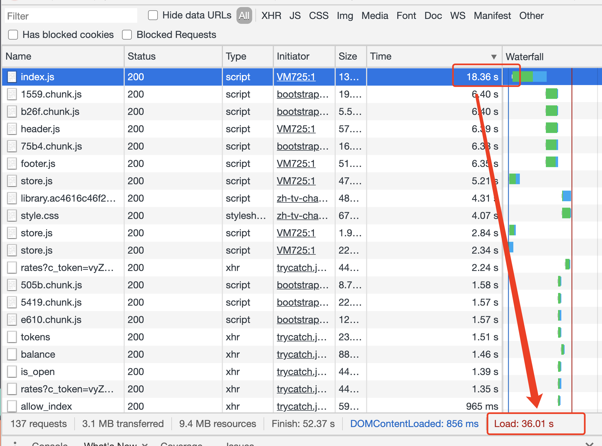
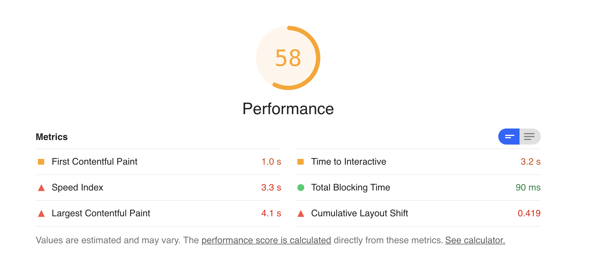
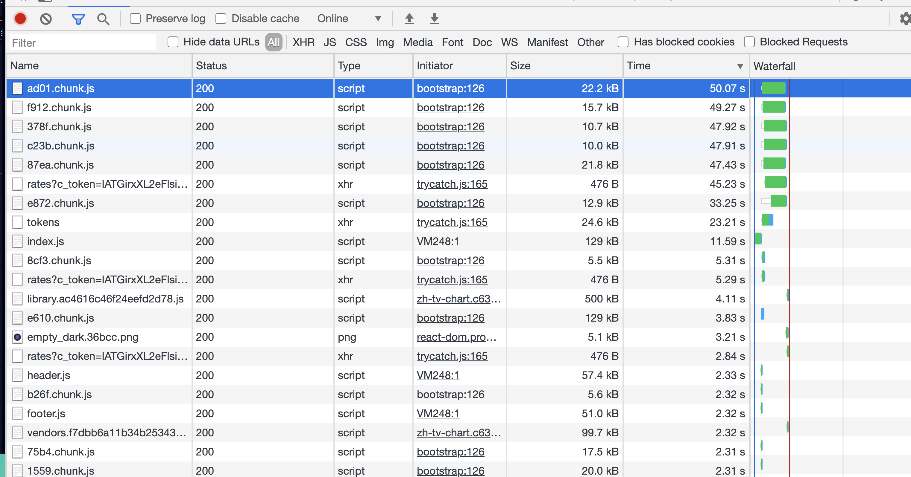
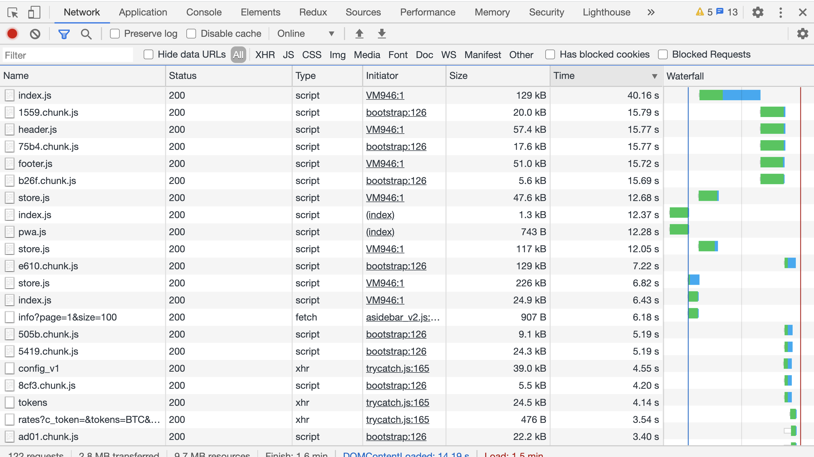
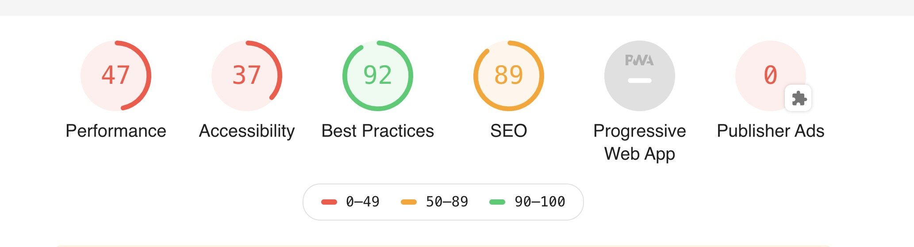
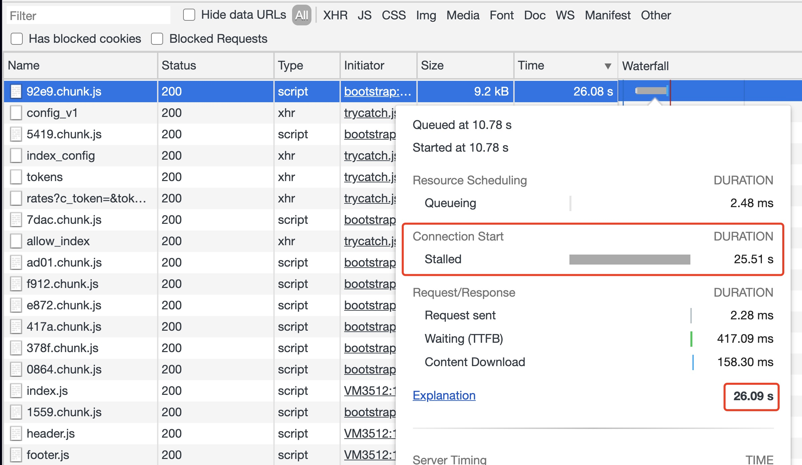
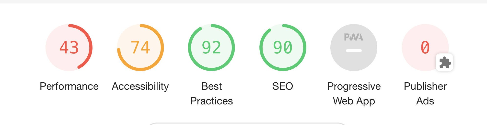

# 前端性能优化\_Lighthouse

## 正式页面开始的参数


可以说是惨不忍睹，好了，接下来一个一个解决吧


## Performance

### 首页明确 Performance 是啥

Performance 是前端性能监控的 API，它可以检测页面中的性能，W3C 性能小组引入进来的一个新的 API，它可以检测到白屏时间，首屏时间，用户可操作的时间节点，页面总下载时间，DNS 查询的时间，TCP 链接的时间等。

```js
const performance = window.performance ||window.msPerformance ||window.webkitPerformance;
console.log(performance) //
Performance {
  memory: MemoryInfo {...},
  navigation: PerformanceNavigation {...},
  timeOrigin: 1597657020032.815,
  timing: PerformanceTiming {...}
}
```

### LightHouse 统计的 performance 参数

- First Contentful Paint 1.0s 页面第一个元素出现的时间
- Time to Interactive 3.2s 页面可以交互的时间
- Speed Index 3.3s 页面完整绘制用的时间
- Total Blocking Time 90ms FCP 到 Time to Interactive 的时间
- Largest Contentful Paint 4.1s 最大资源加载时间
- Cumulative Layout Shift 0.419 在页面生命周期中发生的每个意外布局转移的所有单独布局转移分数的总和
  

### 方法

#### 1.webpack 分包 splitChunk，并行下载

#### 2.检查网络请求头以及 nginx 设置，做 encoding

##### encoding

Encoding 的意思是编码，是将信息分类的结果用一种易于被计算机和人识别的符号体系表示出来的过程，是人们统一认识，统一观点，相互交换信息的一种技术手段。编码的直接产物是代码。【decoding-》解码】
encoding 常见的编码有：

- 简体中文码： GB2312;
- 繁体中文码：BIG5;
- 西欧字符: UTF-8;  
  Encoding 是服务器和客户端即浏览器约定好的压缩算法来压缩发送内容，起到加快下载速度的作用。使用 encoding 能更加从根源上解决问题。【先设置 nginx encoding，如果不达标就调整 webpack 设置】

```txt
# nginx的配置
# nginx.conf
http {
  # ...
  brotli on;
  brotli_comp_level 6;
  brotli_buffers   16  8k;
  brotli_min_length   20;
  brotli_types *;
  # ...
}


# 发送请求头为: [br为Brotli压缩算法]
Accept-Encoding: gzip, deflate, sdch, br
# 服务端支持Brotli算法的话，则返回br, 或不支持时，返回 gzip等
Content-Encoding: br;

# 为什么我加了  反而更卡了
```

接下来想想其他法子

1. css 开启硬件加速

```css
-webkit-transform: translateZ(0);
-moz-transform: translateZ(0);
-ms-transform: translateZ(0);
-o-transform: translateZ(0);
transform: translateZ(0);
```

2. TTFB 时间过长
   2.1 清除本地不必要的 cookie

- 页面加载去除不必要的 cookie
  
  
  2.2 服务器到用户之间的网络不好
- 用`dns-prefetch`解析页面

```
<meta http-equiv="x-dns-prefetch-control" content="on">
<link rel="dns-prefetch" href="//cdn.bootcss.com">
```

3. ` 一顿操作，结果如下：
   
   47 分，比原来还低了。。。

#### 原因分析

```
window.onload = function () {
  setTimeout(function () {
    let t = performance.timing,a = [];
    a.push({'DNS查询耗时': (t.domainLookupEnd - t.domainLookupStart).toFixed(0)})
    a.push({'TCP链接耗时': (t.connectEnd - t.connectStart).toFixed(0)})
    a.push({'request请求耗时': (t.responseEnd - t.responseStart).toFixed(0)})
    a.push({'解析dom树耗时': (t.domComplete - t.domInteractive).toFixed(0)})
    a.push({'白屏时间': (t.responseStart - t.navigationStart).toFixed(0)})
    a.push({'domready时间': (t.domContentLoadedEventEnd - t.navigationStart).toFixed(0)})
    a.push({'onload时间||总下载时间': (t.loadEventEnd - t.navigationStart).toFixed(0)})

    if (t = performance.memory) {
      a.push({'js内存使用占比 ：': (t.usedJSHeapSize / t.totalJSHeapSize * 100).toFixed(2) + '%'})
    }
    console.log(a)
  }, 10000)
}

0: {DNS查询耗时: "0"}
1: {TCP链接耗时: "0"}
2: {request请求耗时: "2"}
3: {解析dom树耗时: "38633"}
4: {白屏时间: "233"}
5: {domready时间: "521"}
6: {onload时间||总下载时间: "39155"}
7: {js内存使用占比 ：: "77.87%"}
```

onload 时间 和 解析 dom 树耗时 太多了

##### `/micro/web/contract/92e9.chunk.js` 以这个文件为例



###### 问题一：Connection Start Stalled 时间过长

原因：

1. 浏览器对同一主机域名并发连接数的限制，过多的 ajax 请求会阻塞后面 ajax 的执行【少于 6 个的时候不会出现阻塞】
   优化措施：
1. 将资源合理分布到多台主机上，提高并发数。但增加并行下载数量会增大开销，这取决于宽带和 CPU 速度，过多的并行下载也会降低性能；
1. 脚本置于底部；
1. 简化代码，优化项目，减少请求数量；

### 在来操作一番

#### 用浏览器存储器把一些固定资源存储到浏览器里

- web 前端本地持久化的一个方案 - localforage

目前瞄准这几个 api
/s_api/basic/config_v1
/s_api/basic/tokens
/s_api/basic/index_config
/api/allcoin_contract/v1/community/info

尽量用以下形式，代替 import from 的方式

```
import Loadable from "react-loadable";
const SpinLoading = Loadable(() => import("@/components/spinLoading"));
// 其实也有缺点，js分块太多，会造成堵塞，带宽不够，所以评分会降低
```

这样写的好处是 webpack 会对代码进行自动分割，
异步加载组件，从而实现路由的懒加载，根据需求引入不同的组件，而不是第一次加载就全部引入。

评分更低了。。。。

#### 优化 html->有了显著的效果

```html
<!DOCTYPE html>
<html lang="zh">
  <head>
    <meta http-equiv="Content-Type" content="text/html;charset=utf-8" />
    <meta http-equiv="X-UA-Compatible" content="IE=edge,chrome=1" />
    <meta content="always" name="referrer" />
    <meta name="theme-color" content="#2932e1" />
    <meta name="format-detection" content="telephone=no" />
    <meta name="apple-mobile-web-app-capable" content="yes" />
    <meta name="apple-touch-fullscreen" content="yes" />
    <meta name="format-detection" content="telephone=no,address=no" />
    <meta name="apple-mobile-web-app-status-bar-style" content="white" />
    <meta http-equiv="X-UA-Compatible" content="IE=edge,chrome=1" />
    <meta name="referrer" content="no-referrer" />
    <meta http-equiv="x-dns-prefetch-control" content="on" />
    <meta name="renderer" content="webkit" />
    <link rel="dns-prefetch" href="..." />
    <meta name="viewport" content="width=device-width, initial-scale=1.0" />
    <meta name="description" content="..." />
    <meta name="keywords" content=".." />
    <title>xxx.COM</title>
    <link rel="manifest" href="./manifest.json" />
  </head>

  <body></body>
</html>
```



#### React

```js
// 方法把 abc=()=>{} 改为 abc(){}
this.abc = this.abc.bind(this);
```

效果不大 还是在 40 分徘徊

## Accessibility

## Bast Practices

## SEO

## Progressive Web App

来把网站点亮 PWA 吧，`performance`搞不定了
pwa 其实就是把网站搞成 app，通过一些属性，获取到和 app 一样的属性

- Fast
- reliable

### Installable 可安装的

-> 怎么告诉浏览器，我是可安装的

### 离线可缓存

<!-- 告一段落   下次在战 -->
