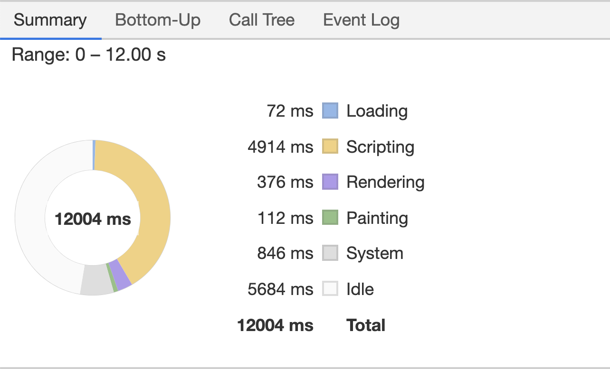

# 网页渲染过程与重绘重排

## 图片



1. Loading: 加载阶段，网络通信和 html 解析
2. Scripting: Javascript 执行
3. Rendering: 重排阶段，样式计算和布局 css
4. Painting: 重绘阶段
5. Other: 其他事件花费时间
6. Idle: 空闲时间

## 如何减少或避免网页重绘和重排

### 浏览器如何渲染网页

#### 什么是关键渲染路径

是指浏览器从最初接收请求来的 HTML, CSS, Javascript 等资源，然后解析、构建树、渲染布局、绘制，最后呈现给用户能看到的界面这整个过程。
用户看到页面实际上是分为两个阶段：页面内容加载完成和页面资源加载完成

- 页面内容加载完成 -》DOMContentLoaded
  -> 仅当 DOM 加载完成，不包括样式表、图片等
- 页面资源加载完成 =》Load
  -> 页面所有 DOM 样式表、脚本、图片都加载完成

#### 浏览器渲染的主要过程

- 1. 浏览器将获取的 HTML 文档解析 DOM 树；
- 2. 处理 CSS 标记，构成层叠样式表模型 CSSOM(CSS Object Model);
- 3. 将 DOM 和 CSSOM 合并为渲染树(Rendering Tree)，代表一系列将被渲染的对象；
- 4. 渲染树的每个元素包含的内容都是计算过的，被称为布局`layout`。浏览器使用一种流式处理的方法，只需一次绘制操作就可以布置所有的元素
- 5. 将渲染树的各个节点绘制到屏幕上，这一步就是 painting

```
                     DOM
                      ⏬         布局
HTML -> 解析HTML -> 生成DOM树       🔼
                      ⏬          🔽
                    附着合成  -> 生成渲染树 -> 绘制 -> 显示
                      🔼
CSS样式 -> 解析CSS ->生成CSS规则树
```

### 具体流程详解

> 重排必定会造成重绘

#### 构建 DOM 树

当浏览器接收到服务器响应来的 HTML 文档后，会遍历文档节点，生成 DOM 树。

- DOM 树在构建的过程中可能会被 css 和 JS 的加载而执行阻塞
- `display: none`的元素也会在 DOM 树中
- 注释也会在 DOM 数中
- `Script`标签会在 DOM 树中  
  无论是 DOM 和 CSSOM，都是要经过  
  `Bytes` -> xxxx  
  `characters`-> `<html><head></head><body></body></html>`  
  `tokens` -> `StartTag: html` `StartTag: head` ... `EndTag: head` `StartTag: body` `EndTag: body`  
  `nodes` -> html head meta body p  
  `DOM` ->

```
              html
    head                    body
 meta link               p   div
```

#### 构建 CSSOM 规则树

浏览器解析 css 并生成 CSSOM，每个 CSS 文件都被分析成一个 StyleSheet 对象，每个对象都包含 CSS 规则。CSS 规则对象包含对应于 CSS 语法的选择器和声明对象以及其它对象。

- CSS 解析和 DOM 解析同时进行
- CSS 解析与`Script`的执行互斥
- 在`Webkit`内核中进行了`script`执行优化，只有在 JS 访问 CSS 时才会发生互斥

#### 构建渲染树 Render Tree

通过 DOM 树和 CSS 规则树，浏览器可以通过这两个构建渲染树。浏览器会先从 DOM 树的根节点来遍历每个可见节点，然后对每个可见节点找到适配的 CSS 样式规则并应用。

- `Render Tree`和`DOM Tree`不完全对应
- `display: none`的元素不在`Render tree`中
- `visibility: hidden`的元素在`Render tree`  
  渲染树生成后，还是没有办法渲染到屏幕上，渲染到屏幕需要得到各个节点位置信息，这就是需要布局(Layout)处理了。

#### 触发分层

- 1. 获取 DOM 并将其分割为多个层
- 2. 将每个层独立的绘制进位图中
- 3. 将层作为纹理上传至 GPU
- 4.  复合多个层来生成最终的屏幕图形

渲染流程

> DOM 子树渲染层(RenderLayer) -> RenderObject -> GraphicsContext

- 根元素、position、transform、半透明、css 滤镜、Canvas2D、video、溢出

> Compositor -> 渲染层子树的图形层（GraphicsLayer）-> RenderLayer -> RenderObject

- **Compositor 将所有的拥有 compositing layer 进行合成，合成过程 GPU 进行参与。合成完毕就能够将纹理映射到一个网络几何结构上 - 在视频游戏或 CAD 程序中，这种技术用来给框架式 3d 模型添加“皮肤”。Chrome 采用纹理把页面中的内容分块发送给 GPU。纹理能够以很低的代价映射到不同位置，而且还能够以很低的代价通过把它们应用到一个非常简单的矩形网络中进行变形。这就是 3D CSS 的实现原理**
- CSS3D 透视变形、video、webgl、transform 动画、加速 CSS 滤镜、叠加在已经触发合成层

#### 渲染树布局 Layout of the render tree

布局阶段从渲染树根节点开始遍历，渲染树的每个节点都是一个`Render Object`对象，包含宽高、位置、背景色等样式信息。所以浏览器就可以通过这些样式信息来确定每个节点对象在页面上的确切大小和位置，布局阶段的输出就是盒子模型。

- float 元素，absoulte 元素，fixed 元素会发生位置偏移
- 脱离文档流 = 脱离`RenderTree`

#### 渲染树绘制 Painting the render tree

在绘制阶段，浏览器会遍历渲染树，调用渲染器`paint()`方法，在屏幕上显示内容。渲染树的绘制工具是由浏览器的 UI 后端组件完成。

### 浏览器渲染网页的那些事

#### 浏览器主要组件结构

```
用户界面（用户能看到的浏览器界面）
      🔽
浏览器引擎（查询和操作渲染引擎）       -> 数据存储
      🔽
渲染引擎（负责解析、渲染请求的内容） 主流渲染引擎： Webkit Gecko
 🔽      🔽                        🔽
网络  js解析器[负责解析执行js]   UI后端[负责绘制]
```

#### 渲染阻塞

JS 阻塞页面：JS 可以操作 DOM 来修改 DOM 结构，每次去执行 JavaScript 脚本都会严重阻塞 DOM 树的构建，如果 JavaScript 脚本还操作了 CSSOM，而正好这个 CSSOM 还没下载和构建，浏览器会延迟脚本执行和构建 DOM,直至完成其 CSSOM 的下载和构建，如果阻塞了构建 DOM 树，也阻塞了其后构建 CSSOM 规则树，整个解析进程必须等待 JS 的执行完成才能继续完成。

CSS 阻塞渲染：由于 CSSOM 负责存储渲染信息，浏览器就必须保存在合成渲染树之前，CSSOM 是完备的，这种完备是指所有的 CSS(内联、外部好内部)都已经下载完，并解析完，只有 CSSOM 和 DOM 的解析完全结束，浏览器才会进入下一步渲染。

CSS 阻塞渲染意味着，在 CSSOM 完备前，页面将处于白屏状态。将样式放在`head`中，可以优先解析 CSS，保证更快的首次渲染。

如果页面没有任何样式，CSSOM 依然会生成，默认生成的 CSSOM 自带浏览器默认样式。

解析 dom 同时查找 CSS，所以如果是`div p{font-size: 16px}`，会先寻找所有 p 标签并判断它的父标签是否为`div`之后再决定要不要渲染。所以尽量用`id`或`class`。

#### 回流和重绘 reflow and repaint

##### reflow 触发机制

1. 添加或删除可见的 DOM 元素
2. 元素位置改变
3. 元素本身的尺寸发生改变
4. 内容改变
5. 页面渲染器初始化
6. 浏览器窗口大小发生改变

##### reflow 回流

当浏览器发现布局变化，就会重新渲染，就是`reflow`,`reflow`会从`html`这个`root frame`开始递归往下。

##### reflow 减少重排的方法

- 集中修改样式，或直接切换 css class
- 修改之前先设置`display: none`，脱离文档流
- 使用 BFC 特性，不影响其他元素位置
- 频繁触发（resize scroll）使用节流和防抖
- 使用`createDocumentFragment`批量操作 DOM
- 优化动画，使用 css3 和 requestAnimationFrame

##### repaint 重绘

`repaint`是当我们改变元素的背景色、文字颜色、边框颜色等等不影响它周围或内部布局的属性时，屏幕的一部分需要重画，但元素的几何尺寸和位置没有发生改变。
reflow 必定会引起 repaint。  
`display:none`会触发`reflow`。  
`visibility:hidden`只会触发 repaint。

reflow 或 repaint 可能不会立即执行，积攒一批后在统一执行-> 异步 reflow 或增量异步 reflow

#### 减少回流或重绘的触发次数

- 样式表越简单，重排和重绘就越快
- 重排和重绘的 DOM 元素层级越高，成本就越高
- table 元素的重排和重绘成本要高于 div 元素
- 尽量不要把读操作和写操作放在一个语句里
- 用`transform`做变形和位移可以减少 reflow
- 避免逐个修改节点样式，尽量一次性修改
- 使用`DocumentFragment`将需要多次修改的 DOM 元素缓存，最后一次性`append`到真实的 DOM 中渲染
- 可以将需要多次修改的 DOM 元素设置`display:none`，
- 避免多次读取某些属性
- 通过绝对位移将复杂的节点元素脱离文档流，形成新的 Render Layer，降低回流成本。
- 缓存重排结果
  - 离线 DOM Fragment/clone
  - 虚拟 DOM react

#### 优化

1. 最小化重绘和重排
2. 批量修改 DOM

- 让该元素脱离文档流
- 对其进行多重改变
- 将元素带回文档
  具体操作：
  1 隐藏元素，进行修改后在显示

```js
let ul = document.querySelector("#mylist");
ul.style.display = "none";
appendNode(ul, data);
ul.style.display = "block";
```

2 使用文档片段创建一个子树，然后在拷贝到文档中

```js
let fragment = document.createDocumentFragment();
appendNode(fragmnt, data);
ul.appendChild(fragment);
```

3 将原始元素拷贝到一个独立的节点中，操作这个节点，然后覆盖原始元素

```js
let old = document.querySelector("#mylist");
let clone = old.cloneNode(true);
appendNode(clone, data);
old.parentNode.replaceChild(clone, old);
```

3. 缓存布局信息

## 参考博客：

[浏览器渲染原理与过程](http://jianshu.com/p/e6252dc9be32x)

#### 开启 3D 加速 GPU 加速

- Texture: 即 CPU 传输到 GPU 的一个 Bitmap
- GPU 能够快速对 texture 进行偏移、缩放、旋转、修改透明度等操作

- CPU -> 计算里大 GPU -> 并发处理能力强

##### Layer 模型

- 浏览器根据 css 属性为元素生成 layers
- 将 layers 作为 texture 上传到 GPU
- 当改变 Layer 的 transform，opacity 属性时，渲染会跳过 layout paint，直接通知 GPU 对 layer 做出改变

##### Layer 创建标准

- 拥有 3d transform 属性
- 使用 animation, transition 实现 opacity, transform 动画
- video
- canvas
- flash
- 使用 css filter 元素
- z-index 大于相邻的节点的 layer 元素

**requestAnimatiobnFrame(callback) 定义绘制每一帧前的工作**

```css
-webkit-transform: translateZ(0);
-webkit-backface-visibility: hidden;
/*
-webkit-transform: translate3d(0,0,0);
触发硬件加速的图片大小只能是256或512，否则拼接处会出现裂缝
*/
```
