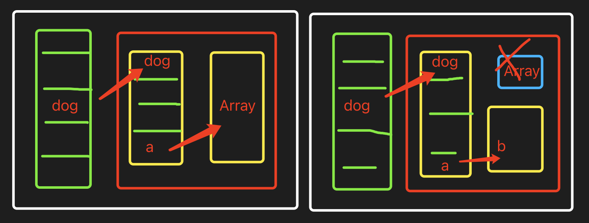

# 浏览器垃圾回收机制

- 浏览器怎样进行垃圾回收
- 浏览器中不同类型变量的内存都是何时释放
- 哪些情况会导致内存泄露，如何避免
- weakMap weakSet 和 Map Set 有什么区别

## 什么是垃圾数据



```js
let dog = new Object();
dog.a = new Array(1);
dog.a = "b";
```

这时候的 Array 就成了不被使用的数据，专业名词叫[不可达]的数据。
这就需要回收的垃圾数据。

## 垃圾回收算法

##### 第一步：`标记空间中[可达]值`

V8 采用的是可达性(reachability)算法来判断堆中的对象应不应该被回收。
这个算法的思路是：

- 从根节点（Root）出发，遍历所有的对象
- 可以遍历到的对象，是可达的（reachable）
- 没有被遍历到的对象，是不可达的（unreachable）

在浏览器环境下，根节点很多，主要包括

- 全局变量 window，位于每个 iframe 中
- 文档 DOM 树
- 存放在栈上的变量
- 。。。

这些根节点不是垃圾，不可能被回收

##### 第二步：`回收[不可达]`的值所占据的内存

在所有标记完成之后，统一清理内存中所有不可达对象

##### 第三步：做内存整理

- 在频繁回收对象后，内存中就会存在大量不连续空间，专业名词叫`内存碎片`
- 当内存中出现大量的内存碎片，如果需要分配较大的连续内存时，就有可能出现内存不足的情况
- 所以最后一步是整理内存碎片（但这步是可选的，因为有的垃圾回收器不会产生内存碎片，比如接下来我们要介绍的副垃圾回收器）

## 什么时候垃圾回收
