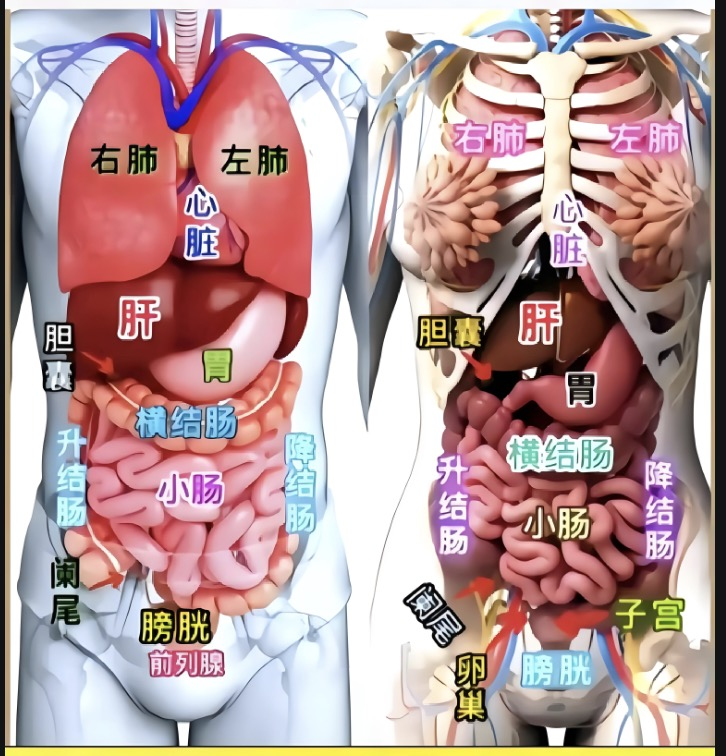
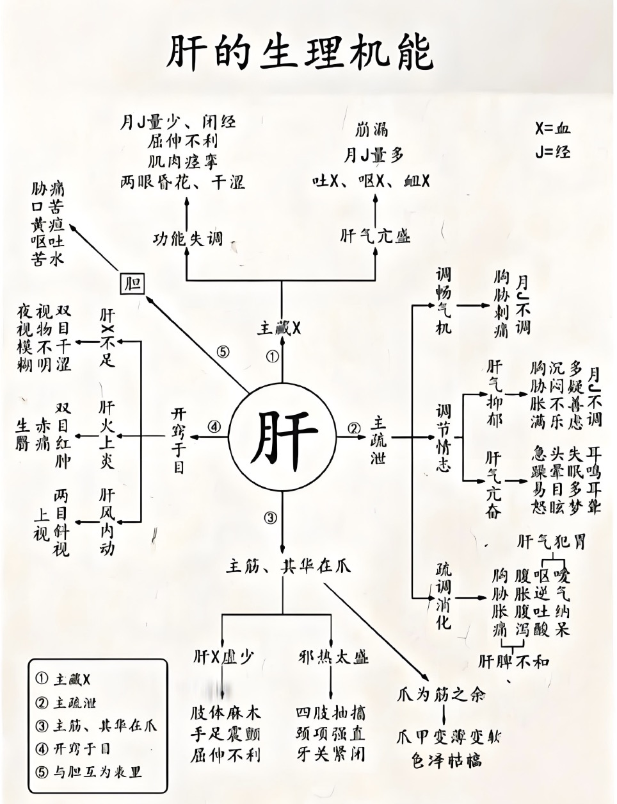
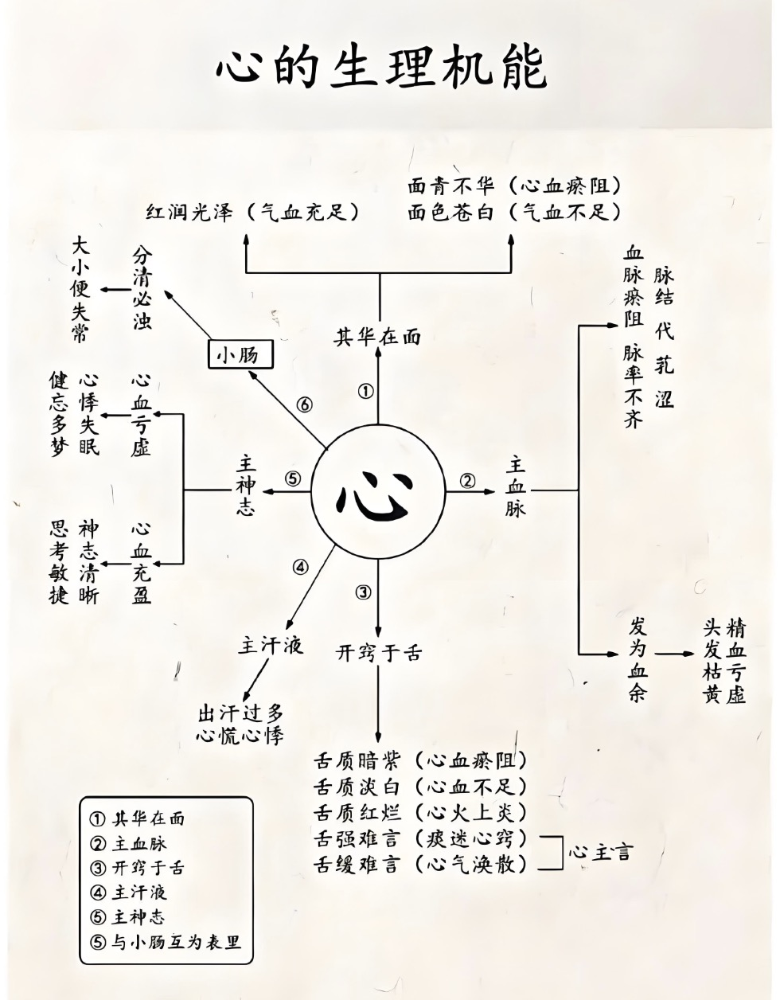
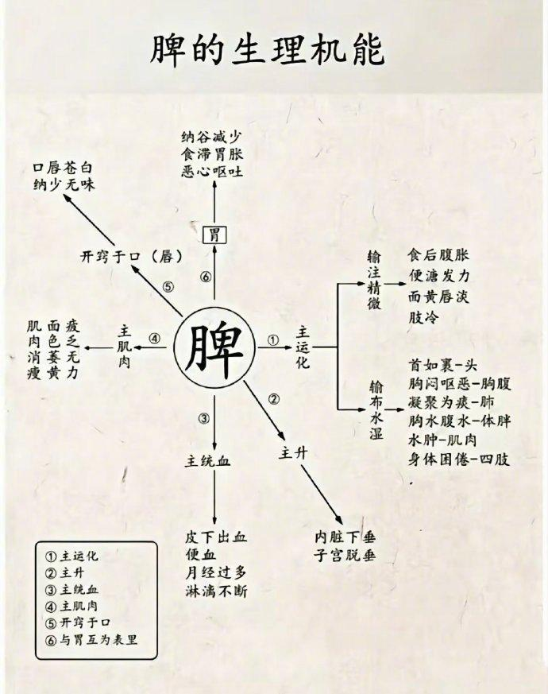
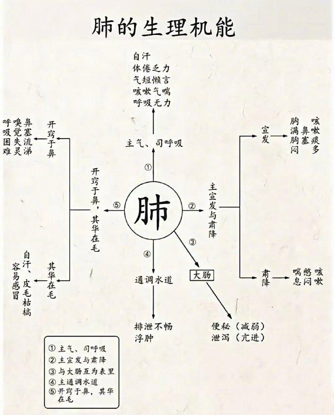
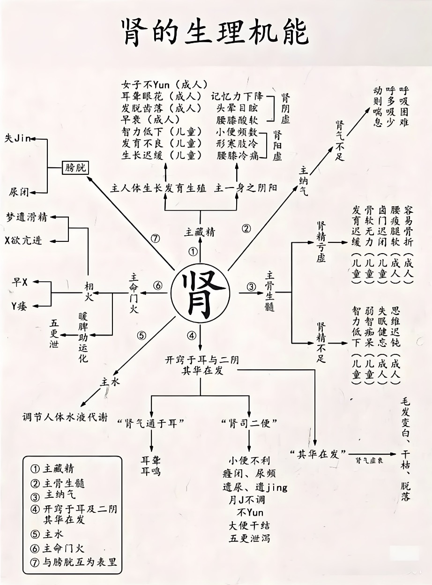
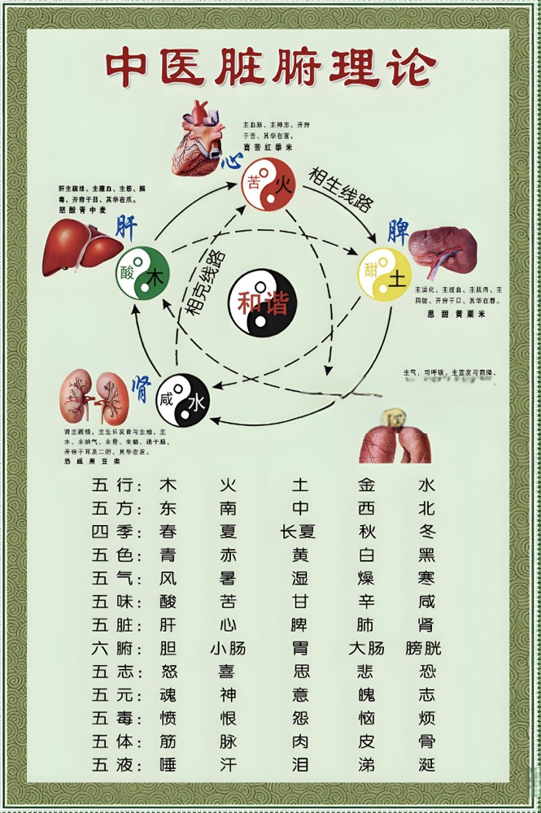
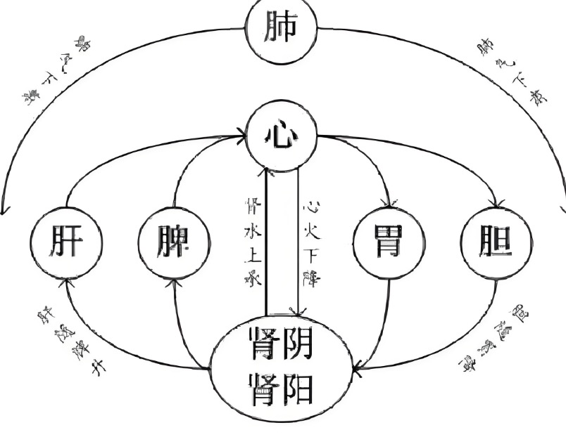
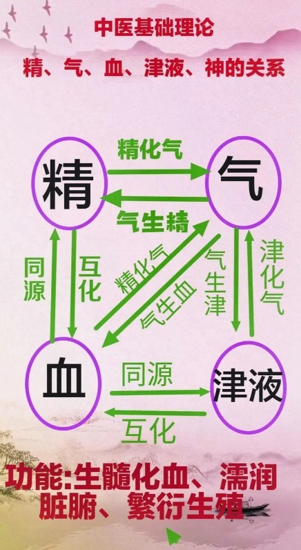

# 五脏与五行

## 疾病的解决途径

- 西医->控制症状
- 中医->调理整体平衡
- 营养->修复细胞

## 认识五脏

### 五脏六腑

- 五脏：心肝脾肺肾
- 六腑：小肠，胆，胃，大肠，膀胱，三焦
- 五脏为阴，六腑为阳，加在一起为十一脏
  - 十一脏取决于胆，脏腑的运行
    - 运行之初是胆
    - 运行之中是肾-癸(gui)水
    - 运行之末是胃
  - 三焦：上焦，中焦和下焦，上焦是心肺，中焦是脾胃，下焦就是肝肾
    - 肝肾同属于寒
    - 心肺同属于热
    - 脾胃载体的作用

### 肝

#### 中医

- 肝主疏泄
  - 调节全身气机，保持气的顺畅运行，防止气滞
  - 肝气顺畅则情绪稳定，肝气郁结则容易导致情绪波动、焦虑、抑郁等
  - 疏调消耗
    - 反酸需要调节
- 肝主藏血
  - 肝负责存储血液，调节血量。运动回释放血液以供骑士，休息时回收血液
  - 调节月经，肝血充足月经正常，肝血不足导致月经不调
- 肝主筋
  - 肝血不足可能导致筋脉僵硬、关节疼痛
- 开窍于目
  - 肝血不足可能导致视力模糊、眼干涩
- 肝与胆互为相表里

#### 现代医学

- 代谢功能
  - 肝参与蛋白质的合成与分解，包括氨基酸的转化与利用
- 解毒
  - 利用多种酶系统将有毒物质转化为无毒或低毒，通过胆汁或尿液排出体外
- 胆汁分泌
  - 肝分泌胆汁，帮助消化脂肪，促进脂溶性维生素的吸收
- 免疫功能
  - 肝内的库普弗细胞(Kupffer cell)具有吞噬和清除血液中异物的能力，参与免疫反应
- 血液生成和调节
  - 产血：肝不是主要造血器官，但参与血液的生成和调节。肝合成多种血液成分，如凝血因子，维持血液正常功能
  - 储血

### 心

#### 中医

- 心主血脉：推动血液运行，调节血量。
- 心主神明：主宰精神活动，影响睡眠。
- 心开窍于舌：反映在舌象上。
- 心其华在面：表现在面部。
- 心与小肠相表里：与小肠相互影响。

#### 现代医学：

- 泵血功能：推动血液循环，确保组织器官得到足够的氧气和营养。
- 电生理功能：通过电信号控制心脏的收缩和舒张。
- 内分泌功能：分泌激素调节血压和水盐平衡。
- 调节功能：调节血压和体温。
- 免疫功能：参与局部免疫反应。

### 脾

- 营养和运动

#### 中医理论：

- 脾主运化：消化和吸收食物中的营养物质，调节水液代谢。
  - 湿气：内气 外气
    - 外气：刮痧，艾灸，泡澡，泡脚等
    - 脾脏的运化功能：各种豆
- 脾主升清：将水谷精微上输至心肺和头目，提升中气。
- 脾主统血：统摄血液，防止出血。
  - 月经不断也是脾虚
- 脾开窍于口：反映在口腔和味觉上。
- 脾其华在唇：表现在唇色上。
  - 秋天冬天嘴唇会干
- 脾与胃相表里：与胃共同完成消化吸收过程。

#### 现代医学：

- 免疫功能：参与免疫反应，清除病原体和异物。
- 血液过滤：过滤血液，清除老化和受损的红细胞。
- 储血功能：储存血液，调节血容量。
- 内分泌功能：分泌激素和生长因子，参与代谢和生长发育。

### 肺

#### 中医理论中的肺

- 肺主气：
  - 呼吸功能：肺负责吸入清气（氧气）和呼出浊气（二氧化碳），维持人体的呼吸功能。
  - 调节气机：肺通过呼吸运动调节全身的气机，保持气的顺畅运行。
  - 鼻炎：润肺养肺
- 肺主宣发和肃降：
  - 宣发：肺将清气和津液向上向外布散，滋养皮毛和全身。
  - 肃降：肺将浊气和代谢废物向下排出，保持呼吸道的清洁和通畅。
  - 咳嗽（脾升）
- 肺主通调水道：
  - 调节水液代谢：肺通过宣发和肃降功能，调节水液的分布和排泄，防止水湿积聚。
- 肺主皮毛：
  - 滋养皮毛：肺通过宣发功能，将津液和精微物质输送到皮肤和毛发，保持皮肤的润泽和毛发的光泽。
  - 防御外邪：肺的功能强健，可以抵御外邪的侵袭，减少感冒和其他呼吸系统疾病的发生。
- 肺开窍于鼻：
  - 开窍于鼻：肺的功能状态可以通过鼻腔反映出来。肺功能正常则鼻腔通畅，呼吸顺畅；肺功能失调则可能导致鼻塞、流涕等症状。
- 肺与大肠相表里：
  - 与大肠的关系：肺与大肠在生理和病理上相互影响。肺的肃降功能有助于大肠的传导功能，大肠的病变也可以影响肺的功能。
  - 便秘，腹泻

#### 现代医学中的肺

- 呼吸功能：
  - 气体交换：肺通过肺泡与血液之间的气体交换，将氧气从空气中转移到血液中，同时将二氧化碳从血液中排出到空气中。
  - 呼吸运动：肺的扩张和收缩由膈肌和肋间肌的运动驱动，维持正常的呼吸节律。
- 免疫功能：
  - 防御机制：肺具有多种防御机制，如黏液纤毛系统、肺泡巨噬细胞等，可以清除吸入的灰尘、细菌和其他有害物质。
  - 免疫细胞：肺含有大量的免疫细胞，参与免疫反应，保护肺部免受感染。
- 内分泌功能：
  - 激素分泌：肺可以分泌一些激素和生物活性物质，如血管紧张素转化酶（ACE）、前列腺素等，参与调节血压和炎症反应。
- 调节功能：
  - 调节酸碱平衡：肺通过呼出二氧化碳，调节血液的酸碱平衡，维持体内环境的稳定。
  - 调节体温：肺通过呼吸运动，帮助调节体温，尤其是在剧烈运动或高温环境中。
- 血液过滤：
  - 过滤血液：肺的毛细血管网可以过滤血液中的微小血栓和异物，保护心脏和其他器官免受损害。

### 肾

#### 中医理论：

- 肾藏精：藏精，主生长发育和生殖。
  - 阴虚
  - 阳虚：怕冷
  - 掉头发 不孕 记忆力
- 肾主水：调节水液代谢。
  - 小便
- 肾主纳气：纳气，维持呼吸深度和稳定性。
- 肾主骨生髓：主骨，生髓，影响血液生成。
- 肾开窍于耳及二阴：反映在听力和大小便上。
  - 耳鸣
- 肾其华在发：表现在头发上。（肺）
  - 秃头：肝虚 肾虚
- 肾主命门火
  - 性欲旺盛
- 肾与膀胱相表里：与膀胱相互影响。

#### 现代医学：

- 滤过和排泄功能：滤过血液，重吸收有用物质，排泄废物。
- 调节水电解质平衡：维持水平衡和电解质平衡。
- 调节酸碱平衡：维持血液的酸碱平衡。
- 内分泌功能：分泌激素，参与血压调节、红细胞生成和钙磷代谢。
- 免疫功能：参与局部免疫反应，保护肾组织。

## 五行的关系

- 五行：金木水火土
  - 金：肺，大肠（秋）
  - 木：肝，胆（春）
  - 水：肾，膀胱（冬）
  - 火：心，小肠（夏）
  - 土：脾，胃（夏末秋初）
- 天干(10 个)：甲，乙，丙，丁，戊，己，庚，欣，壬，癸
- 天干与五行的关系
  - 甲（jiǎ） - 阳木，对应胆
  - 乙（yǐ） - 阴木，对应肝
  - 丙（bǐng） - 阳火，对应小肠
  - 丁（dīng） - 阴火，对应心
  - 戊（wù） - 阳土，对应胃
  - 己（jǐ） - 阴土，对应脾
  - 庚（gēng） - 阳金，对应大肠
  - 辛（xīn） - 阴金，对应肺
  - 壬（rén） - 阳水，对应膀胱
  - 癸（guǐ） - 阴水，对应肾

调理的重心是平衡

- 上下不连贯：脾胃
- 太咸伤肾
- 太辣伤肺、胃

