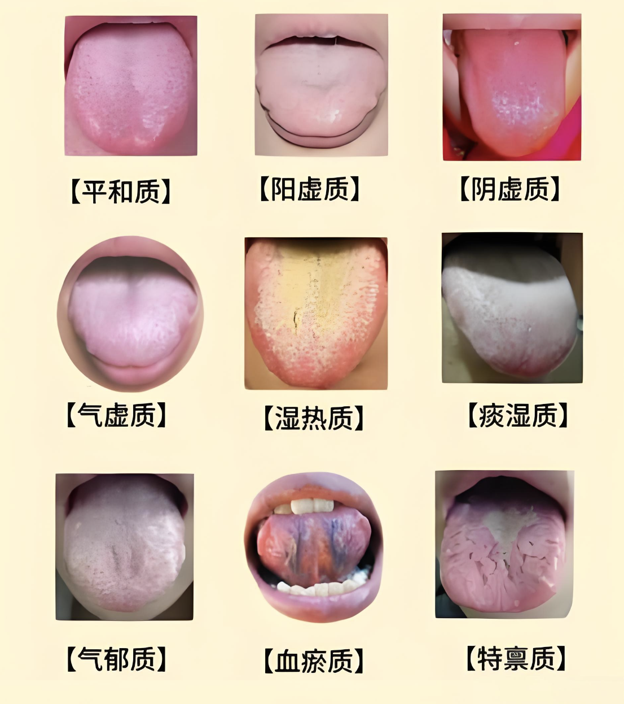

# 望舌知健康

中医的望闻问切

- 中医的九大体质
- 舌像解读
- 偏颇体质成因
- 如何解决

## 中医的九大体质

- 气血
- 分别是：气虚质、阳虚质、阴虚质、痰湿质、平和质、血瘀质、湿热质、气郁质、特禀质

### 一、平和质(A 型)

- 总体特征: 阴阳气血调和，以体态适中、面色红润、精力充沛等为主要特征。
- 形体特征: 体形匀称建壮。
- 常见表现: 面色、肤色润泽，头发稠密有光泽，目光有神，鼻色明润，嗅觉通利，唇色红润，不易疲劳，精力充沛，耐受寒热，睡眠良好，胃纳佳，二便正常，舌色淡红，苔薄白，脉和缓有力。
- 心理特征: 性格随和开朗。
- 发病倾向: 平素思病较少。
- 对外界环境适应能力: 对自然环境和社会环境适应能力较强。

### 二、气虚质(B 型)

- 总体特征: 元气不足，以疲乏、气短、自汗等气虚表现为主要特征。
- 形体特征: 肌肉松软不实。
- 常见表现: 平素语音低弱，气短懒言，容易疲乏，精神不振，易出汗，舌淡红，舌边有齿痕，脉弱。
- 发病倾向: 易患感冒、内脏下垂等病;病后康复缓慢。
- 对外界环境适应能力: 不耐受风、寒、暑、湿邪。

### 三、阳虚质(C 型)

- 总体特征: 阳气不足，以畏寒怕冷、手足不温等虚寒表现为主要特征。
- 形体特征: 肌肉松软不实。
- 常见表现: 平素畏冷，手足不温，喜热饮食，精神不振，舌淡胖嫩，脉沉迟。
- 发病倾向: 易患痰饮、肿胀、泄泻等病;感邪易从寒化。
- 对外界环境适应能力: 耐夏不耐冬;易感风、寒、湿邪。

### 四、阴虚质(D 型)

- 总体特征: 阴液亏少，以口燥咽干、手足心热等虚热表现为主要特征。
- 形体特征: 体形偏瘦。
- 常见表现: 手足心热，口燥咽干，鼻微干喜冷饮，大便干燥，舌红少津，脉细数。
- 发病倾向: 易患虚劳、失精、不寐等病;感邪易从热化。
- 对外界环境适应能力: 耐冬不耐夏;不耐受署、热、燥邪。

### 五、痰湿质(E 型)

- 总体特征: 痰湿凝聚，以形体肥胖、腹部肥满、口黏苔腻等痰湿表现为主要特征。
- 形体特征: 体形肥胖，腹部肥满松软。
- 常见表现: 面部皮肤油脂较多，多汗且黏胸闷，痰多，口黏腻或甜，喜食肥甘甜黏苔腻，脉滑。
- 发病倾向: 易患消渴、中风、胸痹等病。
- 对外界环境适应能力: 对梅雨季节及湿重环境适应能力差。

### 六、湿热质(F 型)

- 总体特征: 湿热内蕴，以面垢油光、口苦昔黄腻等湿热表现为主要特征。
- 形体特征: 形体中等或偏瘦。
- 常见表现: 面垢油光，易生痤疮，口苦口干，身重困倦，大便黏滞不畅或燥结，小便短黄，男性易阴囊潮湿，女性易带下增多舌质偏红，苔黄腻，脉滑数。
- 发病倾向: 易忠疮疖、英疸、热淋等病。
- 对外界环境适应能力: 对夏末秋初湿热气候，湿重或气温偏高环境较难适应。

### 七、血瘀质(G 型)

- 总体特征: 血行不畅，以肤色晦黯、舌质紫黯等血瘀表现为主要特征。
- 形体特征: 胖瘦均见。
- 常见表现: 肤色晦黯，色素沉着，容易出现瘀斑，口唇黯淡，舌黯或有瘀点，舌下络脉紫黯或增粗，脉涩。
- 发病倾向: 易患症痕及痛证、血证等，
- 对外界环境适应能力: 不耐受寒邪。

### 八、气郁质(H 型)

- 总体特征: 气机郁滞，以神情抑郁、忧虑脆弱等气郁表现为主要特征。
- 形体特征: 形体疫者为多。
- 常见表现: 神情抑郁，情感脆弱，烦闷不乐，舌淡红，苔薄白，脉弦。
- 心理特征: 性格内向不稳定、敏感多虑。
- 发病倾向: 易思脏躁、梅核气、百合病及郁证等。
- 对外界环境适应能力: 对精神刺激适应能力较差;不适应阴雨天气。

### 九、特禀质(I 型)

- 总体特征: 先天失常，以生理缺陷、过敏反应等为主要特征。
- 形体特征: 过敏体质者一般无特殊; 先天禀赋异常者或有畸形，或有生理缺陷。
- 常见表现: 过敏体质者常见哮喘、风团、咽痒、鼻塞、喷嚏等;忠遗传性疾病者有垂直遗传、先天性、家族性特征; 患胎传性疾病者具有母体影响胎儿个体生长发育及相关疾病特征。
- 心理特征: 随禀质不同情况备异。
- 发病倾向: 过敏体质者易患哮喘、荨麻疹、花粉症及药物过敏等;遗传性疾病如血友病、先天思型等;胎传性疾病如五迟(立迟、行迟、发迟、齿迟和语迟)、五软（头软、项软、手足软、肌肉软、口软）、解颅、胎惊等。
- 对外界环境适应能力: 适应能力差，如过敏体质者对易致过敏季节适应能力差，易引发宿疾。

## 偏颇体质形成的原因

- 营养过剩 -> 痰湿体质
- 长期甘甜 -> 痰湿、湿热体质（胰岛素泛滥）
- 营养不良 -> 气虚、阳虚体质
- 长期焦虑 -> 气郁、血瘀体质
- 长期不运动 -> 气虚体质
- 长期熬夜 -> 气虚、阴虚体质（舌头泛红，容易烦躁）
- 长期饮酒 -> 湿热体质
- 长食(居)寒凉 -> 阳虚、血瘀体质（耗肾气）
- 劳力劳神过度 -> 气虚体质
- 长期吃辣 -> 湿热、阴虚体质（不适合吃辣椒）
- 房劳过度 -> 阳虚体质
- 长吃夜宵 -> 痰湿体质

## 正确用参需要知道

- 人参
  - 属补气药。人参性味甘温，主要用于气虚，如体虚气弱，久病气弱或疲劳过度等。
- 党参
  - 又叫上党人参，防风党参，有补中益气、止渴、健脾益肺养血生津。用于牌肺气虚，食少倦总，咳虚虚喘，气血不足，面色萎黄，心悸气短，津伤口渴，内热消渴、四肢无力
- 西洋参
  - 又称花旗参，产于加拿大、美国等现在东北也种植。擅长补气养阴，清火生津，有别于人参，可用于夏季进补而不上上火
- 玄参
  - 玄参的干燥根为常用中药，性微寒，味甘、苦。有凉血滋阴、泻火解毒之效。用于热病伤阴、舌绛烦渴、温毒发斑
- 丹参
  - 紫丹参，丹参的药性: 味苦，微寒。入心、肝经丹参的功效与作用:活血调经，祛癌止痛，丹参具有活血止痛、宁心安神
- 高丽参
  - 又称朝鲜参、别直参，带根茎的根，经加工蒸制而成，具有大补元气、滋补强身、生津止渴、宁神益智等功效，适用于惊悸失眠者、体虚者、心力衰竭、心源性休克等。
- 苦参
  - 它也有一个特别苦的特点，所以被称为苦参。苦参性苦，性寒。苦参具有清热解毒苦参性苦，药有清热利温，抗苗消炎，健胃驱虫之效，常用作治疗皮肤瘙痒，神经衰弱，消化不良及便秘等症。
- 红参
  - 红参就是把人参蒸熟之后晒干使用的，红参温补的力量就比较强，所以红参也是有适用证的，对于体质偏于寒凉的人来说，红参就是比较适宜的，但是对于热性体质的人来说千万不可以用红参，这会加重热性的积累，对身体反而不好
- 野山参
  - 野山参性微温，味甘，野山参主根短相，与根茎等长或较短，形似人体存量很少，极其珍贵。具有大补元气、补脾益肺生津养血、安神益智
- 沙参
  - 根部长得非常类似于梦卜，沙参的性质微塞，沙参有补而不燥的特点。沙参属补虚药,味甘,善补五脏之阴,尤其擅长补益肺、胃之阴。有些人长期肺气亏虚,容易感冒,使用党参、人参等补益后容易上火,这些人就可以用沙参代替进补
- 白糖参
  - 白糖参简称糖参，以浆气不足、体形欠佳、不适于加工红参的鲜人参为原料加工而成，补益牌肺 白糖参流浸膏用于治疗胃不足、胃酸缺乏性胃炎及慢性胃炎患者，能使胃液酸度增高，大多数患者食欲不一…不良症状改善
- 太子参
  - 太于参有益气、健脾、生津、润肺的作用，太子参是甘、微苦而平的性味，入脾经，也入肺经，可以用于牌虚出现的身体值总、乏力、不想动、没有力气等病症，还可以用于食欲不振，以及可以用于病后出现的身体虚

## 厨房里的科学养生

- 寒性: 大闸蟹 苦瓜
- 油: 高脂血不能用猪油
- 阳虚：小茴香 姜 大葱 蒜 八角
- 阳虚应该吃 狗肉 鹿肉 韭菜 补阳
- 阴虚应该吃 螃蟹、田螺、苦瓜、西瓜
