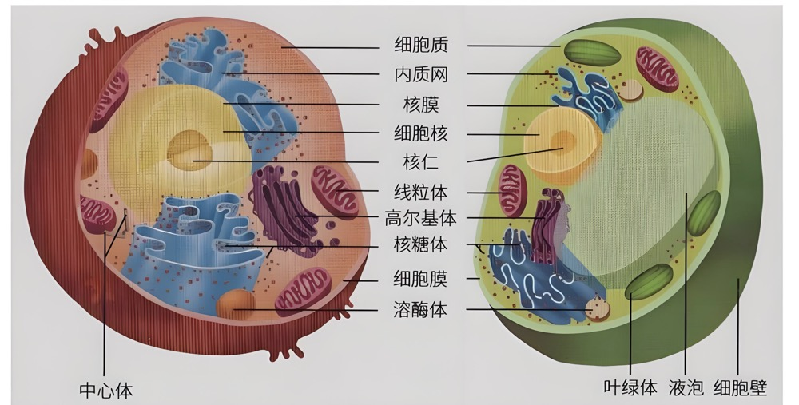
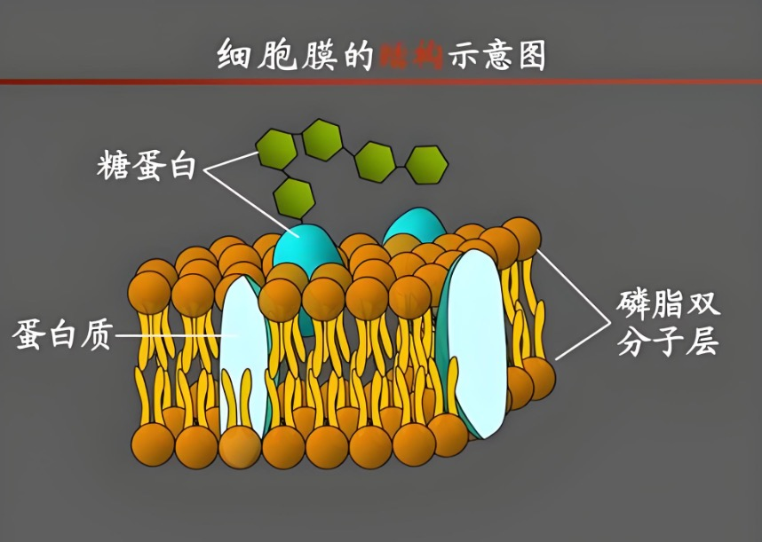
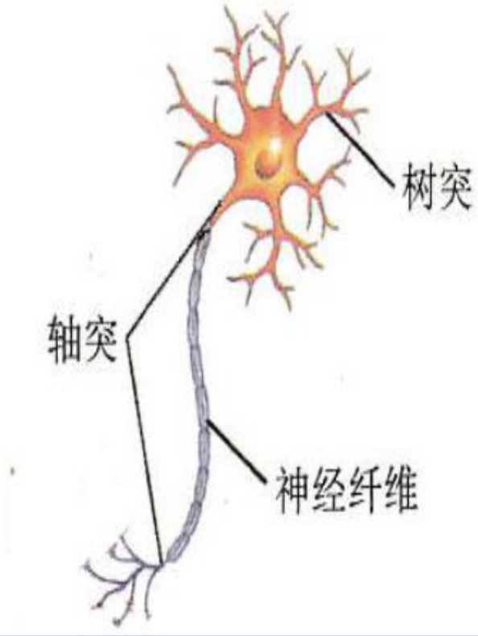
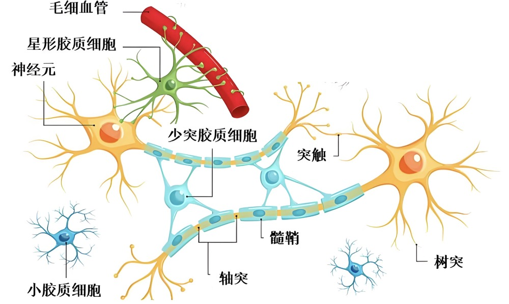
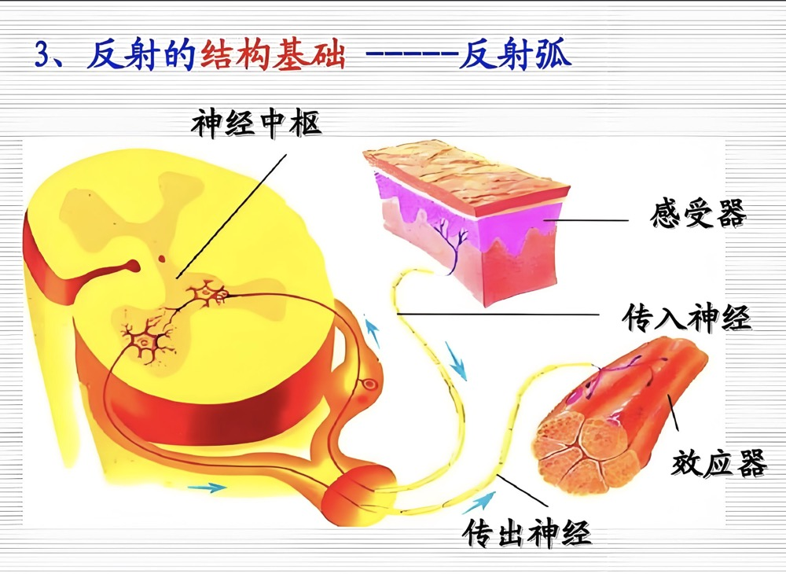
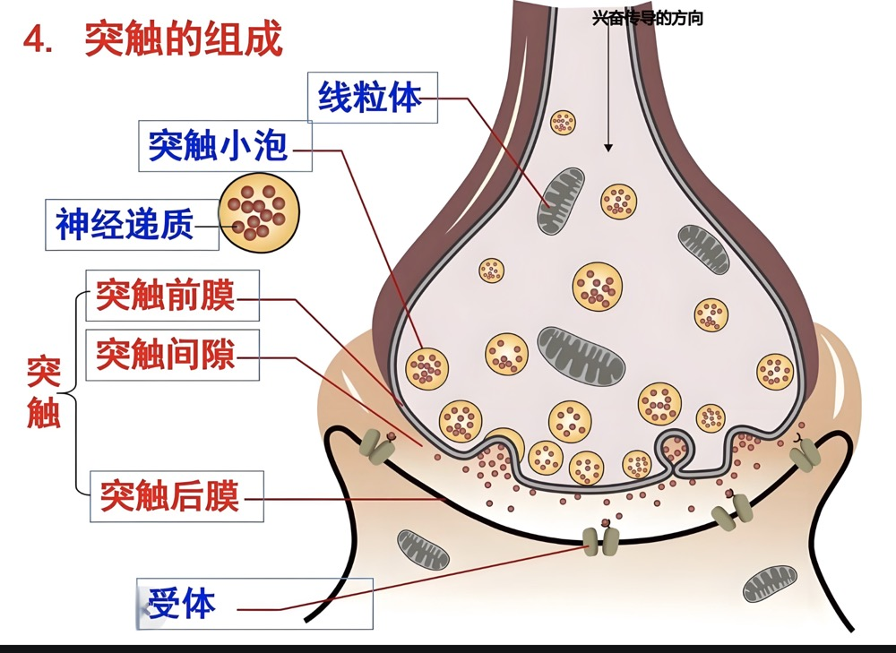
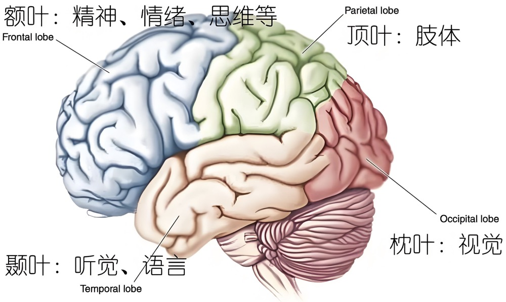

# 认识神经系统

- 中枢神经系统
  - 脑
    - 大脑、小脑
      - 灰质：有神经中枢（如语言中枢、感觉中枢等）
      - 白质：传导功能
    - 脑干: 延脑、脑桥、中脑、间脑
  - 脊髓
    - 灰质: 有神经中枢(如排尿中枢、膝跳反射中枢等)
    - 白质:传导功能
- 周围神进系统
  - 脑神经和脊神经
    - 躯体神经
      - 躯体感觉神经
      - 躯体运动神经
    - 内脏神经
      - 内脏感觉神经
      - 内脏运动神经（植物性神经）
        - 交感神经
        - 副交感神经
- 周围神进系统（按功能分）
  - 传入神经（运动神经）
  - 传出神经（感觉神经）
- **脑神经共 12 对，三类神经都有;脊神经共 31 对全部是混合神经**

## 细胞

- 慢性病的根源 一 细胞（基本单位）

### 动物细胞结构及作用:

- 细胞膜
  - 作用: 保护细胞并控制细胞号外界之间物质交换
- 细胞核
  - 内含遗传物质，起传宗接代作用
- 细胞质
  - 许多生命活动的场所

### 细胞膜

- 糖蛋白
- 蛋白质
- 磷脂双分子层

## 神经系统

### 1 神经元

- 神经系统的基本单位--神经元(神经细胞)
- 神经元的基本结构
  - 细胞体: 对信息进行分析整合
  - 突起
    - 树突: 短而多，接受刺激并将兴奋传入胞体
    - 轴突: 长一条，将兴奋由胞体传出到外围

### 2 神经胶质

- 支持和保护神经元，维持神经元的微环境。

### 3 反射弧

- 最简单的功能单元，实现快速反应。

### 4 突触

- 神经元之间的连接点，实现信号传递

- 突触变多/变少增强链接效率!突触连捷其它神经元的突触变多/多余的突触修
  突触变多/变少增强链接效率!突触连捷其它神经元的突触变多/多余的突触修

- 突触强化: 学习过程中，经常被使用的神经回路成连接会经历突触强化。这意味着突独的连接强度增加，从而使得信号传递更加高效。这种强化主要是通过突触可塑性的机促作用(Potentiation),LTP）和长时程抑制（Long-制来实现的，如长时程增强(LongTerm Depression,LTD)

## 学习

- 1. 为什么学习
  - 抵抗不确定，预防、解决问题，获取更好的生存条件
- 2. 什么是学习
  - 通过有限的例子找出规律，应用解决无限的问题和案例
- 3. 如何学习
  - 了解大脑的运行机制，如何思考和记忆，根据特定规律学习和记忆
- 4. 大脑特性
  - 大脑的遗忘特征
  - 大脑的可塑性

### 大脑皮层功能区

- 躯体运动中枢
- 中央沟
- 躯体感觉中枢
- 语言中枢
- 视觉中枢
- 听觉中枢

### 大脑（颅腔内）

- 端脑
- 间脑
- 小脑
- [中脑、脑桥、延髓] 脑干->第 3-12 对脑神经

### 脑神经

- 嗅神经
- 视神经
- 动眼神经
- 滑车神经
- 三叉神经
- 展神经
- 面神经
- 前庭蜗神经
- 舌咽神经
- 迷走神经
- 副神经
- 舌下神经

## 神经递质与情绪

| 日常获得                             | 神经递质             | 对生活的影响               |
| ------------------------------------ | -------------------- | -------------------------- |
| 体育锻炼、表达感激之情、并与成就振动 | 多巴胺(动机和快乐)   |                            |
| 乐观、积极的态度、睡觉               | 血清素(幽默和幸福)   |                            |
| 经常晒太阳、睡在黑暗和安静的环境     | 褪黑素（休息和健康） | 改善睡眠质量，提升生活质量 |
| 锻炼和接受按摩                       | 肾上腺素             |                            |
| 拥抱、亲吻、跳舞、接纳、爱与关怀     | 催产素 (爱和链接)    |                            |
| 冥想、瑜伽、呼吸和身体练习           | 加巴 (平静和放松)    |                            |
| 与大自然的接触 微笑和巧克力 亲密行为 | 内啡肽 (健康和幸福)  |                            |
