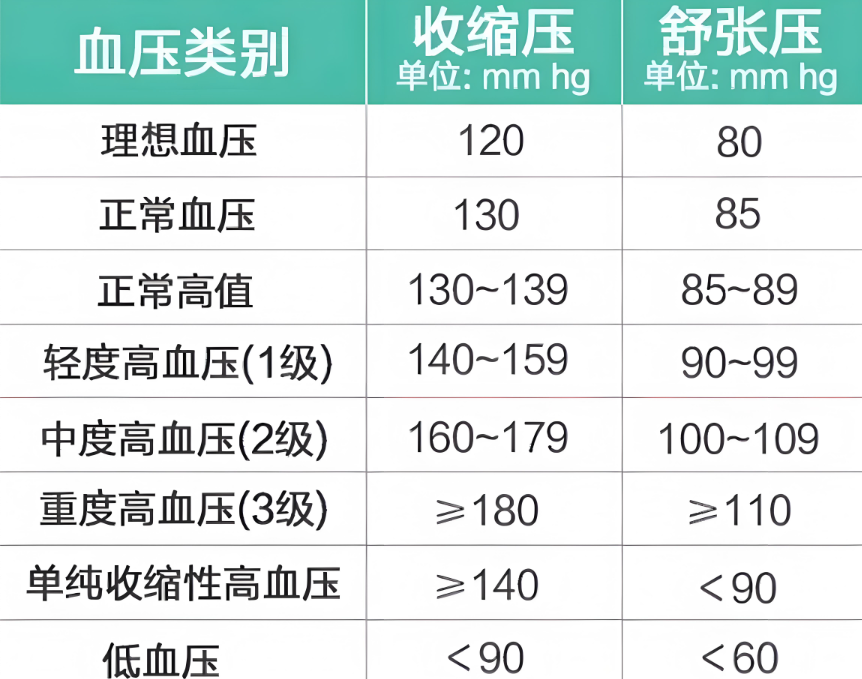
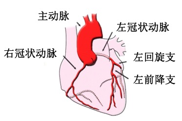
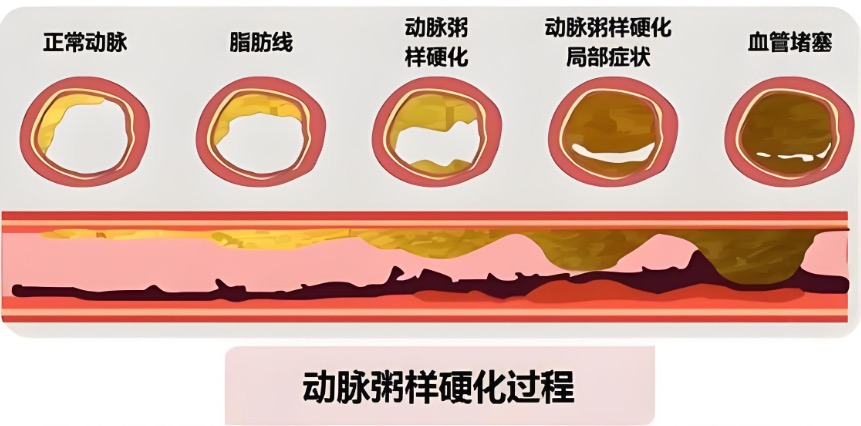

# 高血压的自我管理

- 蓝色：平静 放松
- 红色：兴奋

## 高血压背景

- 我国高血压患者 2.45 亿，每年医疗费用达 318.9 亿元，其已成为我国人群因病致死、致残的首因。我国因心脑血管病导致的死亡占国民总死亡的 40%以上，约 70%的脑卒中死亡和约 50%心肌梗死与高血压密切相关。
- 18 岁及以上居民高血压患病率为 27.9%每 4 名成年人里至少有 1 个高血压患者肥胖人群高血压患病率远高于正常人群

## 高血压定义

- 高血压也称血压升高，是血液在血管里流动时对血管壁造成的压力值持续高于正常的现象。

  

## 高血压分类

- 继发性高血压
  - 病因治愈后就能痊愈
  - 继发性高血压由特定的族病或病因引起血压升高，这被称为继发性高血压，这类高血压可以通过治疗导致的血压升高的疾病而得到根治或改普。
  - 肾脏：血功能血管狭窄
  - B6、B12、叶酸等可缓解 治愈
  - 妊娠高血压
- 原发性高血压
  - 可控制，不能完全治愈
  - 原发性高血压是一种以血压升高为主要临床表现而病因尚未明确的独立疾病，占所有高血压患者的 90%以上。

## 高血压病因

- 血液
  - 血量越多，越费劲
  - 血粘稠也会有压力，高血脂
- 血管
  - 动脉硬化：抽烟、喝酒、压力
    - 冠状：容易动脉硬化
- 心脏
  - 甲亢：心脏跳动会更快

## 高血压诱因

- 高纳低钾饮食：建议高钾低钠
  - 盐：建议 5g/一天, 啤酒瓶盖少一丢丢
- 超重或肥胖
  - 肥胖的人：心脏压力大
- 吸烟
  - 对肺不好
  - 尼古丁会刺激交感神经
  - 血管缺氧，更容易损伤血管内壁
- 过量饮酒
- 长期精神压力
  - 肾上腺素等刺激血压
- 体力活动不足
  - 血液运行的越多，有利于废物的排除
- 遗传因素

## 高血压症状

- 35+都应该关注，有一半的人不知道有高血压
- 高血压典型症状:
  - 头痛、疲倦或不安、心律失常、心悸耳鸣
- 高血压危象:
  - 视力模糊、意识丧失、失忆、心肌梗死、肾功能损坏、心绞痛、肺水肿等

## 高血压的危害

- 心
- 脑
- 肾
  - 肾小管，肾小球就是个小球
  - 血压控制不好：尿蛋白
  - 尿毒症：血压、血糖控制不好
- 眼
- 血管

### 具体症状

- 动脉硬化: 早期甚至一半都没感觉，应该早早关注，早点预防
  
  - 正常动脉
  - 脂肪线
  - 动脉粥样硬化
  - 血栓
  - 梗死
- 心脑血管
  - 脑中风
    - 出血性（血压引起）
    - 临睡前喝一点点水
- 心肌梗塞

## 治疗

### 降压药物治疗

- 只作用症状，没解决根源
- 降压药物种类
  - 利尿药 (通过尿液多排-对盐比较敏感的)
    - 矿物质（钾）也会被排出：无力等
    - 尿酸高也不建议吃 影响嘌呤
  - β 受体阻滞剂
    - 阻断 让心脏活动放缓，心率快的用
  - 钙通道阻滞剂
    - 用量最大
    - 让血管收缩，钙阻断了，变相的血管舒张了，血压就是降
  - 血管紧张素转换酶抑制剂
  - 血管紧张素 Ⅱ 受体阻滞剂

### 日常禁忌

- 不能吵架
- 上厕所不能憋气用力
- 不要摔跤

### 如何自我管理

- 改变生活习惯
  - 健康饮食低脂低钠
  - 戒烟
  - 限制饮酒
  - 适当增加活动
  - 适当减重
- 营养与血压
  - 蛋白质:血管壁胶原蛋白主要组成成分，增强心肌能力
  - VC:抗氧化，恢复血管弹性
  - VE:抗氧化，改善动脉硬化
  - 辅酶 Q10: 增强心肌功能
  - 卵磷脂（身体的脂肪）: 降血脂
  - 钙和镁: 降低血压
  - 钾: 通过扩血管作用及促进尿钠排出作用降低血压
- 管理方向
  - 一、解决“多”的问题
    - 1、启动身体清理机制，改善血液内环境，清理血液中多余的低密度胆固醇、甘油三酯等
    - 2、改善血管动脉硬化
  - 二、解决“少”的问题
    - 1、改善心脏功能
    - 2、恢复血管壁弹性
