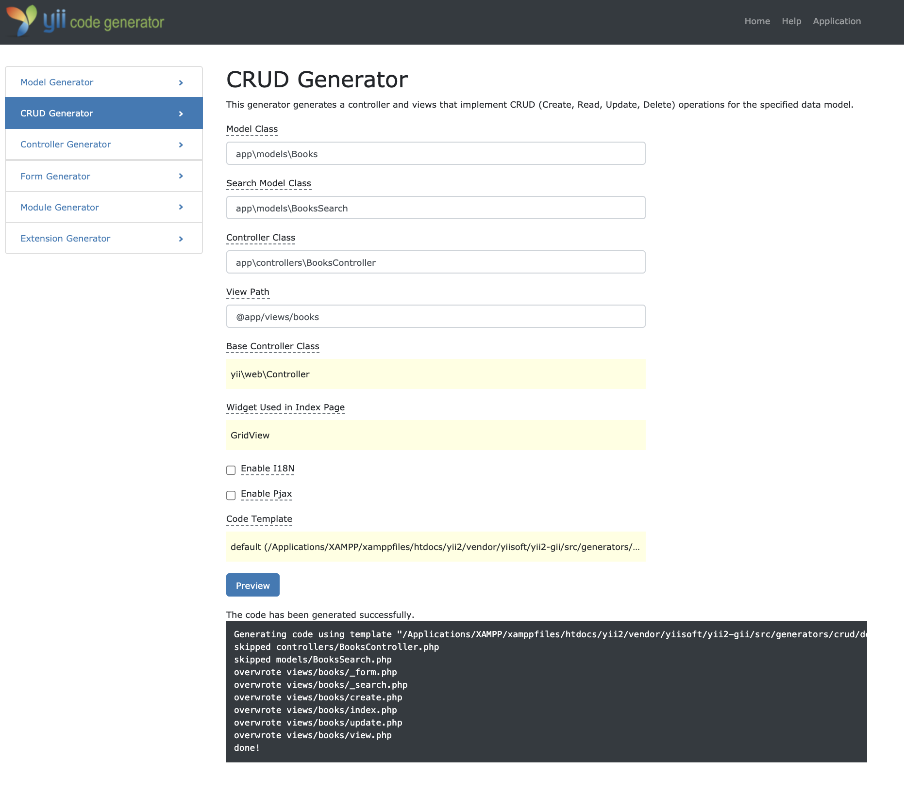

# Yii 开发一个图书管理系统

## MVC 模式

#### View Model Controller

- Controller 截获用户发出的请求
- Controller 调用 Model 完成状态的读写操作
- Controller 把数据传递给 View
- View 渲染最终结果并呈现给用户
- MVC 都在服务器上


#### DAO(Data Access Object)

DAO 数据访问对象是一个面向对象的数据库 接口

#### 环境

- XAMPP
  - Apache MariaDB PHP Perl
  - 直接打开是走磁盘
  - 起服务打开是走网络的
  - systemcil linux 控制软件命令
  - ProFTPD FTP 服务器 文件传输协议 scp
  - 生产环境=>自己搭 php + apache + mysql
  - mariadb mysql 内核一样 管理机制不一样，mysql 得初始化，密码强制设定，mysql 会生成口令，得记下来

```sh
# centos
yum install mysql # mariadb
systemctl status mysqld # 基础服务状态
systemctl status mariadb
# mysql root用户默认只允许在本机上操作
### 解决方法：
#### 1. mysql user  多创建几个root用户  root host改为%
#### 2. 用SSH通道 ssh命令
```

### 安装 Yii

Composer-专业 PHP 开发环境

#### 1. 环境安装操作步骤

- 1. 配置好 XAMPP 环境
- 2. 下载 yii2 basic
- 3. 解压放到 web 发布路径下
- 4. 修改`config/web.php`文件，给`cookieValudationKey`配置项添加一个密钥，内容随意，为了配置 cookie
- 5. 保证 Yii 安装目录访问权限
- 6. 通过浏览器访问 web 路径`/web/index.php`打开 yii 应用，可以看到主页面

```sh
# 检查目录权限
ls -alF
# chmod change mod
### chmod   7[给当前用户权限]7[给当前用户组权限]5[只读权限]
### 776  可读可写   750  生产环境下不能配置777
# 掩码  四个二进制的字节组成，一个字节是8位
# d rwx r-x r-x@ 三组
# rwx read write Excut
# hailiting 文件所有者
# staff 所有者所在的用户

drwxr-xr-x@  3 hailiting  staff      96  1 22  2020 controllers/
# The directory is not writable by the Web process   目录权限不够导致
ps -ef | grep apache | grep -v grep

sudo chmod -R 777 /xxx
```

#### 2. Yii 环境基本配置

- 1. 配置数据库连接，修改`config/db.php`配置参数
- 2. 激活 Gii 模块，修改`config/web.php`，找到以下代码，并检查

```php
if(YII_ENV_DEV){
  $config["bootstrap"][] = "gii";
  $config["modules"]["gii"]= [
    "class" => "yii\gii\Module"
  ]
}
```

2.1. 检查应用的入口脚本`web/index.php`，找到这行代码将`YII_ENV_DEV`设为`true`  
2.2. 在开发模式下，按照下面的配置会激活 Gii 模块，直接通过 URL`http://localhost/index.php?r=gii`访问 Gii

```php
defined("YII_ENV") or define("YII_ENV", "dev")
```

2.3. 通过本机以外的机器访问 Gii，请求会被出于安全原因拒绝，可以配置 Gii 为其添加容许访问的 IP 地址

```php
"gii"=>[
  "class"=>"yii\gii\Module",
  "allowedIPs" => ["127.0.0.1", "::1"],
]
```

#### CRUD Generator

增删改查



- 1. 当创建页面 404 时，可能是数据库有问题
- 2. 创建的路由是 `.../index.php?r=books/index`

```php
// BooksController.php
...
use yii\web\Response;

class BooksController extends Controller {
  public $enableCsrfValidation = false;
  ...
  public function actionIndex(){
    $searchModel = new BooksSearch();
    $dataProvider = $searchModel -> search(Yii::$app->request->queryParams);
    YII::$app->response->format = Response::FORMAT_JSON;
    return $dataProvider->getModels();
  }
  public function actionCreate(){
    $result = array("code"=>0,"message"=>"");
    $model = new Books();
    YII::$app->response->format = Response::FORMAT_JSON;
    if($model->load(Yii::$app->request->post() ) && $model->save()){
      // return $this->redirect(["view", "id"=>$model->id]);
      $result["message"] = "ok";
    } else {
      $result["code"] = 1;
      $result["message"] = "error";
    }
  }
  public function actionUpdate($id){
    $model = $this->findModel($id);
    if($model->load(Yii::$app->request->post()) && $model->save()){
      return $this->redirect(["view","id"=>$model->id]);
    }
    return $this->render("update", [
      "model"=>$model,
    ])
  }
  public function actionDelete($id){
    var_dump($id);
    $this->findModel($id)->delete();
    $result=array("code"=>0,"message"=>"success");
    YII::$app->response->format = Response::FORMAT_JSON;
    return $result;
  }
  protected function findModel($id){
    if($model=Books::findOne($id) !==null){
      return $model;
    }
    throw new NotFoundHttpException('The requested page does not exist.');
  }
}
```

### UML 设计

## 实题讲解

### 请写出如下代码输出值，并解释为什么

```js
console.log(a); // undefined
console.log(typeof yideng(a)); // undefined
yideng(); // 词法作用域 yideng is not a function
var flag = true;
if (!flag) {
  var a = 1;
}
if (flag) {
  function yideng(a) {
    yideng = a;
    console.log("0000-1");
  }
} else {
  function yideng(a) {
    yideng = a;
    console.log("0000-2");
  }
}
```

```js
console.log(yideng);
function yideng() {
  console.log("output");
}
console.log(yideng);
function init() {
  // yideng();
  console.log(yideng);
  var flag = true;
  if (flag) {
    function yideng(a) {
      yideng = a;
      console.log("yideng1");
    }
  } else {
    function yideng(a) {
      yideng = a;
      console.log("yideng2");
    }
  }
}
init();
```

```js
console.log("1   ", test);
function test() {
  console.log("2   ", test);
  test = undefined;
  console.log("3   ", test);
}
// console.log("4  ", test);
// test();
console.log("5   ", typeof test());
```

```js
console.log(aa);
// 只读变量
var a = function aa() {};
console.log(typeof aa()); //  aa is not defined
```

### 写出如下输出值，并完成附加题的作答

```js
function fn() {
  console.log(this.length); // 0
}
var yideng = {
  length: 5,
  method: function() {
    "use strict";
    // 软绑  没有指向的时候 报错
    fn();
    // arguments.fn
    arguments[0](); // 2
};
// bind(null) 正常指向  站位
// bind({}) 硬绑
const result = yideng.method.bind(null);
result(fn, 1);
```

```js
// 形参和实参
// this指向
function yideng(a, b, c) {
  // this的指向
  console.log(this.length);
  // call callee caller
  console.log(this.callee.length);
}
function fn(d) {
  // arguments.yideng()
  // arguments -> fn
  // this.callee = fn  形参
  arguments[0](10, 20, 30, 40, 50);
}
// 实参 4个   形参 1个
fn(yideng, 10, 20, 30);
```

```js
function test(a) {
  console.log(arguments.length);
}
test(1, 2, 3, 4);
console.log(test.length);
```

### 请问变量 a 会被 CG(Collect garbage) 回收吗，为什么

![查看调用栈]](./img/one_02.png)

```js
function test() {
  var a = "yideng";
  return function() {
    debugger;
    eval(""); // 因为eval 所以浏览器不会回收变量 a
    // window.eval("");  // 这个就可以解除
  };
}
test()();
// 1. eval 不对词法环境（lexical envirmoent）任何的变量进行解除绑定

var obj = {};
with (obj) {
  a = 1;
}
console.log(obj.a); // undefined
console.log(a); // 1
// 2. with 不会，浏览器一旦遇到with,浏览器会放弃所有变量的回收

new Function("console.log('a')"); // 全局的
var a = 20;
function init() {
  var a = 30;
  var s = new Function("console.log(a)"); // 20 全局的
  new Function(console.log(a))(); // 30
  s();
}
init();
// 3. 如果调用了Function 词法作用域也会不一样

// 4. try...catch 欺骗了词法作用域， catch(e) 延长了作用域链
```

```js
function Human(name) {
  this.name = name;
}
var a1 = new Human("a1");
var a2 = new Human("a2");
a1 = null;
a2 = null;
```

```js
function Yideng(name) {
  this.name = name;
}
let YidengFactory = function(name) {
  let student1 = new Yideng(name);
  return function() {
    console.log(student1); // 因为console在引用
  };
};
lett p1 = new YidengFactory("laoyuan");
p1();
p1=null;
// YidengFactory 没了  Yideng的引用还在
```

### 请写出以下代码输出值，并解释原因

```js
Object.prototype.a = "a";
Function.prototype.a = "a1";
Function Person(){}
var yideng = new Person();
console.log("p.a: "+ yideng.a); // a1
// 1..   ..1  (1).constructor是个对象
console.log(1..a);
// 1.  是不合法
// js 是整形
// console.log(1.a);
console.log(yideng.__proto__.__proto__.constructor.constructor.constructor);// Function {[native code]}
```

![one_03]](./img/one_03.png)

Object.prototype 和 Function.prototype 打印的内容差距很大的原因是什么呢  
万物皆对象，function 是一等公民

### 请在下面写出 JavaScript 面向对象编程的混合式继承，并写出 es6 版本的继承。

- 要求，汽车是父类，Cruze 是子类，父类有颜色，价格属性，有销售方法，Cruze 子类属性父类颜色的红色，价格是 1400000，售价方法实现如下语句，将红色的 Cruze 卖给小王的价格是 14w
- 很多库里用`Object.create(null)`是什么原因
  空对象，没有任何属性

```js
// es5
function inherits(child, parent) {
  const __proto = Object.create(parent.prototype);
  __proto.constructor = child.prototype.constructor;
  child.prototype = __proto;
}
function Car(color, price) {
  this.color = color;
  this.price = price;
}
Car.prototype.sall = function() {
  console.log(this.color + " sall");
};
function Cruze(color, price) {
  Car.call(this, color, price);
}
inherits(Cruze, Car);
const xiaowang = new Cruze("Red", 140000);
xiaowang.sall();

// es6
class Car {
  constructor(color, price) {
    this.color = color;
    this.price = price;
  }
  sall() {
    console.log(this.color + " sall");
  }
}
class Cruze extends Car {}
const xiaowang = new Cruze("Red", 140000);
xiaowang.sall();
```

### 请写出 es6 的元编程

元编程：对 js 进行编程，用 js 去控制 js，一些方法 js 没有，去实现他
Symbol 就是一个元编程。

- 1. Symbol.toPrimitive 原始属性
- 2. tco 的尾调用优化
- 3. Proxy
- 4. Reflect 反射 `Reflect.apply()`
  - `Reflect-metadata`

```js
let obj = {
  [Symbol.toPrimitive](hint) {
    switch (hint) {
      case "number":
        return 123;
      case "string":
        return "str";
      case "default":
        return "undefined";
    }
  },
};
console.log(String(obj));
console.log(obj * 2);

let aa = {
  [Symbol.toPrimitive]: ((i) => () => ++i)(0),
};
if (aa == 1 && aa == 2 && aa == 3) {
  console.log("1111");
}
// TCO 支持浏览器的TCO
function test(i) {
  return test(i--, i);
  TCO_ENABLED = true;
}
test(5);

let aa = {
  age: 30,
};
const validator = {
  set(target, key, value) {
    if (typeof value !== "number" || Number.isNaN(value)) {
      throw new Error("年龄是Number类型");
    }
  },
};
const proxy = new Proxy(aa, validator);
proxy.age = "ssss";

function s() {}
Reflect.apply(s, this, ["aaa"]);
```

```js
require("reflect-metadata");
class C {
  method() {}
}
Reflect.defineMetadata("yideng", "sssss", C.prototype, "method");
let metadataValue = Reflect.getMetadata("yideng", C.prototype, "method");
console.log(metadataValue); // sssss
```

### 请按照下方要求作答，并解释原理？请解释下 babel 编译后的 async 原理

async 是对`generator`的升级

```js
let a = 0;
let yideng = async () => {
  a = a + (await 10);
  console.log(a); // 10
};
yideng();
console.log(++a); // 1
```

```js
// es5
function asyncGeneratorStep(gen, resolve, reject, _next, _throw, key, arg) {
  try {
    var info = gen[key](arg);
    var value = info.value;
  } catch (error) {
    reject(error);
    return;
  }
  if (info.done) {
    resolve(value);
  } else {
    Promise.resolve(value).then(_next, _throw);
  }
}
function _asyncToGenerator(fn) {
  return function() {
    var self = this,
      args = arguments;
    return new Promise(function(resolve, reject) {
      var gen = fn.apply(self, args);
      function _next(value) {
        asyncGeneratorStep(gen, resolve, reject, _next, _throw, "next", value);
      }
      function _throw(err) {
        asyncGeneratorStep(gen, resolve, reject, _next, _throw, "throw", err);
      }
      _next(undefined);
    });
  };
}
var a = 0;
var yideng = (function() {
  var _ref = _asyncToGenerator(
    regeneratorRuntime.mark(function _callee() {
      return regeneratorRuntime.wrap(function _callee$(_context) {
        while (1) {
          switch ((_context.prev = _context.next)) {
            case 0:
              _context.t0 = a;
              _context.next = 3;
            case 3:
              _context.t1 = _context.sent;
              a = _context.t0 + _context.t1;
              console.log(a);
            case "end":
              return _context.stop();
          }
        }
      }, _callee);
    })
  );
  return function yideng() {
    return _ref.apply(this, arguments);
  };
})();
yideng();
```

### 请问点击`<button id="test"></button>`会有反应吗，为什么，怎么解决

- 同步执行栈
- 异步执行队列 `click` `ajax` `async`

```js
$("$test").click(function(argument) {
  console.log(1);
});
setTimeout(function() {
  console.log(2);
}, 0);
while (true) {
  console.log(Math.random());
}
```

```html
<button id="test">click me</button>
<!-- 模拟多线程 -->
<script
  type="text/javascript"
  src="http://apps.bdimg.com/libs/jquery/2.1.4/jquery.min.js"
></script>
<script src="./Concurrent.Thread.js"></script>
<script type="text/x-script.multithreaded-js">
  $("#test").click(function(argument) {
    alert(1);
  });
  setTimeout(function() {
    console.log(2);
  }, 0);
  while (true) {
    console.log(Math.random());
  }
</script>
```

```js
const w = new Worker("./test.js");
w.onmessage = function(event) {
  console.log(event.data, "2222");
};
// test.js
while (true) {
  postMessage(Math.random());
}
```

### 请用 ES5 实现 ES6 Promise A+规范的代码，同时解释如何使用 Promise 完成实物操作的

Promise bind 深拷贝

```js
// 链式调用
function Promise(fn) {
  var promise = this,
    value = null;
  promise._resolves = [];
  this.then = function(onFulfilled) {
    promise._resolves.push(onFulfilled);
    return this;
  };
  function resolve(value) {
    setTimeout(function() {
      promise._resolves.forEach(function(callback) {
        callback(value);
      });
    }, 0);
  }
  fn(resolve);
}
new Promise(function(resolve, reject) {
  resolve(1);
}).then(function(data) {
  console.log(data);
});
```

### 请写出如下输出值，并解释为什么

js 模拟指针移动  
树状结构

```js
var s = [];
var arr = s;
for (var i = 0; i < 3; i++) {
  var pusher = {
      value: "item" + i,
    },
    tmp; // 用tmp做一个引子
  if (i !== 2) {
    tmp = [];
    pusher.children = tmp;
  }
  arr.push(pusher);
  arr = tmp; // arr指到了children里
}
console.log(s[0]);
```

### 请描述你理解的函数式编程，并写出如下代码结果，那么你能使用 Zone+RX 写出一段 FRP 的代码吗

```js
var Container = function(x) {
  this.__value = x;
};
Container.of = (x) => new Container(x);
Container.prototype.map = function(f) {
  return Container.of(f(this.__value));
};
Container.of(4)
  .map((x) => x + 1)
  .map((x) => "Result is " + x);
```

### 手写 bind

```js
function fn1(a, b, c) {
  console.log(a, b, c);
  return this.x;
}
Function.prototype.bind1 = function() {
  const args = Array.prototype.slice.call(arguments);
  const t = args.shift();
  const self = this;
  return function() {
    return self.apply(t, args);
  };
};
const fn2 = fn1.bind1({ x: 100 }, 10, 20, 30);
const res = fn2();
console.log(res);
```
