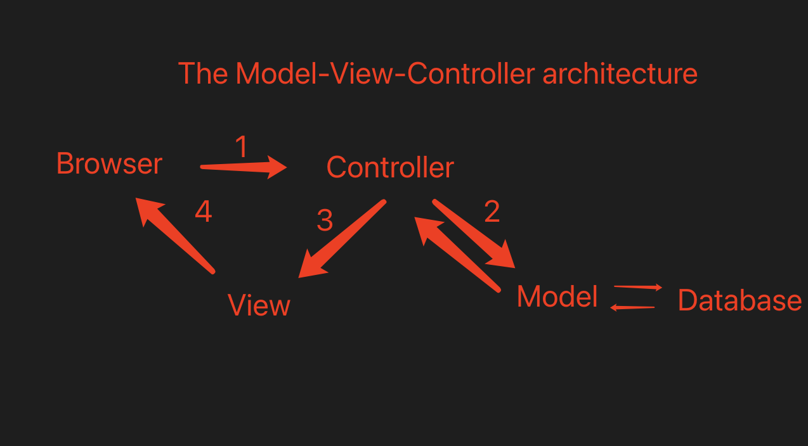

# Yii 开发一个图书管理系统

## MVC 模式

### View Model Controller

- Controller 截获用户发出的请求
- Controller 调用 Model 完成状态的读写操作
- Controller 把数据传递给 View
- View 渲染最终结果并呈现给用户
- MVC 都在服务器上



### DAO(Data Access Object)

DAO 数据访问对象是一个面向对象的数据库 接口

### 环境

- XAMPP
  - Apache MariaDB PHP Perl
  - 直接打开是走磁盘
  - 起服务打开是走网络的
  - systemcil linux 控制软件命令
  - ProFTPD FTP 服务器 文件传输协议 scp
  - 生产环境=>自己搭 php + apache + mysql
  - mariadb mysql 内核一样 管理机制不一样，mysql 得初始化，密码强制设定，mysql 会生成口令，得记下来

```sh
# centos
yum install mysql # mariadb
systemctl status mysqld # 基础服务状态
systemctl status mariadb
# mysql root用户默认只允许在本机上操作
## 解决方法：
### 1. mysql user  多创建几个root用户  root host改为%
### 2. 用SSH通道 ssh命令
```

## 安装 Yii

Composer-专业 PHP 开发环境

### 1. 环境安装操作步骤

- 1. 配置好 XAMPP 环境
- 2. 下载 yii2 basic
- 3. 解压放到 web 发布路径下
- 4. 修改`config/web.php`文件，给`cookieValudationKey`配置项添加一个密钥，内容随意，为了配置 cookie
- 5. 保证 Yii 安装目录访问权限
- 6. 通过浏览器访问 web 路径`/web/index.php`打开 yii 应用，可以看到主页面

```sh
# 检查目录权限
ls -alF
# chmod change mod
## chmod   7[给当前用户权限]7[给当前用户组权限]5[只读权限]
## 776  可读可写   750  生产环境下不能配置777
# 掩码  四个二进制的字节组成，一个字节是8位
# d rwx r-x r-x@ 三组
# rwx read write Excut
# hailiting 文件所有者
# staff 所有者所在的用户

drwxr-xr-x@  3 hailiting  staff      96  1 22  2020 controllers/
# The directory is not writable by the Web process   目录权限不够导致
ps -ef | grep apache | grep -v grep

sudo chmod -R 777 /xxx
```

### 2. Yii 环境基本配置

- 1. 配置数据库连接，修改`config/db.php`配置参数
- 2. 激活 Gii 模块，修改`config/web.php`，找到以下代码，并检查

```php
if(YII_ENV_DEV){
  $config["bootstrap"][] = "gii";
  $config["modules"]["gii"]= [
    "class" => "yii\gii\Module"
  ]
}
```

2.1. 检查应用的入口脚本`web/index.php`，找到这行代码将`YII_ENV_DEV`设为`true`  
2.2. 在开发模式下，按照下面的配置会激活 Gii 模块，直接通过 URL`http://localhost/index.php?r=gii`访问 Gii

```php
defined("YII_ENV") or define("YII_ENV", "dev")
```

2.3. 通过本机以外的机器访问 Gii，请求会被出于安全原因拒绝，可以配置 Gii 为其添加容许访问的 IP 地址

```php
"gii"=>[
  "class"=>"yii\gii\Module",
  "allowedIPs" => ["127.0.0.1", "::1"],
]
```

## UML 设计
